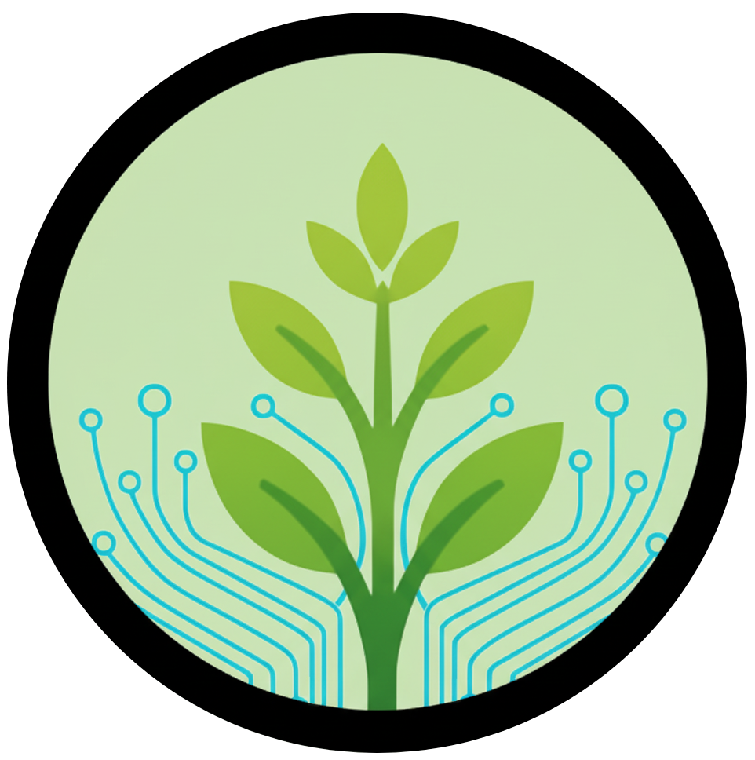
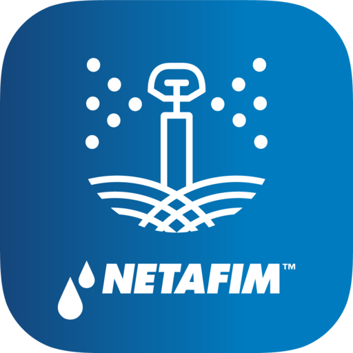
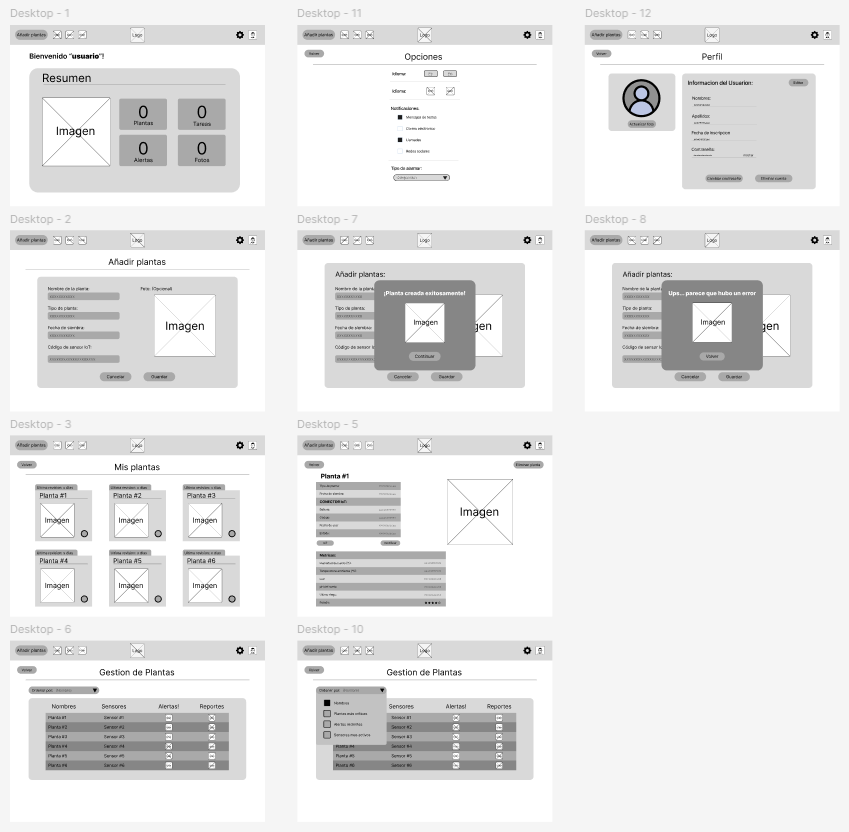
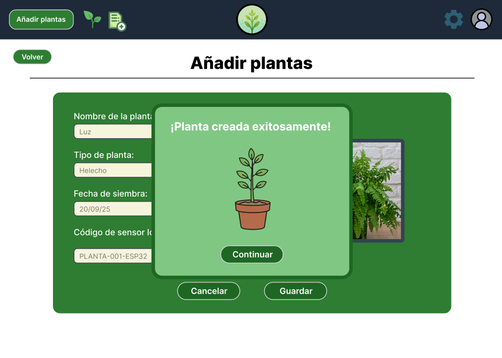
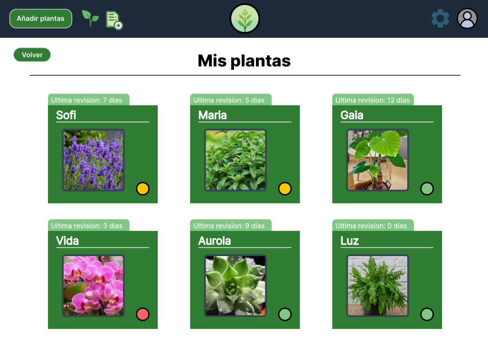
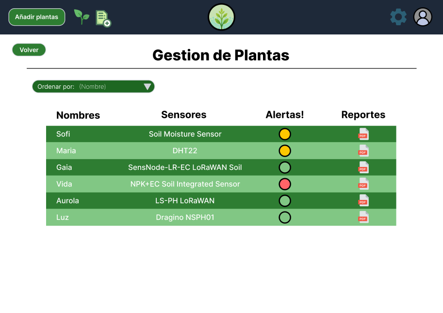

<h2 align="center">
  
</h2>

<h1 align="center">Universidad Peruana de Ciencias Aplicadas</h1>

<h3 align="center">
  Ingeniería de Software
    
  Curso: Desarrollo de Aplicaciones Open Source
    
  Sección: 7380
    
  Profesor: Hugo Allan Mori Paiva
    
  Semestre: 2025-20
    
  Informe del Trabajo Final
    
  Startup: EcoTech
    
  Producto: PlantaE
</h3>

| 
Alumno
       | 
Código
       |
|:-------------------------------------------:|:-------------------------------------------:|
|       Apaza Bocanegra, Elizabeth Noelia     |            u20231c197                       |
|       Contreras Leon, Flor De María         |            u202323243                       |
|       Guillen Galindo, Julio Adolfo         |            u20241a352                       |
|       Miraval Pomalaya, Rodrigo Jesus       |            u202311082                       |
|       Navarro Chinga, Antonio Jhair         |            u202314101                       |

 Septiembre 2025 

# Tabla de contenidos

## [Capítulo I: Introducción](cap1-introduction.md)

- [1.1 Startup Profile](cap1-introduction.md)
    - [1.1.1 Descripción de la Startup](cap1-introduction.md)
    - [1.1.2 Perfiles de integrantes del equipo](cap1-introduction.md)
- [1.2 Solution Profile](cap1-introduction.md)
    - [1.2.1 Antecedentes y problemática](cap1-introduction.md)
    - [1.2.2 Lean UX](cap1-introduction.md)
        - [1.2.2.1 Problem Statement](cap1-introduction.md)
        - [1.2.2.2 Assumptions](cap1-introduction.md)
        - [1.2.2.3 Hypothesis](cap1-introduction.md)
        - [1.2.2.4 Lean UX Canvas](cap1-introduction.md)
- [1.3 Segmentos Objetivos](cap1-introduction.md)

## [Capítulo II: Requirements Elicitation &amp; Analysis](cap2-requirements-elicitation-and-analysis.md)

- [2.1 Competidores](cap2-requirements-elicitation-and-analysis.md)
    - [2.1.1 Análisis competitivo](cap2-requirements-elicitation-and-analysis.md)
    - [2.1.2 Estrategias y tácticas frente a competidores](cap2-requirements-elicitation-and-analysis.md)
- [2.2 Entrevistas](cap2-requirements-elicitation-and-analysis.md)
    - [2.2.1 Diseño de entrevistas](cap2-requirements-elicitation-and-analysis.md)
    - [2.2.2 Registro de entrevistas](cap2-requirements-elicitation-and-analysis.md)
    - [2.2.3 Análisis de entrevistas](cap2-requirements-elicitation-and-analysis.md)
- [2.3 Needfinding](cap2-requirements-elicitation-and-analysis.md)
    - [2.3.1 User Personas](cap2-requirements-elicitation-and-analysis.md)
    - [2.3.2 User Task Matrix](cap2-requirements-elicitation-and-analysis.md)
    - [2.3.3 User Journey Mapping](cap2-requirements-elicitation-and-analysis.md)
    - [2.3.4 Empathy Mapping](cap2-requirements-elicitation-and-analysis.md)
    - [2.3.5 As-is Scenario Mapping](cap2-requirements-elicitation-and-analysis.md)
- [2.4 Ubiquitous Language](cap2-requirements-elicitation-and-analysis.md)

## [Capítulo III: Requirements Specification](cap3-requirements-specification.md)

- [3.1 To-Be Scenario Mapping](cap3-requirements-specification.md)
- [3.2 User Stories](cap3-requirements-specification.md)
- [3.3 Impact Mapping](cap3-requirements-specification.md)
- [3.4 Product Backlog](cap3-requirements-specification.md)

## [Capítulo IV: Product Design](cap4-product-design.md)

- [4.1 Style Guidelines](cap4-product-design.md)
    - [4.1.1 General Style Guidelines](cap4-product-design.md)
    - [4.1.2 Web Style Guidelines](cap4-product-design.md)
- [4.2 Information Architecture](cap4-product-design.md)
    - [4.2.1 Organization Systems](cap4-product-design.md)
    - [4.2.2 Labeling Systems](cap4-product-design.md)
    - [4.2.3 SEO Tags and Meta Tags](cap4-product-design.md)
    - [4.2.4 Searching Systems](cap4-product-design.md)
    - [4.2.5 Navigation Systems](cap4-product-design.md)
- [4.3 Landing Page UI Design](cap4-product-design.md)
    - [4.3.1 Landing Page Wireframe](cap4-product-design.md)
    - [4.3.2 Landing Page Mock-up](cap4-product-design.md)
- [4.4 Web Applications UX/UI Design](cap4-product-design.md)
    - [4.4.1 Web Applications Wireframes](cap4-product-design.md)
    - [4.4.2 Web Applications Wireflow Diagrams](cap4-product-design.md)
    - [4.4.3 Web Applications Mock-ups](cap4-product-design.md)
    - [4.4.4 Web Applications User Flow Diagrams](cap4-product-design.md)
- [4.5 Web Applications Prototyping](cap4-product-design.md)
- [4.6 Domain-Driven Software Architecture](cap4-product-design.md)
    - [4.6.1 Software Architecture Context Diagram](cap4-product-design.md)
    - [4.6.2 Software Architecture Container Diagrams](cap4-product-design.md)
    - [4.6.3 Software Architecture Components Diagrams](cap4-product-design.md)
- [4.7 Software Object-Oriented Design](cap4-product-design.md)
    - [4.7.1 Class Diagrams](cap4-product-design.md)
    - [4.7.2 Class Dictionary](cap4-product-design.md)
- [4.8 Database Design](cap4-product-design.md)
    - [4.8.1 Database Diagram](cap4-product-design.md)
- [4.9 DDD Estratégico](cap4-product-design.md)

## [Capítulo V: Product Implementation, Validation &amp; Deployment](cap5-prod-implementation-validation-deployment.md)

- [5.1 Software Configuration Management](cap5-prod-implementation-validation-deployment.md)
    - [5.1.1 Software Development Environment Configuration](cap5-prod-implementation-validation-deployment.md)
    - [5.1.2 Source Code Management](cap5-prod-implementation-validation-deployment.md)
    - [5.1.3 Source Code Style Guide &amp; Conventions](cap5-prod-implementation-validation-deployment.md)
    - [5.1.4 Software Deployment Configuration](cap5-prod-implementation-validation-deployment.md)
- [5.2 Landing Page, Services &amp; Applications Implementation](cap5-prod-implementation-validation-deployment.md)
    - [5.2.1 Sprint 1](cap5-prod-implementation-validation-deployment.md)
        - [5.2.1.1 Sprint Planning n](cap5-prod-implementation-validation-deployment.md)
        - [5.2.1.2 Aspect Leaders and Collaborators](cap5-prod-implementation-validation-deployment.md)
        - [5.2.1.3 Sprint Backlog n](cap5-prod-implementation-validation-deployment.md)
        - [5.2.1.4 Development Evidence for Sprint Review](cap5-prod-implementation-validation-deployment.md)
        - [5.2.1.5 Execution Evidence for Sprint Review](cap5-prod-implementation-validation-deployment.md)
        - [5.2.1.6 Services Documentation Evidence for Sprint Review](cap5-prod-implementation-validation-deployment.md)
        - [5.2.1.7 Software Deployment Evidence for Sprint Review](cap5-prod-implementation-validation-deployment.md)
        - [5.2.1.8 Team Collaboration Insights during Sprint](cap5-prod-implementation-validation-deployment.md)
    - [5.2.2 Sprint 2](cap5-prod-implementation-validation-deployment.md)
        - [5.2.2.1 Sprint Planning n](cap5-prod-implementation-validation-deployment.md)
        - [5.2.2.2 Aspect Leaders and Collaborators](cap5-prod-implementation-validation-deployment.md)
        - [5.2.2.3 Sprint Backlog n](cap5-prod-implementation-validation-deployment.md)
        - [5.2.2.4 Development Evidence for Sprint Review](cap5-prod-implementation-validation-deployment.md)
        - [5.2.2.5 Execution Evidence for Sprint Review](cap5-prod-implementation-validation-deployment.md)
        - [5.2.2.6 Services Documentation Evidence for Sprint Review](cap5-prod-implementation-validation-deployment.md)
        - [5.2.2.7 Software Deployment Evidence for Sprint Review](cap5-prod-implementation-validation-deployment.md)
        - [5.2.2.8 Team Collaboration Insights during Sprint](cap5-prod-implementation-validation-deployment.md)
          
## [Conclusiones](conclusiones.md)

- [Conclusiones y recomendaciones](conclusiones.md)

## [Bibliografía](bibliography.md)

## [Anexos](anexos.md)

# Registro de Versiones del Informe  

| Versión | Fecha       | Autor(es)                            | Descripción de modificación                             |
|---------|-------------|--------------------------------------|---------------------------------------------------------|
|   0.1   | 21/09/2025  | Apaza Bocanegra, Elizabeth Noelia    |  Elaboración de la estructura inicial del reporte.      |
|   0.2   | 21/09/2025  | Guillen Galindo, Julio Adolfo        |  Desarrollo del Capítulo III y Capítulo IV              |
|   0.3   | 21/09/2025  | Navarro Chinga, Antonio Jhair        |  Desarrollo del Capítulo IV y Capítulo V                |
|   0.4   | 21/09/2025  | Contreras Leon, Flor de Maria        |  Desarrollo Basico de la landing Page               |
|   0.5   | 21/09/2025  | Contreras Leon, Flor de Maria        |  Desarrollo del Capítulo IV y Capítulo V                |

# Student Outcome  
El curso contribuye al cumplimiento del Student Outcome ABET:
_ABET – EAC - Student Outcome 3_

**Criterio:**  Capacidad de comunicarse efectivamente con un rango de audiencias.
En el siguiente cuadro se describe las acciones realizadas y enunciados de conclusiones por parte del grupo, que permiten sustentar el haber alcanzado el logro del ABET – EAC - Student Outcome 3.

|             
Criterio específico
             |          
Acciones Realizadas
            |          
Conclusiones
            |
|:---------------------------------------------------------------------:|-------------------------------------------------------------------|------------------------------------------------------------|
| Comunica oralmente con efectividad a diferentes rangos de audiencia.  | <ul><li>**Apaza Bocanegra, Elizabeth Noelia:**   **TB1:** En esta entrega se realizo entrevistas para conocer las necesidades del proyecto, aportando retroalimentación a los compañeros.   **TP1:** Durante esta entrega, colaboré en la estructuración del repositorio del frontend y en la comprobación del correcto desempeño de los elementos visuales. Aseguré que la interfaz cumpliera con las guías acordadas por el equipo. </li><li>**Contreras Leon, Flor De María:**   **TB1:** Trabajé en equipo para proporcionar liderazgo al desarrollar secciones clave de la documentación del proyecto, incluyendo Lean UX Problem Statements, Assumptions e Hypothesis Statements. Estas actividades permitieron guiar al equipo en la definición clara de problemas, supuestos e hipótesis, estableciendo una base conceptual sólida para estructurar el producto y asegurando que todos los integrantes tuvieran un marco común de referencia para continuar con el desarrollo.   **TP1:**  Apoyé en la implementación de las vistas principales del frontend, verificando la integración de las rutas del sitio web y su coherencia con el diseño establecido. </li><li>**Guillen Galindo, Julio Adolfo:**   **TB1:** Me encargué de informar a mi equipo sobre los porgremos que seguiríamos. Además, participé de forma activa en la revisión de los avances realizados por mis compañeros y colaboré en la preparación del projecto para las presentaciones.   **TP1:** Durante esta etapa, me encargué de coordinar las reuniones de seguimiento del frontend, promoviendo la comunicación entre los miembros del equipo para resolver incidencias de despliegue. También presenté el avance del sprint al grupo, explicando los ajustes aplicados en la interfaz y garantizando la comprensión técnica de todos. </li><li>**Miraval Pomalaya, Rodrigo Jesus:**   **TB1:** En esta entrega colabore con la revision retroactiva de los avances de mis compañeros indicándoles que puntos de la documentación se podrían mejorar. Adicionalmente, realice entrevistas para dos segmentos objetivos.   **TP1:** Participé en la revisión funcional del frontend antes del despliegue, asegurando que las secciones principales respondieran a las necesidades detectadas en las entrevistas con usuarios. </li><li>**Navarro Chinga, Antonio Jhair:**   **TB1:** Estuvo atento en información del equipo de las actividades a seguir, colaborando en la preparación y exposición del proyecto.   **TP1:** Me ocupé de preparar el entorno de desarrollo del frontend y de realizar el despliegue inicial en la plataforma seleccionada. Además, resolví incidencias relacionadas con la carga de componentes. </ul> | <ul><li>**TB1:** Cada persona asumió sus tareas asignadas y se comunicó de forma directa, creando un ambiente de trabajo que impulsó la colaboración y mejoró el trabajo conjunto, aspecto fundamental en proyectos de equipo. </li><li> **TP1:** Durante esta entrega, el equipo demostró una comunicación fluida y efectiva, tanto en la coordinación técnica como en la revisión de avances. Cada integrante asumió un papel activo para garantizar el correcto despliegue del frontend, intercambiando observaciones claras y soluciones rápidas ante los desafíos del sprint. Esta interacción constante fortaleció la cohesión del grupo y mejoró la capacidad colectiva para presentar y argumentar resultados técnicos de manera profesional. </li></ul> |
| Comunica por escrito con efectividad a diferentes rangos de audiencia | <ul><li>**Apaza Bocanegra, Elizabeth Noelia:**   **TB1:** Redacto el documento del avance, así como mensajes y graficos para que el equipo pudiera seguir los lineamientos establecidos.   **TP1:** Redacté el apartado del Sprint 2, detallando las tareas priorizadas y los objetivos del equipo. También contribuí en las secciones grupales de documentación, donde se mostró la evidencia del desarrollo, despliegue y colaboración durante el sprint. </li><li>**Contreras Leon, Flor De María:**   **TB1:** Elaboré y lideré la redacción de secciones clave de la documentación del proyecto, incluyendo Lean UX Problem Statements, Assumptions e Hypothesis Statements, asegurando que la información estuviera clara y organizada. Esta labor permitió que el equipo comprendiera los problemas, supuestos e hipótesis del proyecto de manera consistente, facilitando la comunicación escrita efectiva entre todos los integrantes y asegurando un marco común de referencia.   **TP1:** Elaboré el Sprint Review, presentando la evidencia de los servicios implementados. Además, participé en la documentación conjunta sobre desarrollo, ejecución y despliegue del software. </li><li>**Guillen Galindo, Julio Adolfo:**   **TB1:** Contribuí en la definición de las pautas y lineamientos que nuestro equipo seguia durante el proceso. Además, estuve a cargo de la elaboración de los capítulos 3 y 4.   **TP1:** Redacté la planificación del Sprint 2, donde detallé los criterios de priorización y la distribución de tareas del equipo. </li><li>**Miraval Pomalaya, Rodrigo Jesus:**   **TB1:** Mantuve una comunicación activa y eficaz que fortaleció la confianza mutua. Esto mejoró el trabajo en equipo, un valor crucial para proyectos colaborativos.   **TP1:** Fui responsable de los tiempos estimados. Además, participé en la documentación compartida sobre desarrollo, ejecución y despliegue del software, resaltando el trabajo colaborativo del equipo. </li><li>**Navarro Chinga, Antonio Jhair:**   **TB1:** Participo en la definición de las pautas de nuestro equipo durante el desarrollo, aportando ideas para mejorar la metodología de trabajo con las metricas establecida.   **TP1:** Desarrollé la evidencia técnica de los servicios implementados y su funcionalidad. También intervine en la redacción grupal sobre el proceso de desarrollo, pruebas y despliegue del proyecto. </ul> | <ul><li>**TB1:** Cada integrante asumió las tareas que le fueron asignadas, manteniendo una comunicación constante y efectiva que fomentó la confianza entre todos. Esto contribuyó a fortalecer el trabajo en equipo, un aspecto esencial para el éxito de los proyectos colaborativos. </li><li> **TP1:** En esta fase, todos los miembros mantuvieron un nivel alto de compromiso con la documentación técnica, La colaboración en los apartados grupales permitió que el producto final reflejara en la organización del equipo. Gracias a ello, se logró una documentación completa, coherente y alineada con los objetivos del proyecto. </li></ul> |

# Capítulo I: Introducción
## 1.1. Startup Profile
### 1.1.1. Descripción de la Startup
Somos EcoTech, una startup universitaria conformada por estudiantes de la Universidad Peruana de Ciencias Aplicadas (UPC), dedicada a desarrollar soluciones tecnológicas que promuevan la sostenibilidad y el cuidado responsable de los recursos naturales. En un contexto donde la agricultura urbana y el mantenimiento de áreas verdes enfrentan retos de eficiencia y gestiones, presentamos PlantaE, una plataforma inteligente basada en IoT que permite a los usuarios monitorear y optimizar el cuidado de sus plantas y cultivos urbanos.

PlantaE surge ante la creciente necesidad de contar con herramientas accesibles y confiables que faciliten el riego eficiente y el cuidado de áreas verdes en hogares y viveros. La aplicación recopila datos en tiempo real sobre humedad, temperatura, luminosidad y calidad del aire mediante sensores instalados en macetas o terrenos de cultivo, brindando a los usuarios notificaciones oportunas y recomendaciones personalizadas para garantizar la salud de sus plantas. Ademas de, contribuir al uso responsable del agua, ofreciendo una plataforma que combina tecnología, sostenibilidad y facilidad de uso. Con PlantaE, buscamos acercar la innovación al bienestar ambiental y a la vida diaria de las personas, fomentando comunidades más conscientes y responsables con su entorno.

   
  

### Misión:
Digitalizar y optimizar el cuidado de cultivos urbanos mediante el uso de tecnologías IoT, ofreciendo a personas y viveros herramientas accesibles para gestionar sus plantas de forma sostenible, eficiente y consciente con el medio ambiente.

### Visión:
Ser una referencia en soluciones tecnológicas para el cuidado de plantas y áreas verdes, promoviendo un estilo de vida más sostenible y acercando la tecnología al servicio del bienestar ambiental y de las comunidades.

### 1.1.2 Perfiles de integrantes del equipo
| **Integrante**            | **Apaza Bocanegra, Elizabeth Noelia**                                               |
|---------------------------|-------------------------------------------------------------------------------------|
| **Código del Estudiante** | u20231c197                                                                          |
| **Carrera**               | Ingeniería de Sorftware                                                             |
| **Descripción**           | Tengo 19 años y me defino como una persona responsable, organizada y con facilidad para colaborar con los demás. Disfruto mucho del trabajo en equipo porque me permite intercambiar ideas y seguir aprendiendo de mi carrera. Me interesa desarrollar constantemente nuevas habilidades y busco aportar siempre con una comunicación clara y efectiva en cada proyecto. Mi objetivo es fortalecer mi formación académica y aprovechar cada experiencia para crecer tanto en lo profesional como en lo personal.|
| **Foto**                  | 
  
 |

| **Integrante**            | **Contreras Leon, Flor De María**                                                   |
|---------------------------|-------------------------------------------------------------------------------------|
| **Código del Estudiante** |  u202323243                                                                         |
| **Carrera**               |  Ingenieria de Software                                                             |
| **Descripción**           |  Mi nombre es Flor de María Contreras León y actualmente estudio la carrera de Ingeniería de Software en la Universidad Peruana de Ciencias Aplicadas (UPC), sede San Miguel. Tengo 20 años y me considero una persona responsable, comprometida y dedicada a mi formación profesional.Me apasiona la programación y la investigación, áreas en las que busco seguir aprendiendo y desarrollando nuevas habilidades. Aunque me considero una persona callada, siempre estoy atenta a los detalles, lo que me permite trabajar de manera cuidadosa y eficiente en mis proyectos. Asimismo, valoro el trabajo en equipo y creo que un entorno colaborativo y respetuoso es clave para alcanzar los mejores resultados. |
| **Foto**                  | 
  
 |

| **Integrante**            | **Guillen Galindo, Julio Adolfo**                                                   |
|---------------------------|-------------------------------------------------------------------------------------|
| **Código del Estudiante** | u20241a352                                                                          |
| **Carrera**               | Ingeniería de Software                                                              |
| **Descripción**           | Actualmente curso la carrera de Ingeniería de Software en la UPC. Me considero una persona discreta, pero responsable y enfocada en cumplir los proyectos dentro de los plazos establecidos. Poseo conocimientos en C++ y Python; disfruto trabajar en equipo cuando existe colaboración y apoyo mutuo. Además, me motiva aplicar lo aprendido para afrontar los desafíos que puedan surgir en los próximos ciclos. |
| **Foto**                  | 
  
 |

| **Integrante**            | **Navarro Chinga, Antonio Jhair**                                               |
|---------------------------|-------------------------------------------------------------------------------------|
| **Código del Estudiante** | U202314101                                                                          |
| **Carrera**               | Ingeniería de Sorftware                                                             |
| **Descripción**           | Mi nombre es Antonio Jhair Navarro Chinga, tengo 19 años y soy estudiante del quinto ciclo de la carrera de Ingeniería de Software en la Universidad Peruana de Ciencias Aplicadas. Soy una persona colaborativa y responsable, características que considero fundamentales para el trabajo en equipo y el logro de objetivos comunes. A lo largo de mi formación académica he adquirido sólidos conocimientos en programación estructurada, programación orientada a objetos y algoritmos, lo que me permite abordar problemas con un enfoque lógico y eficiente. Además, me interesa mantenerme actualizado con las nuevas tendencias y herramientas en el mundo del software, y siempre busco nuevas oportunidades para aprender y mejorar mis habilidades colaborando en equipo.|
| **Foto**                  | 
  
 |

| *Integrante*            | **Miraval Pomalaya,Rodrigo Jesus**                                                  |
|---------------------------|-------------------------------------------------------------------------------------|
| *Código del Estudiante* | u202311082                                                                          |
| *Carrera*               | Ingeniería de Software                                                              |
| *Descripción*           | Mi nombre es Rodrigo Jesus Miraval Pomalaya y estudio Ingeniería de Software en la Universidad Peruana de Ciencias Aplicadas. Me considero una persona adaptable y detallista, siempre en busca de aprender y mejorar en lo que hago. Tengo conocimientos en Python, Typescript, HTML y CSS, además de un nivel intermedio en SQL Server y MySQL. Me gusta aplicar lo aprendido en proyectos académicos y trabajar en equipo, ya que compartir ideas no solo ayuda a obtener mejores resultados, sino también a ampliar mi visión en la carrera. |
| *Foto*                  |  
  
    |

## 1.2 Solution Profile

### 1.2.1 Antecedentes y problemática
En el Perú, el cuidado de áreas verdes y la agricultura enfrentan serias dificultades relacionadas con el uso eficiente de recursos, especialmente del agua. Según la Autoridad Nacional del Agua (ANA, 2023), más del 70% del recurso hídrico del país es destinado a la agricultura, pero gran parte se desperdicia debido a sistemas de riego poco eficientes y falta de tecnología de monitoreo.

En las ciudades, la situación no es distinta. Informes de la Municipalidad de Lima (2022) señalan que gran parte de los parques y jardines públicos presentan un riego deficiente, lo que repercute en el deterioro de áreas verdes urbanas. A nivel de hogares, el cuidado de plantas suele hacerse de manera intuitiva, sin datos precisos sobre humedad, temperatura o condiciones ambientales, lo que incrementa el riesgo de pérdida de cultivos o desperdicio de agua.

A esto se suma que la FAO (2021) ha destacado la importancia de impulsar la agricultura urbana y periurbana en países en desarrollo, no solo como fuente de alimentos, sino también como estrategia de sostenibilidad ambiental y de bienestar social. Sin embargo, en el Perú, aún existe un vacío en el acceso a soluciones tecnológicas accesibles que faciliten la gestión eficiente de cultivos urbanos y viveros.

**Análisis 5W2H**

| **Pregunta**                                                         | **Respuesta**                                                                                                                                                                                      |
|:--------------------------------------------------------------------:|:--------------------------------------------------------------------------------------------------------------------------------------------------------------------------------------------------:|
|**What**   ¿Cuál es el problema?                                   |  En el Perú, el cuidado de cultivos urbanos y áreas verdes enfrenta retos significativos por la falta de tecnologías que permitan un monitoreo preciso. Gran parte de los usuarios riegan de manera intuitiva, sin información confiable sobre humedad del suelo, temperatura, luminosidad o calidad del aire. Esto genera pérdidas de plantas, uso ineficiente del agua y deterioro de jardines urbanos y viveros.                                                             |
|**When**   ¿Cuándo sucede el problema?                             |  La problemática ocurre todo el año, pero se intensifica en temporadas de sequía, verano o en situaciones donde el usuario está fuera de casa por mucho tiempo. La falta de monitoreo en tiempo real y de datos confiables hace que la pérdida de cultivos o el mal uso del agua se convierta en un problema recurrente y continuo.                                                                                                                                              |
|**Where**   ¿Dónde se presenta el problema de negocio?             |  Este problema se presenta principalmente en ciudades con creciente interés en agricultura urbana. En las zonas costeras, la necesidad es mayor debido a la escasez de agua y a la poca adopción de tecnologías digitales en el mantenimiento de áreas verdes.                                                                                                                                                                                                                  |
|**Who**   ¿Quiénes están involucrados?                             |  Los principales afectados son las personas en hogares que buscan mantener sus plantas en zonas urbanas, así como viveros y negocios de jardinería que requieren eficiencia para reducir costos y mejorar la calidad de sus productos.                                                                                                                                                                                                                                        |
|**Why**   ¿Por qué se origina el problema?                         |  El uso eficiente del agua y la sostenibilidad ambiental son prioritarios. Según la Autoridad Nacional del Agua (ANA, 2023), más del 70% del recurso hídrico del país se destina a la agricultura, con altos niveles de desperdicio. Una solución tecnológica que permita recopilar datos en tiempo real, enviar alertas y recomendaciones personalizadas no solo optimiza el cuidado de las plantas, sino que también fomenta la conciencia ambiental y contribuye a la gestión responsable de los recursos naturales en un contexto urbano y doméstico.                                                                                                                                                                                                    |
|**How**   ¿Cómo afecta este problema a las personas involucradas?  |  La falta de monitoreo confiable provoca que los usuarios rieguen de manera insuficiente, lo que genera pérdida de plantas, frustración y mayores costos en el mantenimiento de áreas verdes. Y por consiguiente, repercute directamente en la calidad de los productos que ofrecen.                                                                                                                                                                                            |
|**How much**   ¿Cuánto impacto genera el problema en la sociedad?  |  Aunque el impacto económico es considerable, el uso ineficiente del agua contribuye al agotamiento de un recurso escaso en zonas urbanas, mientras que la pérdida de áreas verdes reduce la calidad de vida y el bienestar en las ciudades. En conjunto, esto repercute en la sostenibilidad urbana y en la gestión responsable de los recursos naturales.                                                                                                                      |

### 1.2.1 Antecedentes y problemática

### 1.2.2. Lean UX Process
#### 1.2.2.1. Lean UX Problem Statements
- Los usuarios de áreas urbanas y viveros no cuentan con datos precisos y en tiempo real sobre las condiciones de sus cultivos (humedad, temperatura, luminosidad, calidad del aire), lo que ocasiona un riego ineficiente y un mayor riesgo de pérdida de plantas.  
- Las personas suelen regar sus plantas de manera intuitiva, sin información confiable, lo que genera desperdicio de agua y afecta la sostenibilidad del cuidado de áreas verdes.  
- Viveros y responsables de áreas verdes carecen de soluciones tecnológicas accesibles y fáciles de usar que permitan optimizar el manejo de cultivos urbanos.  

#### 1.2.2.2. Lean UX Assumptions
- Los usuarios están dispuestos a utilizar herramientas digitales siempre que estas sean fáciles de usar y les brinden información clara para mejorar el cuidado de sus cultivos.  
- La incorporación de sensores IoT permitirá obtener datos relevantes que ayudarán a optimizar el riego y mejorar la salud de las plantas.  
- Al recibir notificaciones y recomendaciones personalizadas, los usuarios podrán tomar mejores decisiones que contribuirán a la reducción del consumo de agua y al cuidado responsable de áreas verdes.  
- Existe un segmento de mercado (hogares y viveros urbanos) que busca soluciones sostenibles e innovadoras para optimizar sus recursos y mejorar sus resultados.  

#### 1.2.2.3. Lean UX Hypothesis Statements
- Creemos que al ofrecer una plataforma de monitoreo en tiempo real con sensores IoT, los usuarios urbanos y viveros podrán gestionar sus plantas de manera más eficiente.  
- Creemos que al proporcionar recomendaciones personalizadas y notificaciones oportunas, los usuarios reducirán el desperdicio de agua y mejorarán la salud de sus cultivos.  
- Creemos que al diseñar una interfaz sencilla y accesible, lograremos que tanto usuarios individuales como viveros adopten la aplicación sin necesidad de conocimientos técnicos avanzados.  
- Creemos que si demostramos beneficios tangibles (ahorro de agua, reducción de pérdidas de plantas), los usuarios estarán dispuestos a pagar por la solución.

#### 1.2.2.4 Lean UX Canvas

 
   

## 1.3 Segmentos objetivos
| Segmento Objetivo | Aspectos demográficos | Aspectos geográficos | Aspectos psicográficos |
|-------------------|------------------------|-----------------------|-------------------------|
| **Personas (hogares urbanos que cuidan plantas)** | <ul><li>Sexo: Masculino y femenino.  </li><li>Edades: 25 – 55 años (adultos jóvenes y adultos interesados en la sostenibilidad y el cuidado del hogar).</ul> | <ul><li>Nacionalidad: Peruana.  </li><li>Zona geográfica: Principalmente zonas urbanas y periurbanas con acceso a áreas verdes o pequeños jardines.</ul> | <ul><li>Valoran la sostenibilidad y el cuidado responsable del medio ambiente.  </li><li>Interesados en tecnología accesible que facilite la vida cotidiana.  </li><li>Buscan practicidad y resultados visibles en el cuidado de sus plantas.  </li><li>Dispuestos a probar soluciones innovadoras si estas son fáciles de usar.</ul> |
| **Viveros comerciales** | <ul><li>Sexo: Masculino y femenino (administradores, encargados y trabajadores de viveros).  </li><li>Edades: 20 – 60 años (jóvenes adultos y adultos con experiencia en manejo de cultivos o gestión de negocios de plantas).</ul> | <ul><li>Nacionalidad: Peruana.  </li><li>Zona geográfica: Áreas urbanas, periurbanas y rurales donde se concentran viveros, centros de producción y espacios agrícolas.</ul> | <ul><li>Buscan optimizar recursos (agua, energía, tiempo) para aumentar la rentabilidad.  </li><li>Interesados en soluciones tecnológicas que mejoren la eficiencia operativa.  </li><li>Valoran herramientas que brinden datos confiables y prácticos para la toma de decisiones.  </li><li>Dispuestos a pagar por soluciones que generen beneficios tangibles en productividad y sostenibilidad.</ul> |

# Capítulo II: Requirements Elicitation & Analysis

## 2.1. Competidores

En esta sección, se presenta un análisis de los principales competidores de PlantaE, centrado en aquellos que operan con modelos de negocio digitales similares o que, aunque no sean idénticos, ofrecen productos o servicios que se superponen parcialmente con nuestra propuesta.Evaluamos tanto competidores directos, que ofrecen plataformas basadas en IoT para monitoreo de cultivos y áreas verdes, como competidores indirectos, que brindan soluciones de riego automatizado o aplicaciones de agricultura urbana más generales.

Este análisis nos permitirá comprender mejor el entorno competitivo y cómo podemos diferenciarnos en el ecosistema de soluciones de agricultura urbana sostenible.

1. ### AgroSmart : 
Es una de las startups líderes en soluciones de agricultura digital. Su plataforma combina sensores IoT, imágenes satelitales e inteligencia artificial para optimizar el manejo de grandes cultivos.

- **Fortalezas:** monitoreo IoT en tiempo real, predicciones climáticas y optimización avanzada del riego.

- **Debilidades:** está orientada a la agricultura a gran escala y requiere alta inversión, lo que limita su accesibilidad para viveros urbanos y hogares.

2. ### Netafim:
Es una empresa pionera en riego por goteo inteligente, con sistemas que reducen significativamente el consumo de agua en cultivos.

- **Fortalezas:** experiencia consolidada, sistemas de riego automatizado de alta eficiencia y sostenibilidad hídrica comprobada.

- **Debilidades:** alto costo de implementación y foco en agricultores medianos y grandes, con baja personalización para usuarios urbanos.

3. ### Plantix

Es una aplicación móvil que utiliza inteligencia artificial para diagnosticar plagas y enfermedades en cultivos mediante fotos.

- **Fortalezas:** accesibilidad desde dispositivos móviles, comunidad activa de usuarios y recomendaciones prácticas para el cuidado de plantas.

- **Debilidades:** su alcance está limitado al diagnóstico de problemas y no ofrece un sistema de monitoreo IoT ni gestión hídrica.

### 2.1.1. Análisis competitivo
<table> 
  <tr>
    <th colspan="7"> Competitive Analysis Landscape </th>
  </tr>
  <tr>
    <td colspan="2" rowspan="2">¿Por qué llevar acabo este análisis? </td>
    <td colspan="5"> ¿Que busca comprender el analisis de PlantaE frente a competidores que ofrecen soluciones de agricultura digital e IoT, considerando factores de accesibilidad, mercado objetivo y sostenibilidad? </td>
  </tr>
  <tr>
    <td colspan="5"> Este análisis busca comprender el posicionamiento de PlantaE en comparación con otras soluciones digitales e IoT para la gestión de cultivos y áreas verdes, identificando oportunidades de mejora y diferenciación frente a las necesidades de nuestros segmentos objetivos: hogares urbanos interesados en el cuidado sostenible de plantas y viveros comerciales que buscan optimizar el uso de recursos y mejorar la salud de sus cultivos. </td>
  </tr>
  <tr>
    <td colspan="2"> Productos </td>
    <td> 
 PlantaE    </td>
    <td> 
 AgroSmart   
 </td>
    <td> 
 Netafim   
 </td>
    <td> 
 Plantix   
 </td>
  </tr>
  <tr>
    <td rowspan="2">Perfil</td>
    <td>Overview</td>
    <td> Plataforma accesible de monitoreo IoT en tiempo real para hogares y viveros comerciales. </td>
    <td> Startup de agricultura digital con sensores IoT, IA y datos satelitales. </td>
    <td> Empresa líder en riego inteligente a nivel global. </td>
    <td> App móvil que diagnostica plagas y enfermedades con IA. </td>
  </tr>
  <tr>
    <td>Ventaja competitiva ¿Qué valor ofrece a los clientes?</td>
    <td> Accesible, simple y adaptable a hogares y viveros comerciales. </td>
    <td> Alta tecnología para agricultura a gran escala. </td>
    <td> Experiencia consolidada y eficiencia hídrica. </td>
    <td> Uso de IA accesible desde móvil y comunidad activa. </td>
  </tr>
  <tr>
    <td rowspan="2">Perfil de Marketing</td>
    <td> Mercado Objetivo </td>
    <td> Hogares urbanos y viveros comerciales pequeños/medianos. </td>
    <td> Agricultores industriales y medianos. </td>
    <td> Agricultores medianos y grandes. </td>
    <td> Agricultores y aficionados urbanos </td>
  </tr>
  <tr>
    <td> Estrategias de Marketing </td>
    <td> Educación digital sobre sostenibilidad, alianzas con viveros locales. </td>
    <td> Marketing B2B, posicionamiento tecnológico. </td>
    <td> Branding global, casos de éxito y sostenibilidad hídrica. </td>
    <td> Estrategia digital masiva vía Google Play/App Store. </td>
  </tr> 
  <tr>
    <td rowspan="3">Perfil de Producto</td>
    <td> Productos & Servicios </td>
    <td> Sensores IoT, web, recomendaciones personalizadas. </td>
    <td> Sensores IoT, pronósticos climáticos, gestión avanzada. </td>
    <td> Sistemas de riego por goteo inteligentes, software de gestión. </td>
    <td> Diagnóstico de plagas y comunidad de soporte. </td>
  </tr>
  <tr>
    <td> Precios & Costos </td>
    <td> Accesible, modelo freemium o suscripción baja. </td>
    <td> Alto costo, licencias SaaS premium. </td>
    <td> Alta inversión inicial y mantenimiento. </td>
    <td> Gratis con servicios premium. </td>
  </tr>
  <tr> 
    <td>Canales de distribución (Web y/o Móvil)</td>
    <td> Aplicación Web. </td>
    <td> Aplicación Web y App móvil. </td>
    <td> Equipos físicos más plataforma digital. </td>
    <td> App móvil. </td>
  </tr>  
  <tr>
    <td rowspan="4"> Análisis SWOT </td>
    <td> Fortalezas </td>
    <td> Accesibilidad, simplicidad de uso, enfoque en sostenibilidad urbana. </td>
    <td> Tecnología avanzada, IA y datos satelitales. </td>
    <td> Experiencia consolidada, reducción comprobada de consumo de agua. </td>
    <td> Uso de IA en diagnóstico, comunidad digital activa. </td>
  </tr>
  <tr>
    <td> Debilidades </td>
    <td> Escala inicial limitada, baja madurez tecnológica frente a competidores. </td>
    <td> Costos elevados, poco enfoque en usuarios pequeños. </td>
    <td> Alto costo, poca personalización para usuarios urbanos. </td>
    <td> No ofrece gestión hídrica ni monitoreo IoT. </td>
  </tr>
  <tr>
    <td> Oportunidades </td>
    <td> Creciente demanda de soluciones sostenibles, apoyo a viveros urbanos. </td>
    <td> Expansión en mercados emergentes. </td>
    <td> Creciente necesidad de eficiencia hídrica. </td>
    <td> Integración con soluciones de riego y monitoreo urbano. </td>
  </tr>
  <tr>
    <td> Amenazas </td>
    <td> Entrada de grandes competidores al segmento urbano, barreras de adopción tecnológica. </td>
    <td> Saturación de mercado y alta inversión necesaria para usuarios pequeños. </td>
    <td> Nuevas startups más ágiles y accesibles. </td>
    <td> Dependencia de la precisión de IA y limitación del modelo freemium. </td>
  </tr>
</table>

### 2.1.2. Estrategias y tácticas frente a competidores
Para enfrentar a la competencia y posicionarse de manera sólida en el ecosistema de soluciones sostenibles, **PlantaE implementará estrategias enfocadas en sus principales ventajas competitivas** y en la explotación de oportunidades poco atendidas por otras iniciativas. Entre las principales tácticas preliminares destacan:

**Estrategia de diferenciación sostenible :**
- La plataforma digital de PlantaE facilitará la conexión entre ciudadanos, municipalidades, ONGs y empresas, mediante herramientas enfocadas en la regeneración de áreas verdes y el monitoreo comunitario. Se contempla, por ejemplo, el desarrollo progresivo de funcionalidades como reportes de impacto ambiental en tiempo real y mapas interactivos de proyectos verdes, diferenciándonos de competidores que se centran únicamente en el sector agrícola o de riego.

**Alianzas estratégicas multiactor:**
- PlantaE priorizará la construcción de convenios con municipalidades, viveros urbanos y organizaciones comunitarias. Estas alianzas permitirán fortalecer la confianza en la plataforma, garantizar acceso a insumos sostenibles y generar proyectos colaborativos que refuercen el sentido de pertenencia ciudadana.

**Campañas digitales con enfoque social y ambiental:**
- Las campañas en redes sociales serán clave para sensibilizar sobre la importancia del cuidado de áreas verdes urbanas. Se priorizarán contenidos educativos, testimonios de voluntarios y casos de éxito en la transformación de espacios públicos, reforzando así la conexión emocional entre los usuarios y su entorno.

**Captación y fidelización de comunidades:**
- La plataforma incluirá herramientas que permitan a los ciudadanos participar en proyectos de reforestación, limpieza y mantenimiento, mientras que ONGs y empresas podrán gestionar sus iniciativas desde un panel especializado. Se prevé también la implementación de incentivos no monetarios, como reconocimientos digitales o certificaciones de impacto ambiental.

**Gestión de riesgos y validación de proyectos:**
- Frente a la posible desconfianza en nuevas plataformas digitales o la falta de continuidad en proyectos comunitarios, PlantaE aplicará un modelo de validación y seguimiento transparente. Cada proyecto contará con métricas claras de impacto y espacios de retroalimentación, lo que fortalecerá la confianza y garantizará la sostenibilidad a largo plazo.

## 2.2. Entrevistas

### 2.2.1. Diseño de entrevistas
Hola, mi nombre es [Nombre del entrevistador] y formo parte del equipo que está desarrollando PlantaE, una iniciativa que busca mejorar el cuidado de plantas y áreas verdes con ayuda de la tecnología. Nuestra idea es apoyarnos en el Internet de las Cosas (IoT), es decir, en sensores y dispositivos que recopilan datos en tiempo real sobre tus plantas —por ejemplo, la humedad del suelo o la cantidad de agua utilizada— para que el riego y el mantenimiento sean más fáciles y eficientes.

Con esto queremos crear una aplicación que te brinde alertas, consejos y herramientas prácticas para ahorrar agua, cuidar mejor de las plantas y simplificar el proceso, ya sea en casa o en un vivero.

**Diseño de entrevistas - Segmento 1 :**

**Presentacion del proyecto y inicio de la entrevista:**
- Para empezar, ¿puedes contarnos tu nombre y qué relación tienes con el cuidado de plantas en tu hogar?

- ¿Cómo describirías tu experiencia con las plantas: las consideras un pasatiempo, una responsabilidad o parte de tu estilo de vida?

- ¿Qué lugar ocupan las plantas en tu día a día (ejemplo: decoración, conexión con la naturaleza, bienestar personal)?

- ¿Desde cuándo empezaste a cuidar plantas en casa y qué te motivó a hacerlo?

**Preguntas:**

1. ¿Dedicas un tiempo específico en la semana para cuidar tus plantas o lo haces de manera espontánea?

2. ¿Qué dificultades enfrentas al cuidar tus plantas o áreas verdes?

3. ¿Cómo organizas el riego y mantenimiento de tus plantas?

4. ¿Has tenido problemas relacionados con el riego (por exceso, falta o uso de agua)?

5. ¿Qué tanto influye el consumo de agua en tu decisión de cuidar más o menos plantas?

6. ¿Alguna vez has perdido plantas por no darles el cuidado adecuado? ¿Cómo te sentiste?

7. ¿Ha tenido problemas relacionados con el mantenimiento general de tus plantas (plagas, falta de tiempo, espacio)?

8. ¿Usas actualmente alguna aplicación, sistema o herramienta para ayudarte en el cuidado de tus plantas?

9. ¿Qué tan cómodo te sentirías usando sensores o aplicaciones para recibir alertas y recomendaciones sobre tus plantas?

10. ¿Qué tan útil te resultaría una aplicación que te ayude a optimizar el riego y cuidado de tus plantas?

11. ¿Qué funcionalidades te motivarían más a usar una aplicación como esta? (ejemplo: alertas de riego, consejos personalizados, ahorro de agua).

12. Si tuvieras esta aplicación, ¿cómo crees que cambiaría tu experiencia actual con el cuidado de plantas en casa?

13. ¿Hay algo más que te gustaría agregar sobre tu experiencia con las plantas y áreas verdes?

**Diseño de entrevistas - Segmento 2 :**

**Presentacion del proyecto y inicio de la entrevista:**

- Para comenzar, ¿puedes presentarte y contarnos tu rol dentro del vivero o negocio de plantas?

- ¿Cuál es la historia detrás del vivero? (¿Cómo empezó y qué los motivó a dedicarse a este rubro?)

- ¿Qué tanto valoras la tecnología o la innovación en el manejo de riego y mantenimiento en tu negocio?

**Preguntas:**

1. ¿Qué retos enfrenta en la gestión del riego y mantenimiento a gran escala?

2. ¿Cómo manejan actualmente el control del consumo de agua?

3. ¿Qué estrategias utilizan para garantizar que las plantas se mantengan en buen estado?

4. ¿Han tenido pérdidas significativas de plantas por problemas de riego o mantenimiento?

5. ¿Qué métodos utilizan para planificar y organizar las tareas de su equipo en el vivero?

6. ¿Cómo gestionan el almacenamiento y uso de insumos (fertilizantes, sustratos, pesticidas)?

7. ¿Qué tan importante es para su negocio poder reducir costos relacionados al consumo de agua y mantenimiento?

8. ¿Utilizan actualmente algún software o sistema digital para gestionar el vivero? ¿Cuál?

9. ¿Qué tipo de información o métricas consideran más útiles para tomar decisiones sobre la producción y venta?

10. ¿De qué forma creen que una aplicación como PlantaE podría apoyar la eficiencia y sostenibilidad en su vivero?

11. ¿Qué funcionalidades valoraría más en una herramienta digital pensada para viveros (ejemplo: gestión de riego por sectores, alertas de plagas, informes de consumo)?

### 2.2.2. Registro de entrevistas
##### Segmento 1: Personas con plantas en casa

##### Entrevista N°1: Alessandro Bravo

- Sexo: Maculino
- Edad: 20 años
- Direccion: Lima, Av Peru San Martin de Porres.
  
|  **ALESSANDRO BRAVO**   |
|:---------------------------------------------------------------------------------------------------------------------------------------------------------------------:|
| 
  
 |
| **Link de la Entrevista:** https://upcedupe-my.sharepoint.com/personal/u202323243_upc_edu_pe/_layouts/15/stream.aspx?id=%2Fpersonal%2Fu202323243%5Fupc%5Fedu%5Fpe%2FDocuments%2Fupc%2Dpre%2D202520%2D1asi0729%2D7380%2DPrime%2DFix%2Dneedfinding%2Dsprint%2D1%2Dsegmento%2D1%2Dentrevista%2D1%2Emp4&ga=1&referrer=StreamWebApp%2EWeb&referrerScenario=AddressBarCopied%2Eview%2E3e7b0ada%2D1360%2D4737%2Dbf3b%2Dc76da7f504f3 |
| 
<b>Duración:</b> 00:05:57 &nbsp;&nbsp;&nbsp; <b>Inicio:</b> 00:00:10 &nbsp;&nbsp;&nbsp; <b>Final:</b> 00:05:54
 |
| Alessandro Bravo, de 20 años, es estudiante universitario y comentó que le gustan las plantas principalmente como elemento decorativo dentro de su hogar. Señaló que sigue una rutina básica de cuidado, aunque reconoce que sus plantas no siempre están en buen estado debido a que a veces olvida detalles importantes o no les dedica el tiempo suficiente. Nunca ha utilizado una aplicación o sistema digital para el mantenimiento de sus plantas, pero considera que la idea de una herramienta como PlantaE es muy atractiva, ya que le permitiría organizar mejor el riego y mejorar la salud de sus plantas. El entrevistado reconoció que en ocasiones ha perdido plantas por descuidos y que le resultaría valioso contar con recordatorios o alertas que lo apoyen en el cuidado. Asimismo, resaltó que una aplicación con consejos prácticos y funciones simples lo motivaría a mantener sus plantas más saludables. |

##### Entrevista N°2: Angélica Apaza

* Sexo: Femenino
* Edad: 22 años
* Dirección: Breña, Lima

| **ANGELICA APAZA**  |
|:---------------------------------------------------------------------------------------------------------------------------------------------------------------------:|
| 

 |
| **Link de la Entrevista:** https://www.youtube.com/watch/Q3Tf_ZKPya4](https://upcedupe-my.sharepoint.com/:v:/g/personal/u20241a352_upc_edu_pe/Ecmjh8RFCTRIomT8_NIQua0B23OZkxBkdxsjql-p0fnUzQ?nav=eyJyZWZlcnJhbEluZm8iOnsicmVmZXJyYWxBcHAiOiJPbmVEcml2ZUZvckJ1c2luZXNzIiwicmVmZXJyYWxBcHBQbGF0Zm9ybSI6IldlYiIsInJlZmVycmFsTW9kZSI6InZpZXciLCJyZWZlcnJhbFZpZXciOiJNeUZpbGVzTGlua0NvcHkifX0&e=3riBC |
| 
<b>Duración:</b> 00:05:57     <b>Inicio:</b> 00:00:51     <b>Final:</b> 00:05:56
 |
| Angelica Apaza, 22 años, de Breña (Lima), comentó que en su hogar tiene alrededor de diez plantas, aunque reconoció que le resulta complicado mantener una rutina adecuada de cuidado debido al poco tiempo disponible y a que cada especie requiere atenciones distintas. Considera a las plantas tanto un pasatiempo como una responsabilidad y afirma que le aportan bienestar personal. Explicó que aprendió a cuidarlas por influencia de su madre y su hermana, y que organiza su riego con un calendario semanal, aunque en ocasiones se le olvida o riega de más, lo que ha ocasionado la pérdida de algunas plantas, incluyendo un cactus. Además, mencionó problemas frecuentes con plagas como las mosquitas blancas y que actualmente no usa ninguna aplicación o herramienta digital para apoyarse. Angélica considera que una app como PlantaE le sería bastante útil, especialmente si incluyera recordatorios de riego y recomendaciones contra plagas, ya que esto le permitiría mejorar su cuidado y hasta aumentar la cantidad de plantas que mantiene en casa. |

##### Entrevista N°3: Fátima Florez

* Sexo: Femenino
* Edad: 20 años
* Dirección: San Miguel, Lima

| **FÁTIMA FLOREZ**| 
|:---------------------------------------------------------------------------------------------------------------------------------------------------------------------:|
| 

 |
| **Link de la Entrevista:** https://upcedupe-my.sharepoint.com/:v:/g/personal/u20241a352_upc_edu_pe/ET2khbpUsB1NkjRrAbrWipwBi3KePCMdFYO-VOY88QQmOw?nav=eyJyZWZlcnJhbEluZm8iOnsicmVmZXJyYWxBcHAiOiJPbmVEcml2ZUZvckJ1c2luZXNzIiwicmVmZXJyYWxBcHBQbGF0Zm9ybSI6IldlYiIsInJlZmVycmFsTW9kZSI6InZpZXciLCJyZWZlcnJhbFZpZXciOiJNeUZpbGVzTGlua0NvcHkifX0&e=enlbIJ|
| 
<b>Duración:</b> 00:05:51     <b>Inicio:</b> 00:00:52     <b>Final:</b> 00:05:49
  |
| Fátima Florez, 20 años, de San Miguel (Lima), indicó que en su casa cuida varias plantas, principalmente con fines decorativos, ya que le transmiten alegría al llegar a su hogar. Señaló que empezó hace algunos meses motivada por la idea de darle más color a su casa. Aunque disfruta tenerlas, admitió que a veces olvida regarlas debido a sus estudios o trabajo, lo que ha ocasionado la pérdida de algunas plantas. Intenta regarlas una vez por semana, pero a veces lo hace cada dos, y comentó que suele confundirse con las cantidades de agua, llegando a desperdiciar en ocasiones. Reconoció que la falta de tiempo es su mayor dificultad y que actualmente no utiliza ninguna aplicación, solo busca información en internet cuando la necesita. Fátima considera que una app como PlantaE sería muy útil para ella, sobre todo si incluyera alertas de riego, consejos personalizados y herramientas de ahorro de agua, ya que esto le daría mayor seguridad y le evitaría olvidos. Aseguró que con una aplicación así se sentiría más feliz y motivada a mantener sus plantas en mejores condiciones. |

##### Entrevista N°4: Cristhyan Bravo

- Sexo: Maculino
- Edad: 22 años
- Direccion: Lima, Av Peru San Martin de Porres.

  
| **CRISTHYAN BRAVO** |
|:---------------------------------------------------------------------------------------------------------------------------------------------------------------------:|
| 

 |
| *Link de la Entrevista:*  https://upcedupe-my.sharepoint.com/:v:/g/personal/u20241a352_upc_edu_pe/EUWmFdWZRlpLk977ijnfbnMBiQ48VviNQOlq34IfEIuONw?nav=eyJyZWZlcnJhbEluZm8iOnsicmVmZXJyYWxBcHAiOiJPbmVEcml2ZUZvckJ1c2luZXNzIiwicmVmZXJyYWxBcHBQbGF0Zm9ybSI6IldlYiIsInJlZmVycmFsTW9kZSI6InZpZXciLCJyZWZlcnJhbFZpZXciOiJNeUZpbGVzTGlua0NvcHkifX0&e=VEg0sZ |
| 
<b>Duración:</b> 00:04:38 &nbsp;&nbsp;&nbsp; <b>Inicio:</b> 00:00:02 &nbsp;&nbsp;&nbsp; <b>Final:</b> 00:04:34
 |
| Cristhyan Bravo, de 22 años, es estudiante universitario que trabaja y comentó que le gustan las plantas principalmente como elemento de ayuda psicologica dentro de su hogar. Señaló que sigue una rutina básica de cuidado, aunque a veces afronta problemas con el riego por la falta de organizacion en sus horarios. Nunca ha utilizado una aplicación o sistema digital para el mantenimiento de sus plantas, pero considera que la idea de una herramienta como PlantaE es muy util, ya que le permitiría organizar mejor el riego y mejorar la salud de sus plantas. El entrevistado comento la perdida de plantas por un riego excesivo y que le resultaría valioso contar con recordatorios o alertas que lo apoyen en el cuidado. Asimismo, resaltó que una aplicación con consejos prácticos de cuidado y riego lo ayudaria a mantener sus plantas más saludables. |

##### Entrevista N°5: Alejandra Rodriguez

- Sexo: Femenino
- Edad: 21 años
- Direccion: Lima, Av Sor Edecia San Miguel.

  
| **ALEJANDRA RODRIGUEZ** |
|:---------------------------------------------------------------------------------------------------------------------------------------------------------------------:|
| 

 |
| *Link de la Entrevista:*  https://upcedupe-my.sharepoint.com/:v:/g/personal/u20241a352_upc_edu_pe/EffRswZjrkpDpxFXTDi8VT4BtMxF4TqUALHhzRu45lcRMg?nav=eyJyZWZlcnJhbEluZm8iOnsicmVmZXJyYWxBcHAiOiJPbmVEcml2ZUZvckJ1c2luZXNzIiwicmVmZXJyYWxBcHBQbGF0Zm9ybSI6IldlYiIsInJlZmVycmFsTW9kZSI6InZpZXciLCJyZWZlcnJhbFZpZXciOiJNeUZpbGVzTGlua0NvcHkifX0&e=7FZwLp |
| 
<b>Duración:</b> 00:04:38 &nbsp;&nbsp;&nbsp; <b>Inicio:</b> 00:00:02 &nbsp;&nbsp;&nbsp; <b>Final:</b> 00:04:34
 |
| Alejandra Rodriguez, de 21 años, es estudiante universitaria y comentó que le gustan las plantas principalmente como decoración dentro de su hogar. Señaló que sigue una rutina básica de cuidado, aunque a veces afronta problemas con el riego por la falta entendimiento de cuando regarlas. Nunca ha utilizado una aplicación o sistema digital para el mantenimiento de sus plantas, pero considera que la idea de una herramienta como PlantaE es muy practica, ya que le permitiría organizar mejor el riego con las alertas y los consejos de como cambiar la tierra. La entrevistada comento que le resultaría valioso contar con recordatorios o alertas que lo apoyen en el cuidado. Asimismo, resaltó que una aplicación con consejos prácticos de cuidado y riego la ayudaria a mantener sus plantas más saludables. |

##### Segmento 2: Viveros comerciales

##### Entrevista N°1: Nicole Galindo

- Sexo: Femenino
- Edad: 25 años
- Direccion: Lima, Av Peru Lima
  
|  **NICOLE GALINDO**   |
|:---------------------------------------------------------------------------------------------------------------------------------------------------------------------:|
| 

 |
| **Link de la Entrevista:**  https://upcedupe-my.sharepoint.com/:v:/g/personal/u20241a352_upc_edu_pe/Efp9hVrbxJlJrLzh9qgL_8YBjISOqp_twSZWEYOsiqxZ7g?nav=eyJyZWZlcnJhbEluZm8iOnsicmVmZXJyYWxBcHAiOiJPbmVEcml2ZUZvckJ1c2luZXNzIiwicmVmZXJyYWxBcHBQbGF0Zm9ybSI6IldlYiIsInJlZmVycmFsTW9kZSI6InZpZXciLCJyZWZlcnJhbFZpZXciOiJNeUZpbGVzTGlua0NvcHkifX0&e=5Viycw |
| 
<b>Duración:</b> 00:05:57 &nbsp;&nbsp;&nbsp; <b>Inicio:</b> 00:00:10 &nbsp;&nbsp;&nbsp; <b>Final:</b> 00:05:54
 |
| Nicole Galindo, de 25 años, es dueña de un vivero y comentó que le interesan las plantas no solo como elemento decorativo, sino también por su valor ambiental. Señaló que, aunque sigue una rutina básica de cuidado en su negocio, reconoce que a veces resulta difícil mantener todas las plantas en óptimas condiciones debido a la carga de trabajo y la falta de herramientas especializadas. Nunca ha utilizado una aplicación o sistema digital para la gestión de su vivero, pero considera que la idea de una herramienta como PlantaE es muy atractiva, ya que le permitiría organizar mejor los procesos de riego y mejorar la salud de sus plantas de forma más sostenible. La entrevistada reconoció que en ocasiones ha perdido plantas por descuidos y que le resultaría valioso contar con recordatorios o alertas para optimizar el cuidado. Asimismo, resaltó que una aplicación con consejos prácticos y funciones simples orientadas a la tecnología ambiental la motivaría a mantener su vivero más saludable y eficiente. |

##### Entrevista N°2: Duban Calderon

- Sexo: Maculino
- Edad: 26 años
- Direccion: Barranca, PE-E16.

  
| **DUBAN CALDERON** |
|:---------------------------------------------------------------------------------------------------------------------------------------------------------------------:|
| 

 |
| **Link de la Entrevista:** https://upcedupe-my.sharepoint.com/:v:/g/personal/u202323243_upc_edu_pe/EbF5JomUEHpIqyj-l26peDMBv6jF_ej3mKvKFNR_L7mQ2g?e=PW2al2&nav=eyJyZWZlcnJhbEluZm8iOnsicmVmZXJyYWxBcHAiOiJTdHJlYW1XZWJBcHAiLCJyZWZlcnJhbFZpZXciOiJTaGFyZURpYWxvZy1MaW5rIiwicmVmZXJyYWxBcHBQbGF0Zm9ybSI6IldlYiIsInJlZmVycmFsTW9kZSI6InZpZXcifX0%3D |
| 
<b>Duración:</b> 00:07:09 &nbsp;&nbsp;&nbsp; <b>Inicio:</b> 00:00:14 &nbsp;&nbsp;&nbsp; <b>Final:</b> 00:07:07
 |
| Duban Calderón, ingeniero agrónomo, lidera junto a su familia un vivero dedicado a la comercialización de plantas, un negocio que nació con la motivación de emprender en el rubro y ofrecer variedad y calidad a los clientes. Desde su experiencia profesional, señala que uno de los principales retos está en la gestión del riego y el mantenimiento, ya que suelen enfrentar problemas de exceso de humedad y cada planta requiere cuidados específicos, lo que impide aplicar un método único de gestión. Actualmente muchas de las tareas se organizan de forma manual, aunque considera clave optimizar el consumo de agua y asegurar la salud de las plantas. Destaca que una aplicación como PlantaE sería de gran apoyo para planificar mejor las actividades y, sobre todo, anticipar y controlar plagas, un aspecto crítico para la sostenibilidad del vivero. |

### 2.2.3. Análisis de entrevistas
- ## Segmento objetivo #1: Personas (hogares urbanos que cuidan plantas)
    - En los tres casos, el descuido ha llevado a la pérdida de plantas, ya sea por olvidos en el riego, exceso de agua o problemas de plagas. Esto evidencia una necesidad latente de apoyo externo que facilite mantener las plantas saludables.
    
    - Actualmente, ninguno de los entrevistados utiliza herramientas digitales específicas para el cuidado de sus plantas. Sin embargo, todos muestran un interés positivo en el uso de una app que ofrezca recordatorios, alertas y consejos prácticos. Específicamente, los aspectos más valorados serían: alertas de riego para no olvidar las plantas, recomendaciones para controlar plagas y herramientas que ayuden a optimizar el consumo de agua.
    
    - También se identifica un patrón en cuanto a la motivación, ,los usuarios se sentirían más felices y motivados al recibir apoyo digital que les permita mantener sus plantas en buen estado. Esto sugiere que, más allá de la funcionalidad práctica, la app debería generar satisfacción y reforzar hábitos positivos de cuidado.

- ## Segmento Objetivo 2: Viveros comerciales
    - Los entrevistados coinciden en que su motivación principal para mantener un vivero radica en ofrecer plantas saludables y de calidad. Ambos destacan que uno de los retos más importantes es la gestión del riego y mantenimiento, dado que cada especie requiere cuidados específicos y no es posible aplicar un método único para todas las plantas.
      
    - Actualmente, la organización de las tareas se realiza de forma manual, lo que limita la eficiencia y la capacidad de optimizar recursos como el agua, además de dificultar la prevención de plagas y problemas de salud de las plantas. Ninguno de los entrevistados ha utilizado aplicaciones digitales para la gestión de viveros, pero ambos perciben que una herramienta como PlantaE sería altamente valiosa.
      
    - En su motivación emocional, esta en mantener las plantas en buen estado, impactando directamente en la rentabilidad y sostenibilidad del negocio.
      
## 2.3. Needfinding

### 2.3.1. User Personas
- User Persona – Usuario Doméstico

| **Attributes**   | **Values** |
|------------------|------------|
| **Name**         | Ana Torres |
| **Age**          | 29 años |
| **Occupation**   | Diseñadora gráfica (trabajo remoto) |
| **Status**       | Soltera |
| **Location**     | Lima, Perú (San Borja) |
| **Tier**         | Cuidadora de plantas domésticas |
| **Archetype**    | Amante de las plantas |
| **Image**        | 
  
 |
| **Quote**        | "Quiero una solución simple y confiable para que mis plantas estén siempre bien." |
| **Motivations**  | Incentive: 80/100 · Fear: 60/100 · Achievement: 70/100 · Growth: 65/100 · Power: 30/100 · Social: 85/100 |
| **Goals**        | Mantener sanas sus plantas de interior y jardín · Recibir alertas simples y claras sobre riego, luz y humedad · Compartir logros en redes sociales |
| **Frustrations** | Falta de tiempo para investigar cuidados · No identificar enfermedades a tiempo · Información técnica confusa en otras apps |
| **Biography**    | Ana vive sola en un departamento y disfruta decorarlo con plantas. Ha perdido varias porque no sabía cómo cuidarlas correctamente. Quiere recordatorios sencillos que eviten descuidos. Comparte sus hobbies en redes sociales y valora soluciones visuales y fáciles de usar. |
| **Personality**  | Extrovert: 65/100 · Thinking: 70/100 · Judging: 60/100 |
| **Technology**   | IT & Internet: 80/100 · Software: 65/100 · Mobile Apps: 90/100 · Social Networks: 95/100 |
| **Brands**       | Instagram · TikTok · Pinterest |

- User Persona – Usuario Institucional

| **Attributes**   | **Values** |
|------------------|------------|
| **Name**         | Carlos Ramírez |
| **Age**          | 45 años |
| **Occupation**   | Administrador de vivero |
| **Status**       | Casado |
| **Location**     | Lima, Perú (Ate) |
| **Tier**         | Gestor de vivero/invernadero |
| **Archetype**    | Administrador pragmático |
| **Image**        | 
  
 |
| **Quote**        | "Necesito datos claros para tomar decisiones rápidas y efectivas." |
| **Motivations**  | Incentive: 85/100 · Fear: 55/100 · Achievement: 90/100 · Growth: 80/100 · Power: 70/100 · Social: 60/100 |
| **Goals**        | Optimizar consumo de agua y fertilizantes · Recibir reportes claros y priorizados para casos críticos · Tomar decisiones estratégicas con base en tendencias históricas |
| **Frustrations** | Instalación de sensores compleja · Resistencia del personal al cambio · Exceso de alertas sin priorización |
| **Biography**    | Carlos administra un vivero de tamaño medio. Usa planillas y reportes en papel, pero sabe que la digitalización es clave. Busca ahorrar costos y tiempo con herramientas que generen reportes claros, exportables y fáciles de compartir con la gerencia. |
| **Personality**  | Extrovert: 55/100 · Thinking: 85/100 · Judging: 75/100 |
| **Technology**   | IT & Internet: 70/100 · Software: 80/100 · Mobile Apps: 60/100 · Social Networks: 50/100 |
| **Brands**       | LinkedIn · Excel · Google Workspace |

### 2.3.2. User Task Matrix

| **Tareas**                              | **Ana (Frecuencia)** | **Ana (Importancia)** | **Carlos (Frecuencia)** | **Carlos (Importancia)** |
|-----------------------------------------|----------------------|-----------------------|-------------------------|--------------------------|
| Buscar solución para cuidado de plantas | Alta                 | Alta                  | Media                   | Media                    |
| Instalar sensores                       | Media                | Alta                  | Alta                    | Alta                     |
| Configurar la app/dashboard             | Alta                 | Alta                  | Alta                    | Alta                     |
| Monitorear condiciones de las plantas   | Alta                 | Alta                  | Alta                    | Alta                     |
| Recibir alertas de cuidado              | Alta                 | Alta                  | Alta                    | Alta                     |
| Analizar reportes históricos            | Baja                 | Media                 | Alta                    | Alta                     |
  | Compartir logros o resultados         | Alta                 | Media                 | Media                   | Media                    |
| Exportar reportes                       | Baja                 | Baja                  | Alta                    | Alta                     |

### Conclusiones
- **Ana** (usuaria doméstica) se enfoca en tareas simples y motivacionales como recibir recordatorios, cuidar sus plantas y compartir avances en redes sociales.  
- **Carlos** (usuario institucional) prioriza el análisis de datos, la exportación de reportes y la optimización de recursos en su vivero.  
- Ambos coinciden en la **alta importancia de un dashboard confiable y alertas claras**, lo que convierte estas funciones en elementos centrales del diseño de **PlantaE**.

# Capítulo III: Requirements Specification
## 3.1. User Stories
<table>
    <tr>
        <td>Epic / Story ID</td>
        <td>Título</td>
        <td>Descripción</td>
        <td>Criterios de Aceptación</td>
        <td>Relacionado con (Epic ID)</td>
    </tr>
      <tr>
      <td>EP-01</td>
      <td>Comunicación de valor y confianza en la página de inicio</td>
      <td>Como usuario, quiero entender de inmediato qué es PlantaE, sus beneficios y testimonios de otros usuarios, para sentirme motivado a registrarme.</td>
      <td></td>
      <td></td>
    </tr>
    <tr>
        <td>EP-02</td>
        <td>Accesibilidad de la plataforma</td>
        <td>Como usuario, quiero que la plataforma sea accesible en móviles, tablets y escritorio, con modo oscuro y soporte de lectores de pantalla, para usarla sin barreras.</td>
        <td></td>
        <td></td>
    </tr>
    <tr>
        <td>EP-03</td>
        <td>Gestión de autenticación y acceso</td>
        <td>Como usuario, quiero registrarme, iniciar sesión y recuperar mi contraseña, para acceder a mis cultivos de manera segura y sin inconvenientes.</td>
        <td></td>
        <td></td>
    </tr>
    <tr>
        <td>EP-04</td>
        <td>Gestión al dashboard</td>
        <td>Como usuario, quiero acceder a un dashboard con métricas y mis plantas registradas, para supervisar mis plantas.</td>
        <td></td>
        <td></td>
    </tr>
    <tr>
        <td>EP-05</td>
        <td>Gestión de perfil</td>
        <td>Como usuario, quiero editar mis datos personales, idioma y preferencias de notificación, para mantener mi perfil actualizado y adaptado a mis necesidades.</td>
        <td></td>
        <td></td>
    </tr>
    <tr>
        <td>EP-06</td>
        <td>Gestión de plantas y sensores</td>
        <td>Como usuario, quiero registrar plantas y vincular sensores IoT (humedad, luz, temperatura), para monitorear el estado de mis cultivos en tiempo real.</td>
        <td></td>
        <td></td>
    </tr>
    <tr>
        <td>EP-07</td>
        <td>Gestión de insumos y recursos de cultivo</td>
        <td>Como usuario, quiero llevar un registro básico de insumos (fertilizantes, semillas, tierra), para planificar mejor el cuidado de mis plantas.</td>
        <td></td>
        <td></td>
    </tr>    
    <tr>
        <td>EP-08</td>
        <td>Panel de métricas y estadísticas</td>
        <td>Como usuario, quiero ver gráficos de humedad, luz, temperatura y fertilización, para analizar la evolución de mis cultivos con datos históricos.</td>
        <td></td>
        <td></td>
    </tr>
    <tr>
        <td>EP-09</td>
        <td>Notificaciones inteligentes y recordatorios</td>
        <td>Como usuario, quiero recibir alertas automáticas sobre humedad baja, falta de luz o fertilización pendiente, para actuar a tiempo y evitar problemas en mis plantas.</td>
        <td></td>
        <td></td>
    </tr>
    <tr>
        <td>EP-10</td>
        <td>Seguimiento del estado de los cultivos</td>
        <td>Como usuario, quiero registrar y visualizar las fases de crecimiento de mis plantas, para planificar cuidados y saber cuándo cosechar.</td>
        <td></td>
        <td></td>
    </tr>
    <tr>
        <td>EP-11</td>
        <td>Feedback y calificaciones comunitarias</td>
        <td>Como usuario, quiero calificar y comentar consejos de la comunidad, para apoyar las mejores prácticas y dar retroalimentación útil.</td>
        <td></td>
        <td></td>
    </tr>
    <tr>
        <td>EP-12</td>
        <td>Gestión de catálogo de plantas</td>
        <td>Como usuario, quiero acceder a una biblioteca de plantas con fichas técnicas y cuidados básicos, para asociarlas a mis registros y aprender más sobre ellas.</td>
        <td></td>
        <td></td>
    </tr>
    <tr>
        <td>EP-13</td>
        <td>Gestión de tareas y acciones programadas</td>
        <td>Como usuario, quiero programar tareas automáticas (regar, fertilizar, trasplantar), para no olvidar el cuidado de mis plantas.</td>
        <td></td>
        <td></td>
    </tr>
    <tr>
        <td>EP-14</td>
        <td>Historial de cuidados y cosechas</td>
        <td>Como usuario, quiero guardar un historial de riegos, fertilizaciones, podas y cosechas, para llevar un control completo de mis cultivos.</td>
        <td></td>
        <td></td>
    </tr>
    <tr>
        <td>EP-15</td>
        <td>Información institucional y autores</td>
        <td>Como visitante, quiero ver una sección sobre los autores de la aplicación y los objetivos del proyecto, para conocer quién está detrás de PlantaE.</td>
        <td></td>
        <td></td>
    </tr>
    <tr>
        <td>US-01</td>
        <td>Acceso a la plataforma</td>
        <td>Como visitante, quiero registrarme o iniciar sesión, para acceder a las funcionalidades de PlantaE.</td>
        <td>
            <ul>
                <li>Escenario 1: Registro exitoso: Dado que el visitante no tiene cuenta, cuando ingresa datos válidos y confirma el registro, entonces el sistema crea la cuenta y lo dirige al dashboard.</li>
                <li>Escenario 2: Inicio de sesión válido: Dado que el usuario ya tiene cuenta, cuando ingresa sus credenciales correctas, entonces accede al sistema sin inconvenientes.</li>
            </ul>
        </td>
        <td>EP-03</td>
    </tr>
    <tr>
        <td>US-02</td>
        <td>Recuperación de contraseña</td>
        <td>Como usuario, quiero recuperar el acceso a mi cuenta mediante correo electrónico, para continuar usando la app aunque olvide mis credenciales.</td>
        <td>
            <ul>
                <li>Escenario 1: Solicitud válida: Dado que el usuario olvidó su contraseña, cuando ingresa su correo válido, entonces el sistema envía un enlace de recuperación.</li>
            </ul>
        </td>
        <td>EP-03</td>
    </tr>
    <tr>
        <td>US-03</td>
        <td>Gestión de plantas</td>
        <td>Como usuario, quiero registrar mis plantas con nombre, tipo y foto, para organizarlas y monitorearlas.</td>
        <td>
            <ul>
                <li>Escenario 1: Registro de planta: Dado que el usuario está en la sección “Mis plantas”, cuando ingresa nombre, tipo y foto, entonces el sistema guarda y muestra la planta en la lista.</li>
                <li>Escenario 2: Eliminación de planta: Dado que el usuario selecciona una planta, cuando confirma su eliminación, entonces el sistema la borra y actualiza la lista.</li>
            </ul>
        </td>
        <td>EP-04</td>
    </tr>
    <tr>
        <td>US-04</td>
        <td>Alertas de cultivo</td>
        <td>Como usuario, quiero recibir notificaciones sobre humedad, luz o temperatura, para cuidar mis plantas a tiempo.</td>
        <td>
            <ul>
                <li>Escenario 1: Alerta de humedad baja: Dado que la humedad cae bajo el umbral, cuando el sistema recibe el dato, entonces envía una alerta de riego al usuario.</li>
                <li>Escenario 2: Historial de alertas: Dado que el usuario ha recibido alertas, cuando accede al historial, entonces ve una lista cronológica de notificaciones.</li>
            </ul>
        </td>
        <td>EP-05</td>
    </tr>
    <tr>
        <td>US-05</td>
        <td>Recomendaciones personalizadas</td>
        <td>Como usuario, quiero recibir consejos basados en mi tipo de planta y datos históricos, para mejorar su salud.</td>
        <td>
            <ul>
                <li>Escenario 1: Generación de consejo: Dado que el usuario tiene plantas registradas, cuando el sistema analiza los datos de sensores, entonces genera recomendaciones de cuidado.</li>
            </ul>
        </td>
        <td>EP-05</td>
    </tr>
    <tr>
        <td>US-06</td>
        <td>Panel de métricas</td>
        <td>Como usuario, quiero ver gráficos de humedad, temperatura y luz, para analizar tendencias de mis plantas.</td>
        <td>
            <ul>
                <li>Escenario 1: Visualización de gráficos: Dado que hay datos históricos de sensores, cuando el usuario selecciona una planta, entonces se muestran gráficas de humedad, luz y temperatura.</li>
            </ul>
        </td>
        <td>EP-07</td>
    </tr>
    <tr>
        <td>US-07</td>
        <td>Gestión de perfil</td>
        <td>Como usuario, quiero actualizar mis datos e idioma preferido, para personalizar mi experiencia en PlantaE.</td>
        <td>
            <ul>
                <li>Escenario 1: Edición de datos: Dado que el usuario está en su perfil, cuando actualiza su nombre o correo válido, entonces el sistema guarda los cambios.</li>
                <li>Escenario 2: Cambio de idioma: Dado que la plataforma soporta español e inglés, cuando el usuario cambia el idioma, entonces todo el contenido se muestra en el idioma seleccionado.</li>
            </ul>
        </td>
        <td>EP-06</td>
    </tr>
    <tr>
        <td>US-08</td>
        <td>Alternar modo oscuro/claro</td>
        <td>Como usuario, quiero poder cambiar entre modo oscuro y claro, para visualizar la página de acuerdo a mis preferencias.</td>
        <td>
            <ul>
                <li>Escenario 1: Cambio manual: Dado que el usuario navega en la plataforma, cuando activa el botón de modo oscuro, entonces la interfaz cambia inmediatamente a ese esquema de colores.</li>
            </ul>
        </td>
        <td>EP-02</td>
    </tr>
    <tr>
        <td>US-09</td>
        <td>Sección de contáctanos</td>
        <td>Como visitante, quiero tener un formulario de contacto, para enviar consultas o sugerencias directamente al equipo de PlantaE.</td>
        <td>
            <ul>
                <li>Escenario 1: Envío válido: Dado que el visitante completa nombre, correo electrónico y mensaje, cuando hace clic en “Enviar”, entonces el sistema almacena la solicitud y notifica al equipo.</li>
                <li>Escenario 2: Validación de campos: Dado que el visitante deja un campo obligatorio vacío o ingresa un correo inválido, cuando intenta enviar el formulario, entonces el sistema muestra un error y no permite el envío.</li>
            </ul>
        </td>
        <td>EP-01</td>
    </tr>
    <tr>
        <td>US-10</td>
        <td>Mostrar autores de la aplicación</td>
        <td>Como visitante, quiero ver una sección con los autores de la app, para conocer quiénes desarrollaron PlantaE.</td>
        <td>
            <ul>
                <li>Escenario 1: Visualización de autores  Dado que el visitante accede a la sección “Sobre nosotros”, cuando carga el contenido, entonces ve una lista con nombres, roles y fotos de los autores.</li>
            </ul>
        </td>
        <td>EP-01</td>
    </tr>
    <tr>
        <td>US-11</td>
        <td>Agregar sensores IoT</td>
        <td>Como usuario, quiero poder vincular un nuevo sensor IoT a una planta, para empezar a recibir datos.</td>
        <td>
            <ul>
                <li>Escenario 1: Vinculación exitosa: Dado que el usuario tiene un sensor nuevo, cuando ingresa su código de registro válido, entonces el sistema lo vincula a la planta seleccionada.</li>
                <li>Escenario 2: Código inválido: Dado que el usuario ingresa un código incorrecto, cuando intenta registrarlo, entonces el sistema muestra un mensaje de error.</li>
            </ul>
        </td>
        <td>EP-04</td>
    </tr>
    <tr>
        <td>US-12</td>
        <td>Visualizar sensores más activos</td>
        <td>Como usuario, quiero ver cuáles sensores registran más actividad, para identificar cultivos con mayor demanda de cuidado.</td>
        <td>
            <ul>
                <li>Escenario 1: Ranking de actividad: Dado que hay sensores vinculados, cuando el usuario abre el panel de métricas, entonces el sistema muestra un ranking con los sensores más activos.</li>
            </ul>
        </td>
        <td>EP-07</td>
    </tr>
    <tr>
        <td>US-13</td>
        <td>Ver alertas recientes</td>
        <td>Como usuario, quiero ver un panel con mis últimas alertas de plantas, para actuar rápido.</td>
        <td>
            <ul>
                <li>Escenario 1: Visualización de alertas: Dado que existen alertas activas, cuando el usuario accede al panel, entonces se muestran clasificadas por tipo (riego, temperatura, luz).</li>
            </ul>
        </td>
        <td>EP-05</td>
    </tr>
    <tr>
        <td>US-14</td>
        <td>Identificar mis plantas más críticas</td>
        <td>Como usuario, quiero ver qué plantas requieren más atención, para priorizar su cuidado.</td>
        <td>
            <ul>
                <li>Escenario 1: Orden de criticidad: Dado que hay varias plantas registradas, cuando el sistema detecta alertas, entonces las ordena por nivel de criticidad en el dashboard.</li>
            </ul>
        </td>
        <td>EP-07</td>
    </tr>
    <tr>
        <td>US-15</td>
        <td>Registro de cosechas</td>
        <td>Como usuario, quiero registrar las veces que cosecho una planta, para llevar un historial de producción.</td>
        <td>
            <ul>
                <li>Escenario 1: Registro exitoso: Dado que el usuario cosecha una planta, cuando ingresa fecha y cantidad, entonces el sistema guarda el registro en el historial.</li>
                <li>Escenario 2: Registro incompleto: Dado que el usuario omite un dato obligatorio, cuando intenta guardar, entonces el sistema muestra un error.</li>
            </ul>
        </td>
        <td>EP-07</td>
    </tr>
    <tr>
        <td>US-16</td>
        <td>Seguimiento de estado de cultivo</td>
        <td>Como usuario, quiero ver las fases de crecimiento de mis plantas, para planificar mejor sus cuidados.</td>
        <td>
            <ul>
                <li>Escenario 1: Cambio automático de fase: Dado que el sistema tiene datos históricos, cuando detecta patrones de crecimiento, entonces actualiza automáticamente la fase de la planta.</li>
            </ul>
        </td>
        <td>EP-04</td>
    </tr>
    <tr>
        <td>US-17</td>
        <td>Visualizar feedback de la comunidad</td>
        <td>Como usuario, quiero ver comentarios y calificaciones de consejos publicados, para identificar las mejores prácticas.</td>
        <td>
            <ul>
                <li>Escenario 1: Visualización de feedback: Dado que existen comentarios en un consejo, cuando el usuario lo abre, entonces puede leerlos con sus calificaciones.</li>
            </ul>
        </td>
        <td>EP-08</td>
    </tr>
    <tr>
        <td>US-18</td>
        <td>Visualizar lista de sensores activos</td>
        <td>Como usuario, quiero ver todos los sensores conectados, para controlar qué plantas están siendo monitoreadas.</td>
        <td>
            <ul>
                <li>Escenario 1: Listado de sensores: Dado que hay sensores vinculados, cuando el usuario accede al panel de sensores, entonces se listan con estado y planta asociada.</li>
                <li>Escenario 2: Eliminación de sensor: Dado que el usuario ya no quiere usar un sensor, cuando lo elimina, entonces desaparece de la lista y se desasocia de la planta.</li>
            </ul>
        </td>
        <td>EP-04</td>
    </tr>
    <tr>
        <td>US-19</td>
        <td>Consultar datos de un sensor</td>
        <td>Como usuario, quiero ver todos los registros de un sensor específico, para entender el comportamiento de una planta.</td>
        <td>
            <ul>
                <li>Escenario 1: Consulta detallada: Dado que un sensor tiene registros, cuando el usuario lo selecciona, entonces el sistema muestra los datos históricos en gráficas.</li>
            </ul>
        </td>
        <td>EP-04</td>
    </tr>
    <tr>
        <td>US-20</td>
        <td>Historial de alertas por planta</td>
        <td>Como usuario, quiero ver todas las alertas recibidas de una planta, para llevar un control de su evolución.</td>
        <td>
            <ul>
                <li>Escenario 1: Listado cronológico: Dado que la planta ha generado alertas, cuando el usuario abre su historial, entonces se muestran en orden de fecha.</li>
            </ul>
        </td>
        <td>EP-05</td>
    </tr>
    <tr>
        <td>US-21</td>
        <td>Descargar reportes</td>
        <td>Como usuario, quiero descargar un reporte de mis cultivos en Excel o PDF, para analizar mis datos fuera de la plataforma.</td>
        <td>
            <ul>
                <li>Escenario 1: Generación exitosa: Dado que el usuario tiene datos registrados, cuando solicita un reporte, entonces el sistema genera el archivo con la información.</li>
            </ul>
        </td>
        <td>EP-07</td>
    </tr>
    <tr>
        <td>US-22</td>
        <td>Cambio de contraseña</td>
        <td>Como usuario autenticado, quiero cambiar mi contraseña, para mantener la seguridad de mi cuenta.</td>
        <td>
            <ul>
                <li>Escenario 1: Cambio exitoso: Dado que el usuario conoce su contraseña actual, cuando ingresa una nueva válida, entonces el sistema actualiza la información y confirma el cambio.</li>
                <li>Escenario 2: Contraseña incorrecta: Dado que el usuario ingresa la contraseña actual incorrecta, cuando intenta cambiarla, entonces el sistema rechaza la solicitud.</li>
            </ul>
        </td>
        <td>EP-03</td>
    </tr>
    <tr>
        <td>US-23</td>
        <td>Eliminar cuenta</td>
        <td>Como usuario, quiero poder eliminar mi cuenta, para dejar de usar PlantaE y borrar mis datos personales.</td>
        <td>
            <ul>
                <li>Escenario 1: Eliminación exitosa: Dado que el usuario confirma la acción, cuando acepta eliminar su cuenta, entonces el sistema borra toda su información.</li>
            </ul>
        </td>
        <td>EP-03</td>
    </tr>
    <tr>
        <td>US-24</td>
        <td>Consultar Preguntas Frecuentes</td>
        <td>Como visitante, quiero ver una sección de FAQ sobre sensores y uso de la app, para resolver dudas rápidas.</td>
        <td>
            <ul>
                <li>Escenario 1: Visualización de FAQ: Dado que el visitante accede a la sección de ayuda, cuando la abre, entonces el sistema muestra al menos tres preguntas frecuentes con respuestas claras.</li>
            </ul>
        </td>
        <td>EP-01</td>
    </tr>
    <tr>
        <td>US-25</td>
        <td>Contacto directo</td>
        <td>Como visitante, quiero enviar mis datos y mensaje al equipo PlantaE, para resolver dudas o sugerir mejoras.</td>
        <td>
            <ul>
                <li>Escenario 1: Envío válido: Dado que el visitante completa nombre, email y mensaje, cuando envía el formulario, entonces el sistema almacena la solicitud.</li>
                <li>Escenario 2: Confirmación de recepción: Dado que el sistema recibió la solicitud, cuando termina el proceso, entonces muestra el mensaje “Gracias por tu mensaje, te responderemos pronto”.</li>
            </ul>
        </td>
        <td>EP-01</td>
    </tr>
    <tr>
        <td>US-26</td>
        <td>Información institucional</td>
        <td>Como visitante, quiero ver redes sociales, contacto y términos legales en todo el sitio, para obtener soporte y conocer condiciones de uso.</td>
        <td>
            <ul>
                <li>Escenario 1: Footer visible: Dado que el visitante navega en el sitio, cuando se desplaza, entonces siempre visualiza la sección de información institucional.</li>
            </ul>
        </td>
        <td>EP-01</td>
    </tr>
    <tr>
        <td>US-27</td>
        <td>Acceso a secciones principales</td>
        <td>Como visitante, quiero navegar fácilmente a Inicio, Beneficios y Contacto, para entender PlantaE.</td>
        <td>
            <ul>
                <li>Escenario 1: Navegación desde menú: Dado que el visitante accede al sitio, cuando abre el menú principal, entonces puede ingresar a las secciones clave.</li>
            </ul>
        </td>
        <td>EP-01</td>
    </tr>
     <tr>
        <td>US-28</td>
        <td>Comprensión inmediata</td>
        <td>Como visitante, quiero entender en segundos qué es PlantaE, para captar rápido su valor.</td>
        <td>
            <ul>
                <li>Escenario 1: Mensaje principal visible  Dado que el visitante accede al sitio, cuando carga la página, entonces visualiza el mensaje de valor en la primera pantalla.</li>
            </ul>
        </td>
        <td>EP-01</td>
    </tr>
    <tr>
        <td>US-29</td>
        <td>Beneficios segmentados</td>
        <td>Como visitante, quiero ver beneficios adaptados a mi perfil (hogar, vivero, comunidad), para entender cómo me ayuda PlantaE.</td>
        <td>
            <ul>
                <li>Escenario 1: Segmentación visible: Dado que el visitante entra a la sección de beneficios, cuando la revisa, entonces encuentra información diferenciada según su perfil.</li>
            </ul>
        </td>
        <td>EP-01</td>
    </tr>
    <tr>
        <td>US-30</td>
        <td>Selección de idioma</td>
        <td>Como usuario, quiero poder cambiar entre inglés y español, para usar la app en mi idioma preferido.</td>
        <td>
            <ul>
                <li>Escenario 1: Cambio exitoso: Dado que el idioma actual es español, cuando el usuario cambia a inglés, entonces el sistema actualiza todo el contenido textual.</li>
                <li>Escenario 2: Persistencia de idioma: Dado que el usuario seleccionó español, cuando vuelve a navegar dentro de la sesión, entonces el sistema mantiene el idioma elegido.</li>
            </ul>
        </td>
        <td>EP-02</td>
    </tr>
    <tr>
        <td>US-31</td>
        <td>Optimización para escritorio</td>
        <td>Como usuario, quiero ver el sitio optimizado en pantallas grandes, para tener toda la información visible sin esfuerzo.</td>
        <td>
            <ul>
                <li>Escenario 1: Visualización completa: Dado que el visitante accede desde una PC, cuando carga la página, entonces el sistema distribuye el contenido de forma clara y amplia.</li>
                <li>Escenario 2: Panel accesible: Dado que el usuario usa desktop, cuando abre el dashboard, entonces ve métricas y datos sin necesidad de scroll excesivo.</li>
            </ul>
        </td>
        <td>EP-02</td>
    </tr>
    <tr>
        <td>US-32</td>
        <td>Navegación fluida</td>
        <td>Como visitante, quiero que cada sección del sitio esté claramente diferenciada, para comprender la estructura.</td>
        <td>
            <ul>
                <li>Escenario 1: Secciones identificables: Dado que el visitante navega, cuando recorre la página, entonces identifica claramente las secciones separadas.</li>
                <li>Escenario 2: Flujo natural: Dado que el visitante se desplaza, cuando pasa de una sección a otra, entonces entiende el orden sin perderse.</li>
            </ul>
        </td>
        <td>EP-02</td>
    </tr>
    <tr>
        <td>US-33</td>
        <td>Testimonios de usuarios</td>
        <td>Como visitante, quiero leer testimonios de otros usuarios de PlantaE, para confiar más en la plataforma.</td>
        <td>
            <ul>
                <li>Escenario 1: Ver testimonios  Dado que el visitante en la página, cuando llega a la sección de testimonios, entonces visualiza al menos tres experiencias reales.</li>
                <li>Escenario 2: Datos del testimonio  Dado que se muestra un testimonio, cuando el visitante lo lee, entonces identifica nombre, tipo de usuario y comentario.</li>
            </ul>
        </td>
        <td>EP-01</td>
    </tr>
</table>

## 3.2. Impact Mapping

  

## 3.3. Product Backlog
  | Orden | User Story Id | Título                           | Descripción                                                                                                                                   | Story Points |
  | ----- | ------------- | -------------------------------- | --------------------------------------------------------------------------------------------------------------------------------------------- | ------------ |
  | 1     | US-01         | Acceso a la plataforma           | Como visitante, quiero registrarme o iniciar sesión, para acceder a las funcionalidades de PlantaE.                                           | 5            |
  | 2     | US-02         | Recuperación de contraseña       | Como usuario, quiero recuperar mi contraseña mediante correo electrónico, para continuar usando la app aunque olvide mis credenciales.        | 3            |
  | 3     | US-03         | Gestión de plantas               | Como usuario, quiero registrar mis plantas con nombre, tipo y foto, para organizarlas y monitorearlas.                                        | 8            |
  | 4     | US-11         | Agregar sensores IoT             | Como usuario, quiero poder vincular un nuevo sensor IoT a una planta, para empezar a recibir datos.                                           | 8            |
  | 5     | US-04         | Alertas de cultivo               | Como usuario, quiero recibir notificaciones sobre humedad, luz o temperatura, para cuidar mis plantas a tiempo.                               | 8            |
  | 6     | US-05         | Recomendaciones personalizadas   | Como usuario, quiero recibir consejos basados en mi tipo de planta y datos históricos, para mejorar su salud.                                 | 5            |
  | 7     | US-06         | Panel de métricas                | Como usuario, quiero ver gráficos de humedad, temperatura y luz, para analizar tendencias de mis plantas.                                     | 8            |
  | 8     | US-13         | Ver alertas recientes            | Como usuario, quiero ver un panel con mis últimas alertas de plantas, para actuar rápido.                                                     | 5            |
  | 9     | US-14         | Identificar plantas críticas     | Como usuario, quiero ver qué plantas requieren más atención, para priorizar su cuidado.                                                       | 5            |
  | 10    | US-15         | Registro de cosechas             | Como usuario, quiero registrar las veces que cosecho una planta, para llevar un historial de producción.                                      | 5            |
  | 11    | US-16         | Seguimiento de estado de cultivo | Como usuario, quiero ver las fases de crecimiento de mis plantas, para planificar mejor sus cuidados.                                         | 8            |
  | 12    | US-21         | Descargar reportes               | Como usuario, quiero descargar un reporte de mis cultivos en Excel o PDF, para analizar mis datos fuera de la plataforma.                     | 5            |
  | 13    | US-07         | Gestión de perfil                | Como usuario, quiero actualizar mis datos e idioma preferido, para personalizar mi experiencia en PlantaE.                                    | 3            |
  | 14    | US-08         | Alternar modo oscuro/claro       | Como usuario, quiero poder cambiar entre modo oscuro y claro, para visualizar la página de acuerdo a mis preferencias.                        | 3            |
  | 15    | US-09         | Sección de contáctanos           | Como visitante, quiero tener un formulario de contacto, para enviar consultas o sugerencias directamente al equipo de PlantaE.                | 5            |

# Capítulo IV: Product Design
## 4.1. Style Guidelines

**Overview:**
El diseño web es un componente esencial de PlantaE. Debe reflejar la esencia de la sostenibilidad urbana, transmitiendo cercanía, confianza y armonía con la naturaleza. La interfaz debe ser clara, ligera y fácil de procesar para todo tipo de usuarios, desde hogares hasta viveros, priorizando siempre la accesibilidad y la experiencia intuitiva.

**Brand Name:**
***PlantaE*** simboliza el vínculo entre las personas y el cuidado de la naturaleza en entornos urbanos. El nombre evoca vida, crecimiento y sostenibilidad, reforzando la idea de que cada acción, por pequeña que sea, contribuye al bienestar colectivo y a la conservación de las áreas verdes. Representa una comunidad comprometida con el equilibrio ecológico, la innovación y la colaboración.

### 4.1.1. General Style Guidelines

**¿Qué debe tener? :**

- Colores naturales y suaves (verde, beige, marrón tierra, toques de verde claro).

- Tipografía moderna, redondeada y amigable.

- Diseño minimalista, intuitivo y con iconografía simple.

- Uso de contrastes suaves que transmitan frescura y confianza.

**¿Qué no debe tener? :**

- Colores demasiado brillantes o estridentes (como rojos fuertes, fucsias o neones).

- Sobrecarga de elementos gráficos que dificulten la navegación.

- Tipografías recargadas o poco legibles.

**Typography:** Open Sans como tipografía principal.

- Títulos (H1 y H2) en estilo Bold para resaltar jerarquía.

- Subtítulos y descripciones en Semi-bold.

- Textos de párrafo en Regular para asegurar legibilidad.

- Notas o captions en Light para diferenciar información secundaria.

  

**Buttons:**

  

**Paleta de Colores:**

  

### 4.1.2. Web Style Guidelines
***PlantaE*** se compromete a ofrecer una interfaz digital que no solo sea visualmente atractiva, sino también funcional y adaptable a distintos dispositivos. La prioridad está en la usabilidad, la accesibilidad y la coherencia visual, garantizando que cada usuario pueda interactuar con la aplicación de manera intuitiva y sin barreras. Estos lineamientos buscan asegurar una experiencia unificada, fresca y eficiente, en armonía con los valores de sostenibilidad y conexión con la naturaleza que inspiran al proyecto.

## 4.2. Information Architecture

La arquitectura de información (IA) en **PlantaE **busca reducir la carga cognitiva de los usuarios, facilitando la navegación, el acceso a funcionalidades clave y guiándolos en su journey de cuidado y gestión de plantas y áreas verdes. Se articula en cinco pilares.

### 4.2.1. Organization Systems
La landing page de PlantaE se organiza bajo un sistema jerárquico y progresivo que busca guiar al usuario desde la propuesta de valor hasta la acción final. Las secciones se estructuran en bloques diferenciados y ordenados para asegurar claridad y fluidez en la navegación:

- Header: incluye el logotipo de PlantaE y la barra de navegación principal.

- Hero Section: propuesta de valor clara con un eslogan, llamada a la acción y una imagen representativa de la app.

- Beneficios principales: explica ventajas de usar PlantaE (ahorro de agua, cuidado fácil, alertas personalizadas).

- Cómo funciona: breve descripción en pasos con íconos para mostrar la instalación de sensores, el monitoreo y las recomendaciones.

- Planes o Público objetivo: bloques diferenciados para usuarios domésticos y viveros.

- Testimonios o casos de uso: muestra evidencia social con experiencias de usuarios.

- Contacto y registro: formulario de contacto, enlaces a redes sociales y botón de registro destacado.

Este orden responde a un patrón de lectura en “Z”, guiando la atención desde el encabezado hasta los botones de acción, asegurando que el usuario encuentre rápidamente información clave antes de decidir registrarse.

### 4.2.2. Labeling Systems
El sistema de etiquetado de PlantaE emplea nombres claros, consistentes y orientados a la acción, con el objetivo de transmitir confianza y accesibilidad:

- Menú principal: “Inicio”, “Beneficios”, “Cómo funciona”, “Planes”, “Contacto”.

- Botones de acción: textos directos como “Regístrate gratis”, “Descubre PlantaE” o “Solicitar demo”.

- Encabezados y subtítulos: utilizan un lenguaje cercano y orientado al usuario, por ejemplo: “Cuida tus plantas de manera inteligente” o “Control total de tus cultivos en un solo lugar”.

- Íconos e imágenes: llevan etiquetas alt descriptivas para garantizar accesibilidad a usuarios con lectores de pantalla.

- Secciones técnicas (dashboard, alertas, reportes): etiquetadas con nombres comprensibles como “Panel de control” o “Alertas críticas”.

Con esto se busca que tanto un usuario casual como uno con perfil técnico puedan comprender sin dificultad el contenido.

### 4.2.3. SEO Tags and Meta Tags
- Landing Page:
    - Title: PlantaE, monitoreo inteligente de cultivos urbanos con IoT.
    - Meta Description: Supervisa tus plantas en tiempo real con sensores IoT, brindando recomendaciones de riego y cuidado personalizado para que tus cultivos urbanos crezcan saludables y sostenibles.
    - Meta Keywords: Plantas inteligentes, cultivos urbanos, IoT, agricultura sostenible, cuidado de plantas, huertos urbanos, monitoreo ambiental.
    - Meta Author: PlantaE Team.

- Web Application:
    - Title: PlantaE, estado de tus plantas en tiempo real.
    - Meta Description: Gestiona tus cultivos urbanos desde un solo lugar. Visualiza humedad, temperatura, luz y calidad del aire con gráficos claros y recibe alertas personalizadas.
    - Meta Keywords: dashboard plantas, monitoreo IoT, gestión de cultivos, agricultura urbana, cuidado de plantas en casa, viveros sostenibles.
    - Meta Author: PlantaE Team.

### 4.2.4. Searching Systems
El sistema de búsqueda de PlantaE está diseñado para facilitar a los usuarios la localización rápida y eficiente de información sobre sus cultivos urbanos. El objetivo es evitar que el usuario se sienta perdido ante el volumen de datos provenientes de los sensores y garantizar que pueda acceder de forma intuitiva al estado de cada planta o conjunto de cultivos.

- Usuarios domésticos: 
    - Filtros dinámicos combinables:
        - Tipo de planta.
        - Estado de salud: Saludable, en riesgo, crítico.
        - Variable ambiental: Humedad, temperatura, luminosidad, calidad del aire.
        - Ubicación: Sala, balcón, terraza, huerto urbano.
        - Nivel de cuidado requerido: Bajo, medio, alto.

    - Tarjetas visuales:
        - Imagen de la planta o ícono representativo.
        - Nombre de la planta.
        - Ubicación asignada.
        - Estado actual resumido: Humedad baja, necesita riego.
        - Indicadores visuales de color:
            - Verde, planta saludable.
            - Amarillo, requiere atención.
            - Rojo, estado crítico.
        
- Viveros comerciales:
    - Filtros por estado de cultivo.
    - Filtro por variable crítica: Lotes con humedad baja, exceso de temperatura o deficiencia de luz.
    - Búsqueda en histórico:
        - Consultar registros por fecha.
        - Estado previo o acciones realizadas.
    - Iconos destacados para alertas, recomendaciones o novedades.
  
### 4.2.5. Navigation Systems
La navegación en PlantaE sigue un enfoque simple, intuitivo y responsivo:

- Menú superior fijo: accesible en todo momento, con enlaces internos a cada sección de la landing page (#benefits, #how-it-works, #plans, #contact).

- Smooth scrolling: desplazamiento fluido entre secciones para mejorar la experiencia del usuario.

- Versión móvil: menú hamburguesa desplegable que mantiene los mismos enlaces clave.

- Navegación secundaria (en la web app): incluye pestañas internas para “Mis Plantas”, “Alertas”, “Reportes” y “Configuración”.

- Breadcrumbs (para viveros con múltiples lotes): facilitan ubicar la posición del usuario dentro del sistema.

- Call To Action destacados: botones visibles en secciones clave que redirigen a registro o demo.

Este sistema permite un recorrido ágil y consistente, evitando que el usuario se pierda entre la información y favoreciendo la interacción rápida con las funciones principales.

## 4.3. Landing Page UI Design

### 4.3.1. Landing Page Wireframe
A continuación, se presentan los wireframes de las principales secciones de la landing page. Cada imagen ilustra el diseño propuesto para las diferentes funcionalidades, flujos de navegación y elementos de interacción de la plataforma.

Wireframe:

En esta primera sección se presenta la pantalla Home de la landing page.

Se presenta la sección de propuesta de who are we:

Se presenta la sección de propuesta de Services:

Se presenta la sección de propuesta de Benefits:

Se presenta la sección de propuesta de Testimonials:

Se presenta la sección de propuesta de Frequently Asked Questions:

Se presenta la sección de propuesta de Contact:

Se presenta la sección de propuesta de Download:

Se presenta la sección de propuesta de Footer:

### 4.3.2. Landing Page Mock-up

Wireflow:

En esta primera sección se presenta la pantalla Home de la landing page.

Se presenta la sección de propuesta de who are we:

Se presenta la sección de propuesta de Services:

Se presenta la sección de propuesta de Benefits:

Se presenta la sección de propuesta de Testimonials:

Se presenta la sección de propuesta de Frequently Asked Questions:

Se presenta la sección de propuesta de Contact:

Se presenta la sección de propuesta de Download:

Se presenta la sección de propuesta de Footer:

## 4.4. Web Applications UX/UI Design
### 4.4.1. Web Applications Wireframes

    

### 4.4.2. Web Applications Wireflow Diagrams

    

### 4.4.2. Web Applications Mock-ups

    
    

### 4.4.3. Web Applications User Flow Diagrams

    

## 4.5. Web Applications Prototyping
- Usuario aparece en el Dashboard, viendo las caracteristicas principales de sucontenido.

    - El usuario inicia en el Dashboard:
        

            
        

    
    - El usuario accede al menu de opciones, donde puede cambiar el estilo de la pagina y el idioma que le guste:
        

           
        

    - El usuario accede a su perfil, donde puede modificar su contraseña y la opcion de eliminar su cuenta:
        

           
        

    - El usuario puede añadir la planta que desee, ingresando su nombre y el codigo del sensor IoT:
        

            
        

    - Si todo es valido, se le mostrara la opcion de solicitud validada:
        

            
        

    - Caso contrario, se le negara el registro y tendra que volver a añadir su planta:
        

            
        

    - El usuario accede a la cantidad de plantas que posee, viendo la situacion de cada planta:
        

            
        

    - El usuario accede a la caracteristica de cada planta, viendo sus funciones que ofrece el IoT:
        

            
        

    - El usuario accede al registro de sus plantas con la posibilidad de descargar un reporte:
          

              
          

    - El usuario pude ordenar su lista dependiendo del nombre, urgencia, sensor y situacion critica de la planta:
          

              
          

### 4.6. Domain-Driven Software Architecture

#### 4.6.1. Software Architecture Context Diagrams

    

#### 4.6.2. Software Architecture Container Diagrams

 

#### 4.6.3. Software Architecture Components Diagrams

- Bounded Context IAM

    

- Bounded Context Dashboard

    

- Bounded Context Add-Plants

    

- Bounded Context Plants

    

- Bounded Context Monitoring

    

### 4.6.4. Software Architecture Components Diagrams

    

## 4.7. Software Object-Oriented Design

### 4.7.1. Class Diagrams

   

## 4.8. Database Design

### 4.8.1. Database Diagrams

    

# Capítulo V: Product Implementation, Validation & Deployment

## 5.1. Software Configuration Management.

### 5.1.1 Software Development Environment Configuration

A continuación, se listan las herramientas y estándares adoptados por el equipo para el desarrollo colaborativo del sistema:

| Actividad               | Herramienta / Guía                                    | Propósito                                                     | Tipo de acceso / Ruta                                                                                                                 |
| ----------------------- | ------------------------------------------------------ | -------------------------------------------------------------- | ------------------------------------------------------------------------------------------------------------------------------------- |
| Project Management      | Trello                                                 | Seguimiento de backlog, tareas y sprints.                      | [https://trello.com/](https://trello.com/)                                                                                               |
| Requirements Management | Gherkin Conventions                                    | Escritura legible de requisitos con formato Given/When/Then.   | [https://cucumber.io/docs/gherkin/](https://cucumber.io/docs/gherkin/)                                                                   |
| Product UX/UI Design    | Figma                                                  | Prototipos y diseño responsive.                               | SaaS –[https://figma.com](https://figma.com)                                                                                            |
| Landing Page            | HTML, CSS, Typescript             | Construcción del Landing Page del sistema.                        |                                                                |
| Version Control         | Git + GitHub                                           | Gestión colaborativa del código fuente.                      | SaaS –[https://github.com](https://github.com)                                                                                          |
| Software Deployment     | Github pages                                           | Despliegue continuo del sistema en ambientes de testing.       | SaaS –[https://railway.app](https://railway.app) / [https://render.com](https://render.com)                                                |                                                                                   |

### 5.1.2. Source Code Management

En esta sección el equipo establece los medios y esquema de organización que aplicará para el seguimiento de modificaciones. Para ello se utilizará **GitHub** como plataforma y sistema de control de versiones.

A continuación se indican los URLs de los repositorios de GitHub para cada producto:

- **Landing Page**: https://github.com/PlantaE-open-sorce/PlantaE-landing

#### GitFlow Workflow

Se implementará el modelo de ramificación propuesto por Vincent Driessen en su artículo *“A successful Git branching model”*, conocido como **GitFlow**. Este modelo organiza el trabajo en las siguientes ramas:

- `main`: Rama principal, contiene siempre el código en producción.
- `develop`: Rama de desarrollo principal, donde se integran las funcionalidades antes de pasar a producción.
- `feature/*`: Ramas creadas a partir de `develop` para desarrollar nuevas funcionalidades.**Convención de nombres:** `feature/<nombre-corto-descriptivo>`_Ejemplo: `feature/login-auth`_
- `release/*`: Ramas creadas desde `develop` cuando se prepara una nueva versión para producción.**Convención de nombres:** `release/<versión>`_Ejemplo: `release/TB1`_

#### Versionado Semántico

Se aplicará el esquema de **Semantic Versioning 2.0.0**, con el siguiente formato:

- **MAJOR**: Incompatibilidades en la API.
- **MINOR**: Nuevas funcionalidades sin romper compatibilidad.
- **PATCH**: Correcciones de errores menores y ajustes sin afectar funcionalidades.

_Ejemplo de versión:_ `v1.3.2`

#### Convenciones de Commits

Se utilizará el estándar de **Conventional Commits** para los mensajes de commits. Esto facilitará la automatización en los procesos de integración continua y generación de changelogs.

**Ejemplos:**

- `feat: add login functionality`
- `fix: correct null pointer exception on user service`
- `chore: update dependencies`

### 5.1.3. Source Code Style Guide & Conventions.

#### Frontend (Landing Page - HTML, CSS, Typescript)

##### Convenciones generales:

- **Idioma**: Todo el código, incluyendo nombres de variables, funciones y clases, está escrito en **inglés**.
- **Indentación**: 2 espacios.
- **Formato de archivos**: `.html`, `.css`, `.js`
- **Estilo de código adoptado**:
  - https://www.w3schools.com/html/html5_syntax.asp
  - https://google.github.io/styleguide/htmlcssguide.html

##### Nomenclatura:

- **Clases CSS**: `kebab-case` (ej. `main-container`)
- **IDs HTML**: `camelCase` (ej. `mainContent`)
- **Variables JS**: `camelCase` (ej. `userName`)
- **Funciones JS**: `camelCase` (ej. `handleClick()`)

### 5.1.4. Software Deployment Configuration

Esta sección detalla los pasos necesarios para desplegar de forma satisfactoria los productos digitales que componen la solución: el landing page.

**1. Landing Page - HTML, CSS y Typescript**

**Tecnología Base**

* Lenguajes: HTML5, CSS3, Typescript
* Hosting: GitHub Pages

**Configuración y Despliegue**

* Repositorio de Código Fuente:
  La Landing Page se desarrolla utilizando HTML, CSS y Typescript puro. Todos los archivos del proyecto deben subirse a un repositorio público en GitHub. Es obligatorio que el archivo `index.html` esté ubicado en la raíz del repositorio (`/`) para que GitHub Pages lo detecte correctamente como punto de entrada del sitio.

**Configuración del despliegue en GitHub Pages** :

* Acceder al repositorio en GitHub.
* Ir a la sección **Settings** del repositorio.
* En el menú lateral, seleccionar  **Pages** .
* En el campo  **Source** , elegir:
  * Rama: `main`
  * Carpeta: `/ (root)`
* Guardar los cambios.

**Publicación** :

Una vez guardada la configuración, GitHub generará automáticamente una URL pública donde la Landing Page estará disponible. Esta URL sigue el formato: `https://<usuario>.github.io/<repositorio>/`

**Actualizaciones** :

Cualquier nuevo commit hecho a la rama `main` será detectado automáticamente por GitHub Pages y aplicado en la versión publicada sin necesidad de acciones adicionales.

## 5.2. Landing Page, Services & Applications Implementation

### 5.2.1 Sprint 1

#### 5.2.1.1. Sprint Planning 1

A continuación, se presenta la planificación correspondiente a nuestro Sprint 1, el cual tiene como enfoque principal el desarrollo de la landing page de PlantaE. En esta etapa inicial, el equipo definió el objetivo del sprint, seleccionó las historias de usuario más relevantes y estableció los entregables clave que permitirán construir una primera versión funcional y visualmente atractiva de la página. Esta planificación busca asegurar un entendimiento compartido entre todos los miembros del equipo y sentar las bases para comunicar eficazmente el valor de la plataforma a los usuarios potenciales.

| Sprint #                             | Sprint 1                                                                                                                                                                                                                                                                                                                                                                                                                                                                                                                              |
| ------------------------------------ | ------------------------------------------------------------------------------------------------------------------------------------------------------------------------------------------------------------------------------------------------------------------------------------------------------------------------------------------------------------------------------------------------------------------------------------------------------------------------------------------------------------------------------------- |
| **Sprint Planning Background** |                                                                                                                                                                                                                                                                                                                                                                                                                                                                                                                                       |
| Date                                 | 2025-09-10                                                                                                                                                                                                                                                                                                                                                                                                                                                                                                                            |
| Time                                 | 19:00 pm (GMT-5)                                                                                                                                                                                                                                                                                                                                                                                                                                                                                                                      |
| Location                             | Modalidad remota mediante la plataforma Discord                                                                                                                                                                                                                                                                                                                                                                                                                                                                                       |
| Prepared By                          | Contreras Leon, Flor De María                                                                                                                                                                                                                                                                                                                                                                                                                                                                                                     |
| Attendees (to planning meeting)      | Apaza Bocanegra, Elizabeth Noelia / Contreras Leon, Flor De María / Guillen Galindo, Julio Adolfo / Miraval Pomalaya, Rodrigo Jesus / Navarro Chinga, Antonio Jhair                                                                                                                                                                                                                                                                                                                                                                          |
| Sprint 0 Review Summary              | Dado que este es el sprint inicial, no se presenta un resumen del sprint anterior.                                                                                                                                                                                                                                                                                                                                                                                                                                                    |
| Sprint 0 Retrospective Summary       | Dado que este es el sprint inicial, no se presenta una retroalimentación del sprint anterior.                                                                                                                                                                                                                                                                                                                                                                                                                                        |
| **Sprint Goal & User Stories** |                                                                                                                                                                                                                                                                                                                                                                                                                                                                                                                                       |
| Sprint 1 Goal                        | Nos enfocamos en implementar la estructura principal y las funcionalidades clave de la landing page pública de PlantaE. Creemos que esto aportará una percepción más sólida del producto y despertará mayor interés entre los usuarios potenciales, al comunicar de forma clara el valor y los beneficios de la plataforma. Esto se confirmará cuando los visitantes puedan navegar de manera fluida por la página, comprendan fácilmente qué ofrece PlantaE y muestren intención de interactuar o registrarse. |
| Sprint 1 Velocity                    | 18 puntos                                                                                                                                                                                                                                                                                                                                                                                                                                                                                                                             |
| Sum of Story Points                  | 18 puntos     

#### 5.2.1.2 Aspect Leaders and Collaborators

##### Aspect Leaders and Collaborators

Durante el Sprint 1, se han definido los principales aspectos a desarrollar, correspondientes a funcionalidades específicas como la visualización de contenido, navegación fluida, adaptabilidad responsiva y gestión de autenticación de usuarios.

Con el objetivo de asegurar una comunicación clara y eficiente dentro del equipo, se elaboró la siguiente matriz de liderazgo y colaboración (LACX), asignando para cada aspecto un líder responsable (L) y colaboradores de apoyo (C).

| Team Member (Last Name, First Name) | GitHub Username    | Questions and Tutorial | About us | Benefits | Testimonials | Contact and Download |
| :---------------------------------- | :----------------- | :--------------------- | :------- | :------- | :----------- | :------------------- |
| Apaza Bocanegra, Elizabeth Noelia | Elizabeth-Apaza     | L                      | C        | C        | C            | C                    |
| Contreras Leon, Flor De María                | FlorDeMa           | C                      | L        | C        | C            | C                    |
| Guillen Galindo, Julio Adolfo	        | julio645         | C                      | C        | L        | C            |                      |
| Miraval Pomalaya, Rodrigo Jesus        | RodMiraval            | C                      | C        | C        | L            | C                    |
| Navarro Chinga, Antonio Jhair    | AntonioNavarro24 | C                      | C        | C        | C            | L                    |

#### 5.2.1.3 Sprint Backlog 1

El objetivo principal de este Sprint es diseñar, implementar y validar las secciones del landing page, asegurando una navegación fluida, una experiencia responsiva en todos los dispositivos y funcionalidades críticas como registro. Se busca garantizar que el usuario final pueda interactuar de manera sencilla y eficiente con la plataforma, mejorando su satisfacción y promoviendo el cumplimiento de los objetivos de negocio.

| User Story ID | User Story Title                  | Task ID | Task Title                                     | Task Description                                                                                                                                  | Estimated Hours |
| ------------- | --------------------------------- | ------- | ---------------------------------------------- | ------------------------------------------------------------------------------------------------------------------------------------------------ | --------------- |
| US-009        | Sección de Contáctanos            | T101    | Diseño del Formulario de Contacto              | Diseñar un formulario con campos de nombre, correo electrónico y mensaje.                                                                         | 1/2h            |
|               |                                   | T102    | Implementación de Envío Válido                 | Programar el formulario para almacenar la solicitud y notificar al equipo cuando los datos estén completos.                                       | 1h              |
|               |                                   | T103    | Validación de Campos                           | Implementar validación que muestre errores cuando falten datos obligatorios o el correo sea inválido.                                             | 1/2h            |
| US-010        | Mostrar autores de la aplicación  | T104    | Diseño de la Sección de Autores                | Diseñar sección “Sobre nosotros” con espacio para lista de nombres, roles y fotos.                                                                | 1/2h            |
|               |                                   | T105    | Implementación de Autores                      | Mostrar dinámicamente los autores con su nombre, rol y fotografía.                                                                                | 1h              |
| US-024        | Consultar Preguntas Frecuentes    | T106    | Definición de Preguntas Frecuentes             | Redactar al menos tres preguntas frecuentes relacionadas con sensores y uso de la app.                                                            | 1/2h            |
|               |                                   | T107    | Implementación de Sección FAQ                  | Implementar sección de ayuda que muestre preguntas y respuestas de forma clara y accesible.                                                        | 1h              |
| US-025        | Contacto directo                  | T108    | Diseño de Formulario de Contacto Directo       | Crear formulario de nombre, correo electrónico y mensaje para contacto directo.                                                                   | 1/2h            |
|               |                                   | T109    | Implementación de Envío Válido en Formulario   | Almacenar la solicitud en sistema cuando los datos estén completos.                                                                               | 1h              |
|               |                                   | T110    | Mensaje de Confirmación                        | Mostrar mensaje de confirmación “Gracias por tu mensaje, te responderemos pronto” tras el envío.                                                   | 1/2h            |
| US-026        | Información institucional         | T111    | Diseño de Footer                               | Diseñar footer con enlaces a redes sociales, contacto y términos legales.                                                                         | 1/2h            |
|               |                                   | T112    | Implementación de Footer Fijo                  | Implementar el footer de manera persistente en todo el sitio.                                                                                     | 1h              |
| US-027        | Acceso a secciones principales    | T113    | Definición de Menú de Navegación               | Diseñar menú principal con enlaces a Inicio, Beneficios y Contacto.                                                                               | 1/2h            |
|               |                                   | T114    | Implementación de Navegación Principal         | Implementar navegación accesible y funcional a las secciones clave desde el menú.                                                                 | 1h              |
| US-028        | Comprensión inmediata             | T115    | Diseño del Mensaje Principal                   | Diseñar mensaje de valor que represente la esencia de PlantaE en la primera pantalla.                                                             | 1/2h            |
|               |                                   | T116    | Implementación de Mensaje de Valor             | Programar la visualización del mensaje principal al cargar la página.                                                                             | 1h              |
| US-029        | Beneficios segmentados            | T117    | Definición de Contenido por Perfil             | Redactar beneficios diferenciados para hogar, vivero y comunidad.                                                                                 | 1/2h            |
|               |                                   | T118    | Implementación de Beneficios Personalizados    | Mostrar dinámicamente la información segmentada según el perfil seleccionado.                                                                     | 1h              |
| US-033        | Testimonios de usuarios           | T119    | Diseño de la Sección de Testimonios            | Diseñar sección visualmente atractiva para mostrar experiencias de usuarios.                                                                      | 1/2h            |
|               |                                   | T120    | Implementación de Testimonios                  | Mostrar mínimo tres testimonios con nombre, tipo de usuario y comentario.                                                                         | 1h              |
|               |                                   | T121    | Validación de Datos de Testimonios             | Asegurar que cada testimonio incluya nombre, tipo de usuario y comentario.                                                                        | 1/2h            |

#### 5.2.1.4. Development Evidence for Sprint Review

Durante el Sprint 1, el equipo se enfocó exclusivamente en el desarrollo de la Landing Page de la plataforma PlantaE.
El objetivo principal fue construir una página pública funcional, atractiva visualmente y completamente responsiva, que comunique eficazmente la propuesta de valor de la plataforma a los usuarios potenciales.
A lo largo del Sprint se diseñaron e implementaron secciones clave como Hero, Sobre Nosotros, Beneficios, Testimonios, Preguntas Frecuentes, Tutoriales, Contacto y el Footer.
También se trabajó en asegurar la adaptabilidad móvil, el cumplimiento de criterios de accesibilidad y la optimización inicial para motores de búsqueda (SEO).

#### Productos según alcance del Sprint:

##### Landing Page

Durante el Sprint 1 se implementó la Landing Page de PlantaE.
Los principales avances fueron:

- Diseño responsivo para diferentes tamaños de pantalla.
- Creación de secciones: Hero, Sobre Nosotros, Beneficios, Testimonios, Preguntas Frecuentes, Contacto y Footer.
- Aplicación de buenas prácticas de accesibilidad (etiquetado semántico, contraste adecuado).
- Optimización inicial para motores de búsqueda (SEO básico).
- Implementación de navegación fluida entre secciones.
- Validación de compatibilidad en navegadores y dispositivos.

#### 5.2.1.5 Execution Evidence for Sprint Review

#### 5.2.1.6 Services Documentation Evidence for Sprint Review

Durante este sprint se completó el diseño e implementación del Landing Page del sistema, el cual forma parte del acceso inicial al sistema y constituye un punto de entrada fundamental para los usuarios. Aunque no se implementaron endpoints tradicionales de tipo REST en este sprint, se documenta a continuación la URL del recurso publicado, junto con evidencia de despliegue, interacción y commits relacionados.

**Descripción del Logro:**

-Implementación del Landing Page estático.

-Deployment del landing page.

### Recursos del Sprint

| Recurso      | Acción implementada   | Método HTTP | URL / Endpoint                                                              | Link de repositorio                                                         |
| ------------ | ---------------------- | ------------ | --------------------------------------------------------------------------- | --------------------------------------------------------------------------- |
| Landing Page | Visualización inicial | GET          | https://plantae-open-sorce.github.io/PlantaE-landing/ | https://github.com/PlantaE-open-sorce/PlantaE-landing |

#### 5.2.1.7. Software Deployment Evidence for Sprint Review.

Durante este Sprint, se realizaron actividades de despliegue de la Landing Page utilizando GitHub Pages como plataforma de hosting. A continuación, se detallan los pasos ejecutados:

**1- Se accedió a la sección Settings del repositorio.**

Dentro de Pages, se seleccionó la rama (main o master) y la carpeta (root o /docs) desde la cual GitHub Pages debía publicar el sitio.
Se guardaron los cambios para activar la publicación automática.

**2- Por default ya esta activado el https**

**3- En la seccion "All workflows" se puede ver que la app se esta deployando.**

**4- El landing page fue exitosamente deployado**

**5- Se obtuvo y verificó la URL pública proporcionada por GitHub Pages.**

### 5.2.2. Sprint 2
Se documenta el proceso de implementación, pruebas, documentación y despliegue del segundo Sprint, enfocado en la construcción de la Frontend Web Application de PlantaE. Este sprint se centró en desarrollar las interfaces de usuario principales utilizando Angular y TypeScript, asegurando una experiencia fluida y atractiva para ambos segmentos objetivo: dueños de plantas y viveros.

#### 5.2.2.1. Sprint Planning 2.

| Sprint #                             | Sprint 1                                                                                                                                                                                                                                                                                                                                                                                                                                                                                                                              |
| ------------------------------------ | ------------------------------------------------------------------------------------------------------------------------------------------------------------------------------------------------------------------------------------------------------------------------------------------------------------------------------------------------------------------------------------------------------------------------------------------------------------------------------------------------------------------------------------- |
| **Sprint Planning Background** |                                                                                                                                                                                                                                                                                                                                                                                                                                                                                                                                       |
| Date                                 | 2025-09-10                                                                                                                                                                                                                                                                                                                                                                                                                                                                                                                            |
| Time                                 | 19:00 pm (GMT-5)                                                                                                                                                                                                                                                                                                                                                                                                                                                                                                                      |
| Location                             | Modalidad remota mediante la plataforma Discord                                                                                                                                                                                                                                                                                                                                                                                                                                                                                       |
| Prepared By                          | Contreras Leon, Flor De María                                                                                                                                                                                                                                                                                                                                                                                                                                                                                                     |
| Attendees (to planning meeting)      | Apaza Bocanegra, Elizabeth Noelia / Contreras Leon, Flor De María / Guillen Galindo, Julio Adolfo / Miraval Pomalaya, Rodrigo Jesus / Navarro Chinga, Antonio Jhair                                                                                                                                                                                                                                                                                                                                                                          |
| Sprint 0 Review Summary              | Dado que este es el sprint inicial, no se presenta un resumen del sprint anterior.                                                                                                                                                                                                                                                                                                                                                                                                                                                    |
| Sprint 0 Retrospective Summary       | Dado que este es el sprint inicial, no se presenta una retroalimentación del sprint anterior.                                                                                                                                                                                                                                                                                                                                                                                                                                        |
| **Sprint Goal & User Stories** |                                                                                                                                                                                                                                                                                                                                                                                                                                                                                                                                       |
| Sprint 1 Goal                        | Nos enfocamos en implementar la estructura principal y las funcionalidades clave de la landing page pública de PlantaE. Creemos que esto aportará una percepción más sólida del producto y despertará mayor interés entre los usuarios potenciales, al comunicar de forma clara el valor y los beneficios de la plataforma. Esto se confirmará cuando los visitantes puedan navegar de manera fluida por la página, comprendan fácilmente qué ofrece PlantaE y muestren intención de interactuar o registrarse. |
| Sprint 1 Velocity                    | 18 puntos                                                                                                                                                                                                                                                                                                                                                                                                                                                                                                                             |
| Sum of Story Points                  | 18 puntos     

#### 5.2.2.2. Aspect Leaders and Collaborators.
En esta sección se presenta la Leadership-and-Collaboration Matrix (LACX) correspondiente al Sprint 2, enfocado en el desarrollo de los bounded contexts del backend y la implementación de la arquitectura de microservicios. Esta matriz define los roles, responsabilidades y nivel de participación de cada miembro del equipo durante el desarrollo de los Web Services RESTful.
#### Aspectos Clave del Sprint 2
Para el Sprint 2, se han identificado cuatro aspectos fundamentales que abarcan el desarrollo frontend completo:

#### Frontend Development (Desarrollo de Interfaces)

- Desarrollo de la aplicación web con Angular

- Implementación de componentes, servicios, guards e interceptors

- Creación de páginas y vistas principales

#### UI/UX Implementation (Implementación de Diseño)

- Traducción de wireframes y mockups a interfaces funcionales

- Implementación de diseño responsive y adaptable

- Optimización de la experiencia de usuario

#### Navigation & Routing (Navegación y Enrutamiento)

- Configuración del sistema de navegación entre páginas

- Implementación de guards de autenticación y autorización

- Definición de flujos de navegación para ambos segmentos de usuarios

#### Integration & Deployment (Integración y Despliegue)Integration & Deployment (Integración y Despliegue)

Integración con la Landing Page existente

Configuración de variables de entorno y entornos

Despliegue y puesta en producción de la aplicación frontend
| Team Member (Last Name, First Name) | GitHub Username    | Frontend Development (L / C) | UI/UX Implementation (L / C) | Navigation & Routing (L / C) | Integration & Deployment (L / C) |
| :---------------------------------- | :----------------- | :--------------------- | :------- | :------- | :----------- |
| Apaza Bocanegra, Elizabeth Noelia | Elizabeth-Apaza     | L                      | C        | C        | C            | 
| Contreras Leon, Flor De María                | FlorDeMa           | C                      | L        | C        | C            |
| Guillen Galindo, Julio Adolfo	        | julio645         | C                      | C        | L        | C            |  
| Miraval Pomalaya, Rodrigo Jesus        | RodMiraval            | C                      | C        | C        | L            |
| Navarro Chinga, Antonio Jhair    | AntonioNavarro24 | C                      | C        | C        | C            | 

#### 5.2.2.3 Sprint Backlog 2

El propósito de este Sprint es crear, desarrollar y probar las secciones del frontend, asegurando una navegación intuitiva y el correcto funcionamiento de elementos clave. El objetivo es que los usuarios puedan interactuar fácilmente con la plataforma, aumentando su satisfacción y contribuyendo al logro de los objetivos del negocio.

Enlace: https://trello.com/b/4aXdCQPO/plante-frontend

<figcaption style="font-size: 0.9em; color: #555;">
    <strong>Figura 1:</strong> Sprint Backlog 2.
  </figcaption>

| User Story ID | User Story Title                 | Task ID | Task Title                                         | Description                                                                                                        | Estimated (Hours) |   Assigned To   | Status |
| :-----------: | :------------------------------: | :-----: | :------------------------------------------------: | :----------------------------------------------------------------------------------------------------------------: | :---------------: | :-------------: | :----: |
| US-01        | Acceso a la plataforma           | T-01    | Diseño de pantallas de registro e inicio de sesión | Diseñar formularios de registro e inicio de sesión con campos claros y estilo coherente al branding de PlantaE. | 3                 | Elizabeth Apaza | Done   | 
| US-01        | Acceso a la plataforma           | T-02    | Implementación del formulario de inicio de sesión  | Programar la funcionalidad para ingresar credenciales y redirigir al dashboard.                                    | 3                 | Elizabeth Apaza | Done   |
| US-01        | Acceso a la plataforma           | T-03    | Implementación del formulario de registro          | Programar la creación de cuentas con validaciones y confirmación visual de registro exitoso.                       | 4                 | Elizabeth Apaza | Done   |
| US-02        | Recuperación de contraseña       | T-04    | Diseño de interfaz de recuperación                 | Crear la pantalla con campo de correo electrónico y botón de envío para restablecer contraseña.                    | 6                 | Antonio Navarro | Done   |
| US-02        | Recuperación de contraseña       | T-05    | Implementación de funcionalidad de recuperación    | Integrar lógica de envío de correo y mensajes de confirmación visual.                                              | 6                 | Antonio Navarro | Done   |
| US-07        | Gestión de perfil                | T-06    | Diseño del perfil del usuario                      | Diseñar la vista de perfil con campos editables (nombre, correo, idioma, notificaciones).                          | 3                 | Julio Guillen   | Done   |
| US-07        | Gestión de perfil                | T-07    | Implementación de edición de perfil                | Programar la actualización de datos personales con validaciones.                                                   | 5                 | Julio Guillen   | Done   |
| US-07        | Gestión de perfil                | T-08    | Implementación del cambio de idioma                | Agregar soporte multilenguaje (es/en) en el frontend usando un switch persistente.                                 | 5                 | Julio Guillen   | Done   |
| US-08        | Alternar modo oscuro/claro       | T-09    | Diseño del botón de cambio de modo                 | Diseñar un toggle visual para activar el modo oscuro o claro.                                                      | 3                 | Flor Contreras  | Done   |
| US-08        | Alternar modo oscuro/claro       | T-10    | Implementación de modo oscuro/claro                | Aplicar estilos dinámicos con CSS variables o framework (Tailwind, Bootstrap) para alternar entre temas.           | 3                 | Flor Contreras  | Done   |
| US-04        | Alertas de cultivo               | T-11    | Diseño del componente de alertas                   | Crear una sección de notificaciones con iconos y colores distintivos por tipo de alerta.                           | 4                 | Rodrigo Miraval | Done   |
| US-04        | Alertas de cultivo               | T-12    | Implementación de visualización de alertas         | Mostrar alertas en tiempo real (mock data o API simulada) con historial visual.                                    | 5                 | Rodrigo Miraval | Done   |
| US-06        | Panel de métricas                | T-13    | Diseño del panel de gráficos                       | Diseñar interfaz visual para mostrar gráficos de humedad, temperatura y luz.                                       | 5                 | Flor Contreras  | Done   |
| US-06        | Panel de métricas                | T-14    | Implementación de gráficos interactivos            | Integrar librería (Chart.js o Recharts) para mostrar datos dinámicos.                                              | 5                 | Flor Contreras  | Done   |
| US-14        | Identificar plantas más críticas | T-15    | Diseño del panel de criticidad                     | Diseñar vista con lista ordenada de plantas según prioridad o nivel de riesgo.                                     | 6                 | Antonio Navarro | Done   |
| US-14        | Identificar plantas más críticas | T-16    | Implementación de orden dinámico                   | Programar lógica para ordenar y destacar plantas críticas.                                                         | 5                 | Antonio Navarro | Done   |
| US-30        | Selección de idioma              | T-17    | Diseño del selector de idioma                      | Diseñar el botón o dropdown de idioma en el header.                                                                | 4                 | Elizabeth Apaza | Done   |
| US-30        | Selección de idioma              | T-18    | Persistencia de idioma en sesión                   | Mantener el idioma seleccionado mientras el usuario navega por la app.                                             | 4                 | Elizabeth Apaza | Done   |
| US-31        | Optimización para escritorio     | T-19    | Diseño responsive de dashboard                     | Adaptar componentes visuales para pantallas grandes con diseño fluido.                                             | 6                 | Julio Guillen   | Done   |
| US-31        | Optimización para escritorio     | T-20    | Pruebas de responsividad y UX                      | Verificar visualización en diferentes dispositivos (mobile, tablet, desktop).                                      | 5                 | Julio Guillen   | Done   |

#### 5.2.2.4. Development Evidence for Sprint Review.
**En esta sección se presenta la evidencia detallada del desarrollo alcanzado durante el Sprint 2, enfocado en la implementación de la Frontend Web Application de EcoTech utilizando Angular y TypeScript. Durante este segundo sprint, el equipo de EcoTech se concentró en desarrollar las interfaces de usuario principales que conectarán a los dos segmentos objetivo con las funcionalidades core de la plataforma.**

El desarrollo se llevó a cabo utilizando Angular como framework principal, junto con TypeScript para garantizar robustez en el código y HTML/CSS para la estructura y estilos. Se implementó una arquitectura de componentes reutilizables siguiendo las mejores prácticas de Angular, con separación clara entre componentes de presentación, servicios de lógica de negocio, guards de navegación e interceptors para manejo de HTTP.

Las principales funcionalidades implementadas durante este sprint abarcan todas las interfaces necesarias para que tanto usuarios particulares como administradores de viveros puedan interactuar eficientemente con EcoTech. Se desarrollaron componentes modulares y reutilizables, implementando lazy loading para optimizar el rendimiento y una experiencia de usuario fluida y responsive.

El trabajo de desarrollo se organizó siguiendo las mejores prácticas de desarrollo frontend, implementando componentes standalone según las nuevas recomendaciones de Angular, gestión de estado reactiva con RxJS, validaciones de formularios robustas y diseño responsive que funciona óptimamente en desktop, tablet y móvil.

Se estableció la integración completa con la Landing Page existente, agregando enlaces directos que permiten a los usuarios navegar fluidamente desde la página de presentación hacia la aplicación web funcional. La configuración incluye internacionalización (i18n), cambio de tema dinámico y optimización de rendimiento con lazy loading.

**Funcionalidades Implementadas con Operaciones CRUD**
- **Sistema de autenticación completo**
Login, registro y gestión de sesiones de usuarios.

- **Gestión de perfiles de usuario**
Edición de datos de perfil con validaciones en tiempo real.

- **Gestión de plantas con avisos**
Funcionalidad completa de agregar, listar, editar y eliminar plantas, incluyendo sistema de recordatorios.

- **Módulo "Mis Plantas"**
Visualización en lista y detalle de plantas asociadas a cada usuario.

- **Panel de administración de plantas (plant-manage)**
Interfaz para gestionar el inventario de plantas con operaciones CRUD.

- **Página de inicio personalizada**
Acceso rápido a opciones como configuración y dashboard principal.

- **Integración unificada con la Landing Page**
Navegación fluida entre la página de presentación y la aplicación web.

#### 5.2.2.5. Execution Evidence for Sprint Review.
**Durante el Sprint 2, se logró la implementación exitosa y el despliegue de la Frontend Web Application de EcoTech, estableciendo una interfaz de usuario completa y funcional que conecta ambos segmentos objetivo con las funcionalidades principales de la plataforma.**

**Principales logros del Sprint 2:**

**Aplicación Web Semi Completa: **Se desarrolló parcialmente la aplicación de Angular con las páginas y componentes necesarios para ambos tipos de usuarios (usuarios particulares y administradores de viveros).

**Experiencia de Usuario Optimizada:** Interfaces responsive e intuitivas que funcionan perfectamente en desktop, tablet y móvil con diseño consistente y accesible.

**Sistema de Navegación Robusto:** Implementación completa de routing con guards de autenticación, lazy loading y protección de rutas sensibles.

**Funcionalidades Interactivas:** Componentes dinámicos incluyendo calendarios de cuidados, filtros de búsqueda de plantas, dashboards de seguimiento y formularios con validaciones en tiempo real.

**Integración con Landing Page:** Enlaces funcionales desde la landing page hacia la aplicación web, creando un flujo de usuario continuo y sin fricciones.

**Funcionalidades implementadas y desplegadas:**

**Sistema de Autenticación:** Login, registro y gestión de sesiones con validaciones completas

**Gestión de Plantas:** CRUD para registro, edición y selección de plantas

**Vista de Seguimiento:** Monitoreo en tiempo real del estado y cuidados de plantas

**Sistema de Recordatorios:** Configuración y visualización de alertas para cuidados de plantas

**Landing Page Actualizada:** Enlaces directos hacia la aplicación web desde la landing page

**Screenshots de la aplicación en funcionamiento:**

Página de login para usuarios

Página de registro para nuevos usuarios

Página principal de la aplicación web con navegación y funcionalidades principales

Página de gestión de plantas

Página de vista para ver detalles de estado de una planta*

Panel de gestión para viveros con plantas registradas

Página de usuario

**Enlaces de despliegue:
**
**Frontend Application: **
**Landing Page: **

#### 5.2.2.6. Services Documentation Evidence for Sprint Review.

#### 5.2.2.7. Software Deployment Evidence for Sprint Review.
**Documentación Técnica – Sprint 2**

Durante el **Sprint 2**, se desarrolló documentación técnica **comprehensiva** para la **Frontend Web Application** implementada.  
La documentación incluye guías de componentes, patrones de diseño implementados y guías de mantenimiento para facilitar el desarrollo futuro y la colaboración del equipo.

---
**Documentación de Frontend generada**

La aplicación cuenta con documentación completa que incluye:

- **Especificación de componentes** con props y eventos soportados  
- **Guías de estilo** y patrones de diseño implementados  
- **Estructura de navegación** y configuración de rutas (*routing configuration*)  
- **Validaciones de formularios** y manejo de errores  
- **Guías de internacionalización** y cambio de tema  
- **Ejemplos de uso** y casos de testing  

---

**Módulos principales documentados**

**Authentication**
**Componentes:** `Login`, `Register`  
**Funcionalidades:** Inicio de sesión, registro, gestión de sesiones  

---

**User Management**
**Componentes:** `Profile`, `EditProfile`, `UserDashboard`  
**Funcionalidades:** Gestión de perfil, edición de datos, panel personal  

---

**Workshop Search**
**Componentes:** `Search`, `Filter`, `WorkshopList`  
**Funcionalidades:** Búsqueda avanzada, filtros dinámicos, resultados paginados  

**Tracking Dashboard**
**Componentes:** `TrackingState`, `NotificationView`, `ProgressBar`  
**Funcionalidades:** Seguimiento en tiempo real, visualización de estados, notificaciones  

**Evidencias de despliegue:**

#### 5.2.2.8. Team Collaboration Insights during Sprint.
**Organización Estratégica del Equipo**

El trabajo se organizó de manera estratégica, asignando a cada miembro módulos específicos según sus fortalezas técnicas y experiencia:

- **Apaza Bocanegra, Elizabeth Noelia** lideró el desarrollo del sistema de autenticación y modelos de seguridad, componentes críticos para la protección de datos de usuarios.  
- **Contreras Leon, Flor De María** se especializó en el dashboard de resumen y gestión de datos agregados, enfocándose en la presentación de métricas clave para los usuarios.  
- **Guillen Galindo, Julio Adolfo** desarrolló el núcleo del sistema de plantas, implementando los modelos y repositorios para la gestión del catálogo botánico.  
- **Miraval Pomalaya, Rodrigo Jesus** implementó la gestión de perfiles de usuario, asegurando una experiencia personalizada y consistente.  
- **Navarro Chinga, Antonio Jhair** desarrolló el sistema de configuraciones y preferencias, permitiendo la personalización de la aplicación.  

---

**Arquitectura Implementada para PLANT-CARE**

**PRESENTATION**  
- Log-in y perfil (`login`, `profile`, `register`)  
- Inicio y opciones (`setting`, `dashboard`)  
- Añadir plantas con avisos (`add-plant`)  
- Mis plantas y detalles de plantas (`plant-list`, `plant-detail`)  
- Gestión de plantas (`plant-manage`)  

**GUARDS**  
- Sistema de protección de rutas y autenticación  

**COMPONENTS**  
- Shell principal de la aplicación (`plant-care-shell`)  

**INFRASTRUCTURE**  
- `Auth-http` (Elizabeth)  
- `Dashboard-http` (Flor)  
- `Plant-http` (Julio)  
- `Settings-http` (Antonio)  
- `Profile-http` (Rodrigo)  

**DOMAIN**  
- `Auth.model` (Elizabeth)  
- `Dashboard-summary.model` (Flor)  
- `Plant.model`, `Plant-metrics.model`, `Plant-type.model` (Julio)  
- `Settings.model` (Antonio)  
- `User-profile.model` (Rodrigo)  

**REPOSITORIES**  
- `Auth.repository` (Elizabeth)  
- `Dashboard.repository` (Flor)  
- `Plant.repository` (Julio)  
- `Settings.repository` (Antonio)  
- `Profile.repository` (Rodrigo)  

**APPLICATION**  
- `Auth.facade` (Elizabeth)  
- `Dashboard.facade` (Flor)  
- `Plant.facade` (Julio)  
- `Settings.facade` (Antonio)  
- `Profile.facade` (Rodrigo)  

---

El **Sprint 2** consolidó al equipo como una unidad técnica cohesiva especializada en desarrollo frontend con **Angular**, estableciendo bases arquitectónicas sólidas para el módulo **PLANT-CARE** y sentando las bases para la integración futura con servicios backend.

# Conclusiones y Recomendaciones

## Conclusiones

- El proyecto **PlantaE** permitió identificar la necesidad de soluciones tecnológicas accesibles para optimizar el cuidado de plantas y áreas verdes, especialmente en contextos urbanos donde el riego suele ser ineficiente.  
- La propuesta basada en IoT demostró ser viable y con alto potencial de impacto social y ambiental, contribuyendo al uso responsable del agua y fomentando prácticas sostenibles.  
- Las entrevistas y validaciones realizadas confirmaron el interés de los usuarios en una herramienta intuitiva, simple y confiable, tanto para hogares como para viveros.  
- El trabajo grupal fortaleció la capacidad de análisis, diseño y desarrollo, además de potenciar las habilidades de comunicación, coordinación y aprendizaje colaborativo de los integrantes.  
 
## Recomendaciones

- Mantener una adecuada **organización de los tiempos** en cada fase del proyecto, estableciendo cronogramas realistas y priorizando tareas clave.  
- Reforzar el proceso de validación con más usuarios, lo que permitirá obtener retroalimentación continua y mejorar la experiencia de uso.  
- Explorar la posibilidad de alianzas con municipalidades, viveros u organizaciones ambientales para ampliar el alcance e impacto del proyecto.  
- Seguir perfeccionando la interfaz y funcionalidades del sistema, priorizando siempre la usabilidad, la accesibilidad y la sostenibilidad como ejes centrales.  

# Bibliografía del Proyecto de Desarrollo de Aplicaciones Open Source
- Food and Agriculture Organization. (n.d.). *Urban and peri-urban agriculture*. https://www.fao.org/home/en 

- Netafim. (n.d.). *Smart irrigation solutions*. https://www.netafim.pe/

- AgroSmart. (n.d.). *Digital agriculture platform*. https://agrosmart.cl/

- Plantix App. (n.d.). *Plant health diagnostics*. https://plantix.net/es/

- Autoridad Nacional del Agua (ANA). (2023). *Informe sobre el uso del recurso hídrico en el Perú*. https://www.ana.gob.pe  

- Municipalidad de Lima. (2022). *Informe de gestión de parques y áreas verdes urbanas*. https://www.lima.gob.pe  

- Food and Agriculture Organization (FAO). (2021). *Urban and peri-urban agriculture*. http://www.fao.org

# Anexos
# Recursos y enlaces del proyecto

- **Anexo A:** https://docs.google.com/document/d/1zINlhzmnKyniDVVokQMfvuoBA4vSuaIajIOYp49oacw/edit?usp=sharing
- **Link de Pivotal Tracker:** [Link pendiente]()  
- **Anexo B:** https://docs.google.com/document/d/1xcIOcSKPVMVoZWKIGCKIhOoBmv-iqynUJZYSEiFKYdQ/edit?usp=sharing
- **Anexo C:** https://upcedupe-my.sharepoint.com/:f:/g/personal/u20241a352_upc_edu_pe/Elp8MWR3ykNDqQQziLuDkz8BoQslYeSMc69sfqVDp4jBoQ?e=36MLT4
- **Wireframes and Mockups:** https://www.figma.com/design/HCThYqSPxzxt0JNZeJzd9N/Untitled?node-id=0-1&t=6A5hYpLCgRMBgVS2-1 
- **Web Applications Wireflow Diagrams:** https://www.figma.com/design/PPJfbzpYLR6c4nQ5jYwNe7/PlantE?node-id=0-1&t=iDIQYljrwXyWJJqd-1 
- **Diagrama de clases:** https://lucid.app/lucidchart/7920ed01-f41f-4906-b209-e2f0c7146fd9/edit?viewport_loc=-117%2C724%2C2258%2C1130%2CHWEp-vi-RSFO&invitationId=inv_78d4d852-5365-4ba6-b314-7576663e5e59
- **Diagrama de base de datos:** [Link pendiente]()  
- **Domain-Driven Software Architecture:** https://structurizr.com/share/107206/1ed27f55-6b24-440e-8630-94e2b165f188
- **Web Applications User Flow Diagrams:** https://www.figma.com/design/PPJfbzpYLR6c4nQ5jYwNe7/PlantE?node-id=0-1&t=iDIQYljrwXyWJJqd-1 
- **URL de la organización del proyecto:**  https://github.com/PlantaE-open-sorce 
- **URL del repositorio del reporte:** https://github.com/PlantaE-open-sorce/PlantaE-Report.git  
- **URL del repositorio de la landing page:** https://github.com/PlantaE-open-sorce/PlantaE-landing.git
- **URL del repositorio del Frontend:** https://github.com/PlantaE-open-sorce/PlantE-frontend.git
- **URL del repositorio del backend:** [Link pendiente]()  
- **URL deploy Landing Page:** https://plantae-open-sorce.github.io/PlantaE-landing
- **Link de Trello (Sprints Backlog):** https://trello.com/invite/b/68ce3ff8e12e133c183cd40c/ATTI305fe686ba4051b68ba8b95e59ebb4e4467CCE1B/plantae 
- **URL del Frontend desplegado:** https://plant-e-frontend.vercel.app/auth/login
- **URL del Backend desplegado:** [Link pendiente]()  
- **Video About-The-Team:** [Link pendiente]()  
- **Video About-The-Product:** [Link pendiente]()
