# Capítulo II: Requirements Elicitation & Analysis
## 2.1. Competidores
### 2.1.1. Análisis competitivo
<table> 
  <tr>
    <th colspan="7"> Competitive Analysis Landscape </th>
  </tr>
  <tr>
    <td colspan="2" rowspan="2">¿Por qué llevar acabo este análisis? </td>
    <td colspan="5"> ¿Que busca comprender el analisis de PlantaE frente a competidores que ofrecen soluciones de agricultura digital e IoT, considerando factores de accesibilidad, mercado objetivo y sostenibilidad? </td>
  </tr>
  <tr>
    <td colspan="5"> Este análisis busca comprender el posicionamiento de PlantaE en comparación con otras soluciones digitales e IoT para la gestión de cultivos y áreas verdes, identificando oportunidades de mejora y diferenciación frente a las necesidades de nuestros segmentos objetivos: hogares urbanos interesados en el cuidado sostenible de plantas y viveros comerciales que buscan optimizar el uso de recursos y mejorar la salud de sus cultivos. </td>
  </tr>
  <tr>
    <td colspan="2"> Productos </td>
    <td> 
 PlantaE   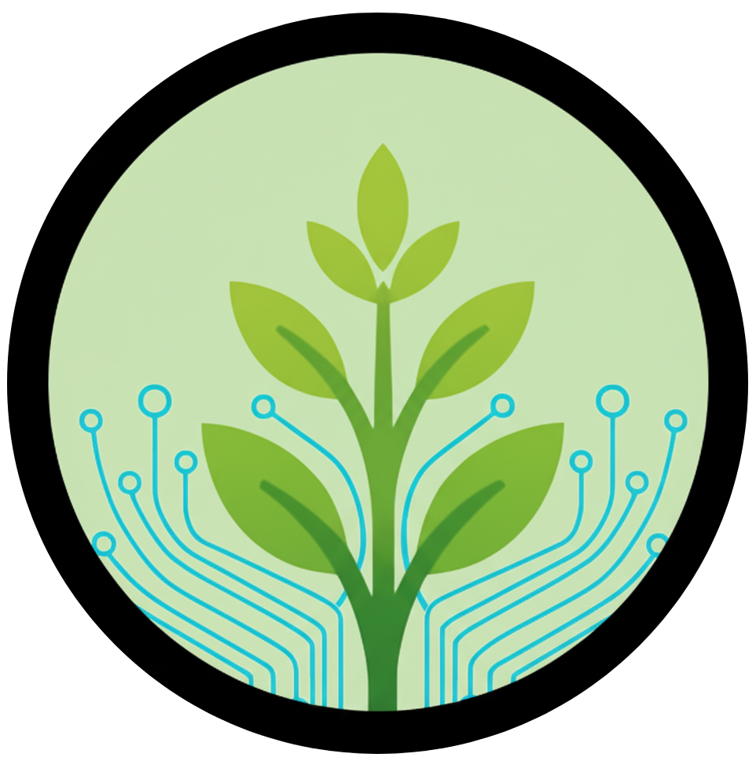 </td>
    <td> 
 AgroSmart   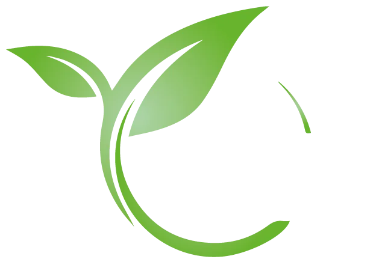
 </td>
    <td> 
 Netafim   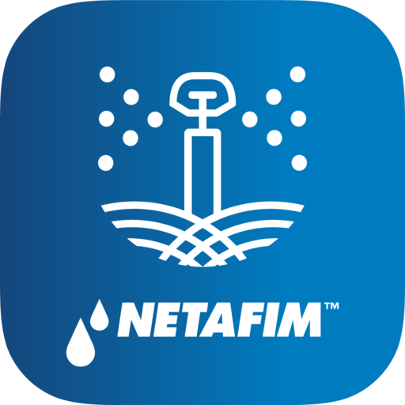
 </td>
    <td> 
 Plantix   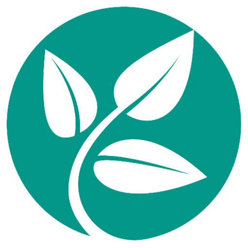
 </td>
  </tr>
  <tr>
    <td rowspan="2">Perfil</td>
    <td>Overview</td>
    <td> Plataforma accesible de monitoreo IoT en tiempo real para hogares y viveros comerciales. </td>
    <td> Startup de agricultura digital con sensores IoT, IA y datos satelitales. </td>
    <td> Empresa líder en riego inteligente a nivel global. </td>
    <td> App móvil que diagnostica plagas y enfermedades con IA. </td>
  </tr>
  <tr>
    <td>Ventaja competitiva ¿Qué valor ofrece a los clientes?</td>
    <td> Accesible, simple y adaptable a hogares y viveros comerciales. </td>
    <td> Alta tecnología para agricultura a gran escala. </td>
    <td> Experiencia consolidada y eficiencia hídrica. </td>
    <td> Uso de IA accesible desde móvil y comunidad activa. </td>
  </tr>
  <tr>
    <td rowspan="2">Perfil de Marketing</td>
    <td> Mercado Objetivo </td>
    <td> Hogares urbanos y viveros comerciales pequeños/medianos. </td>
    <td> Agricultores industriales y medianos. </td>
    <td> Agricultores medianos y grandes. </td>
    <td> Agricultores y aficionados urbanos </td>
  </tr>
  <tr>
    <td> Estrategias de Marketing </td>
    <td> Educación digital sobre sostenibilidad, alianzas con viveros locales. </td>
    <td> Marketing B2B, posicionamiento tecnológico. </td>
    <td> Branding global, casos de éxito y sostenibilidad hídrica. </td>
    <td> Estrategia digital masiva vía Google Play/App Store. </td>
  </tr> 
  <tr>
    <td rowspan="3">Perfil de Producto</td>
    <td> Productos & Servicios </td>
    <td> Sensores IoT, web, recomendaciones personalizadas. </td>
    <td> Sensores IoT, pronósticos climáticos, gestión avanzada. </td>
    <td> Sistemas de riego por goteo inteligentes, software de gestión. </td>
    <td> Diagnóstico de plagas y comunidad de soporte. </td>
  </tr>
  <tr>
    <td> Precios & Costos </td>
    <td> Accesible, modelo freemium o suscripción baja. </td>
    <td> Alto costo, licencias SaaS premium. </td>
    <td> Alta inversión inicial y mantenimiento. </td>
    <td> Gratis con servicios premium. </td>
  </tr>
  <tr> 
    <td>Canales de distribución (Web y/o Móvil)</td>
    <td> Aplicación Web. </td>
    <td> Aplicación Web y App móvil. </td>
    <td> Equipos físicos más plataforma digital. </td>
    <td> App móvil. </td>
  </tr>  
  <tr>
    <td rowspan="4"> Análisis SWOT </td>
    <td> Fortalezas </td>
    <td> Accesibilidad, simplicidad de uso, enfoque en sostenibilidad urbana. </td>
    <td> Tecnología avanzada, IA y datos satelitales. </td>
    <td> Experiencia consolidada, reducción comprobada de consumo de agua. </td>
    <td> Uso de IA en diagnóstico, comunidad digital activa. </td>
  </tr>
  <tr>
    <td> Debilidades </td>
    <td> Escala inicial limitada, baja madurez tecnológica frente a competidores. </td>
    <td> Costos elevados, poco enfoque en usuarios pequeños. </td>
    <td> Alto costo, poca personalización para usuarios urbanos. </td>
    <td> No ofrece gestión hídrica ni monitoreo IoT. </td>
  </tr>
  <tr>
    <td> Oportunidades </td>
    <td> Creciente demanda de soluciones sostenibles, apoyo a viveros urbanos. </td>
    <td> Expansión en mercados emergentes. </td>
    <td> Creciente necesidad de eficiencia hídrica. </td>
    <td> Integración con soluciones de riego y monitoreo urbano. </td>
  </tr>
  <tr>
    <td> Amenazas </td>
    <td> Entrada de grandes competidores al segmento urbano, barreras de adopción tecnológica. </td>
    <td> Saturación de mercado y alta inversión necesaria para usuarios pequeños. </td>
    <td> Nuevas startups más ágiles y accesibles. </td>
    <td> Dependencia de la precisión de IA y limitación del modelo freemium. </td>
  </tr>
</table>

### 2.1.2. Estrategias y tácticas frente a competidores
## 2.2. Entrevistas

### 2.2.1. Diseño de entrevistas
### 2.2.2. Registro de entrevistas
##### Segmento 2: Viveros comerciales

##### Entrevista N°1: Nicole Galindo

- Sexo: Femenino
- Edad: 25 años
- Direccion: Lima, Av Peru Lima
  
|  **NICOLE GALINDO**   |
|-----------------------|
| 

 |
| **Link de la Entrevista:**  [Ver Entrevista](https://upcedupe-my.sharepoint.com/:v:/g/personal/u20241a352_upc_edu_pe/Efp9hVrbxJlJrLzh9qgL_8YBjISOqp_twSZWEYOsiqxZ7g?nav=eyJyZWZlcnJhbEluZm8iOnsicmVmZXJyYWxBcHAiOiJPbmVEcml2ZUZvckJ1c2luZXNzIiwicmVmZXJyYWxBcHBQbGF0Zm9ybSI6IldlYiIsInJlZmVycmFsTW9kZSI6InZpZXciLCJyZWZlcnJhbFZpZXciOiJNeUZpbGVzTGlua0NvcHkifX0&e=5Viycw) |
| 
<b>Duración:</b> 00:05:57 &nbsp;&nbsp;&nbsp; <b>Inicio:</b> 00:00:10 &nbsp;&nbsp;&nbsp; <b>Final:</b> 00:05:54
 |
| Nicole Galindo, de 25 años, es dueña de un vivero y comentó que le interesan las plantas no solo como elemento decorativo, sino también por su valor ambiental. Señaló que, aunque sigue una rutina básica de cuidado en su negocio, reconoce que a veces resulta difícil mantener todas las plantas en óptimas condiciones debido a la carga de trabajo y la falta de herramientas especializadas. Nunca ha utilizado una aplicación o sistema digital para la gestión de su vivero, pero considera que la idea de una herramienta como PlantaE es muy atractiva, ya que le permitiría organizar mejor los procesos de riego y mejorar la salud de sus plantas de forma más sostenible. La entrevistada reconoció que en ocasiones ha perdido plantas por descuidos y que le resultaría valioso contar con recordatorios o alertas para optimizar el cuidado. Asimismo, resaltó que una aplicación con consejos prácticos y funciones simples orientadas a la tecnología ambiental la motivaría a mantener su vivero más saludable y eficiente. |

### 2.2.3. Análisis de entrevistas
- ## Segmento objetivo #1: Personas (hogares urbanos que cuidan plantas)
    - En los tres casos, el descuido ha llevado a la pérdida de plantas, ya sea por olvidos en el riego, exceso de agua o problemas de plagas. Esto evidencia una necesidad latente de apoyo externo que facilite mantener las plantas saludables.
    
    - Actualmente, ninguno de los entrevistados utiliza herramientas digitales específicas para el cuidado de sus plantas. Sin embargo, todos muestran un interés positivo en el uso de una app que ofrezca recordatorios, alertas y consejos prácticos. Específicamente, los aspectos más valorados serían: alertas de riego para no olvidar las plantas, recomendaciones para controlar plagas y herramientas que ayuden a optimizar el consumo de agua.
    
    - También se identifica un patrón en cuanto a la motivación, ,los usuarios se sentirían más felices y motivados al recibir apoyo digital que les permita mantener sus plantas en buen estado. Esto sugiere que, más allá de la funcionalidad práctica, la app debería generar satisfacción y reforzar hábitos positivos de cuidado.

- ## Segmento Objetivo 2: Viveros comerciales
    - Los entrevistados coinciden en que su motivación principal para mantener un vivero radica en ofrecer plantas saludables y de calidad. Ambos destacan que uno de los retos más importantes es la gestión del riego y mantenimiento, dado que cada especie requiere cuidados específicos y no es posible aplicar un método único para todas las plantas.
      
    - Actualmente, la organización de las tareas se realiza de forma manual, lo que limita la eficiencia y la capacidad de optimizar recursos como el agua, además de dificultar la prevención de plagas y problemas de salud de las plantas. Ninguno de los entrevistados ha utilizado aplicaciones digitales para la gestión de viveros, pero ambos perciben que una herramienta como PlantaE sería altamente valiosa.
      
    - En su motivación emocional, esta en mantener las plantas en buen estado, impactando directamente en la rentabilidad y sostenibilidad del negocio.
      
## 2.3. Needfinding
### 2.3.1. User Personas
### 2.3.2. User Task Matrix
### 2.3.3. User Journey Mapping
- Segmento objetivo 1:

  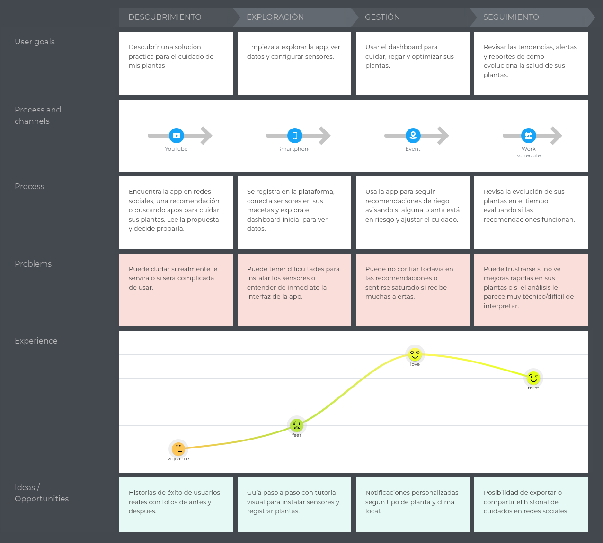

- Segmento objetivo 2:

 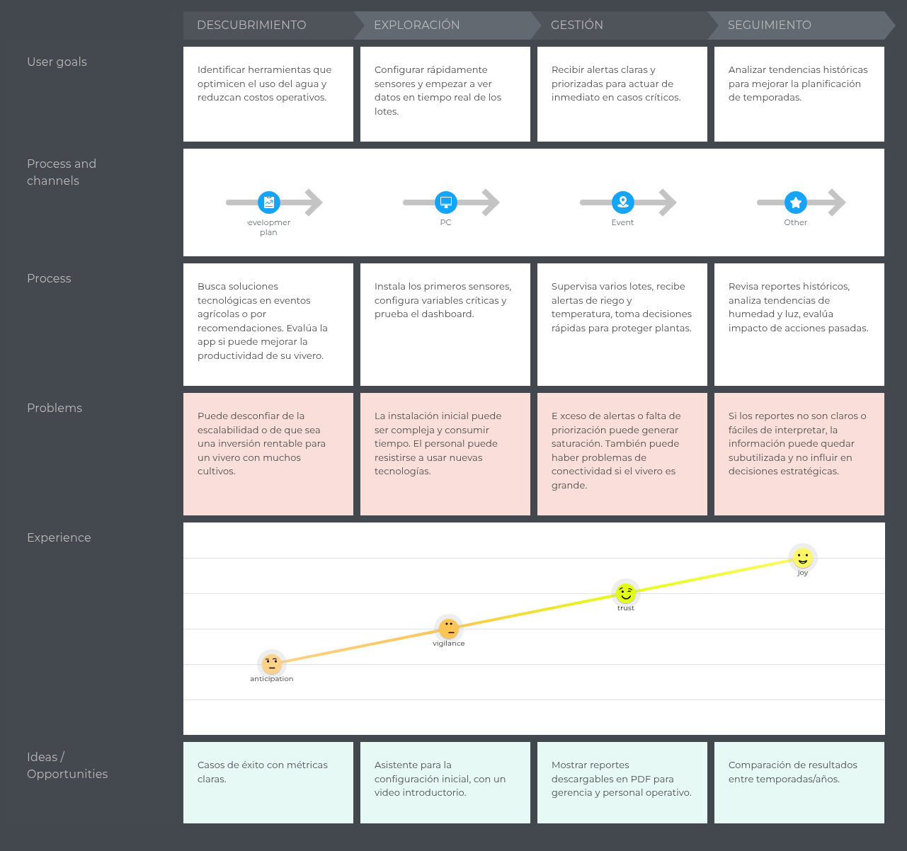

### 2.3.4. Empathy Mapping
- Segmento objetivo 1:

 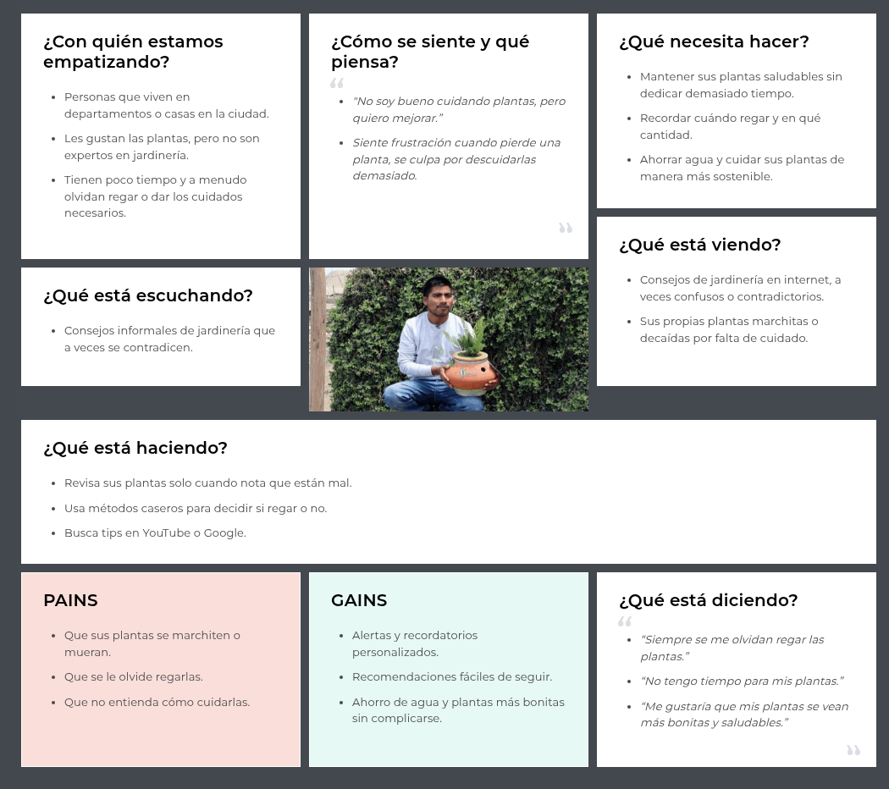

- Segmento objetivo 2:

 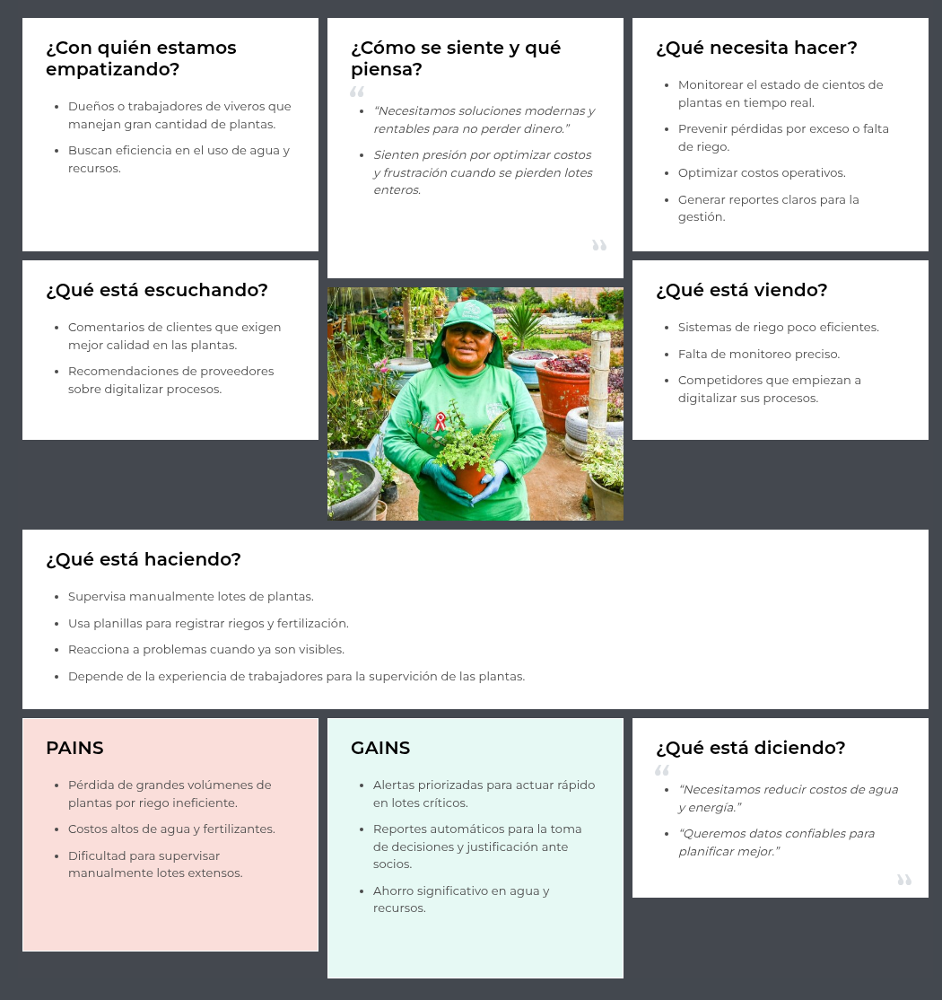

## 2.4. Big Picture Event Storming

 
  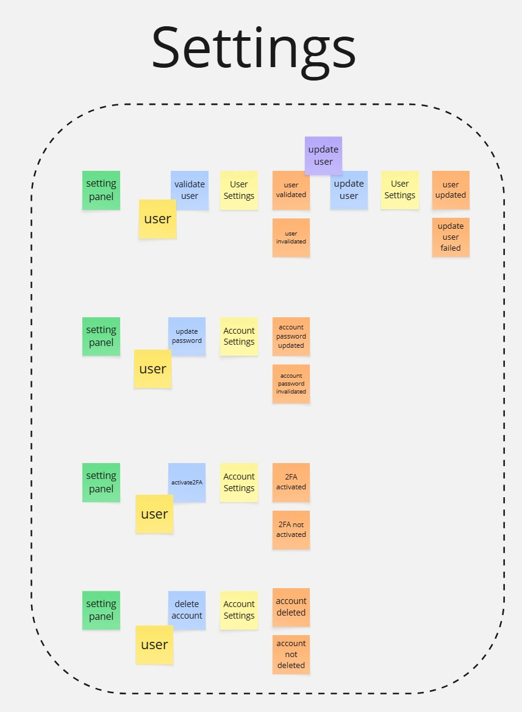 
  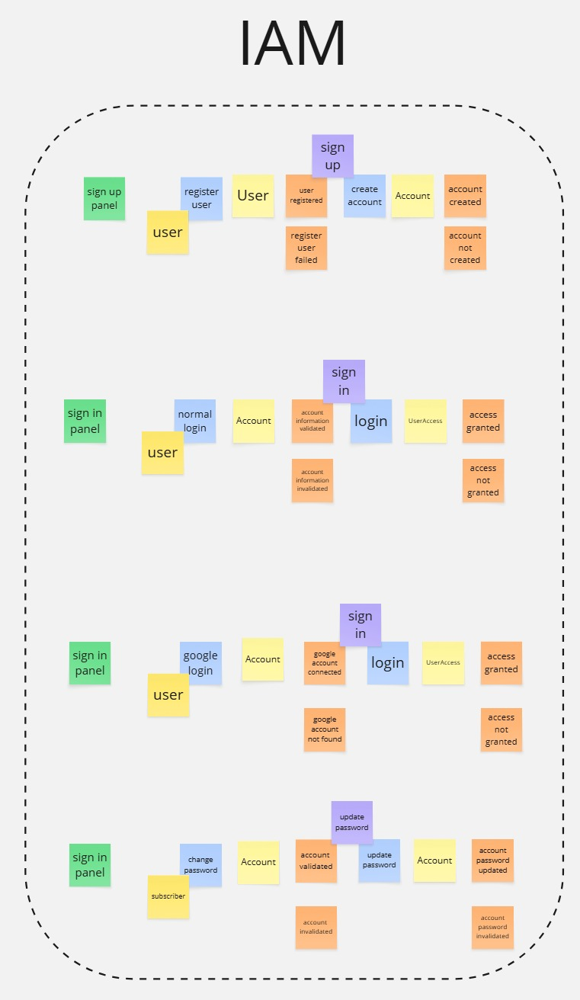 
  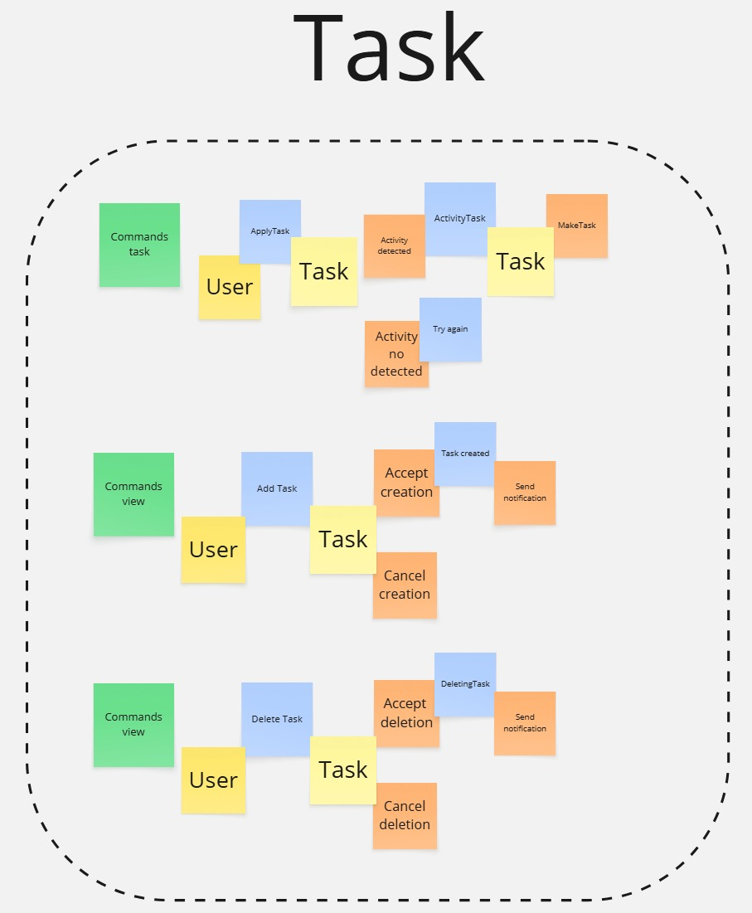 
  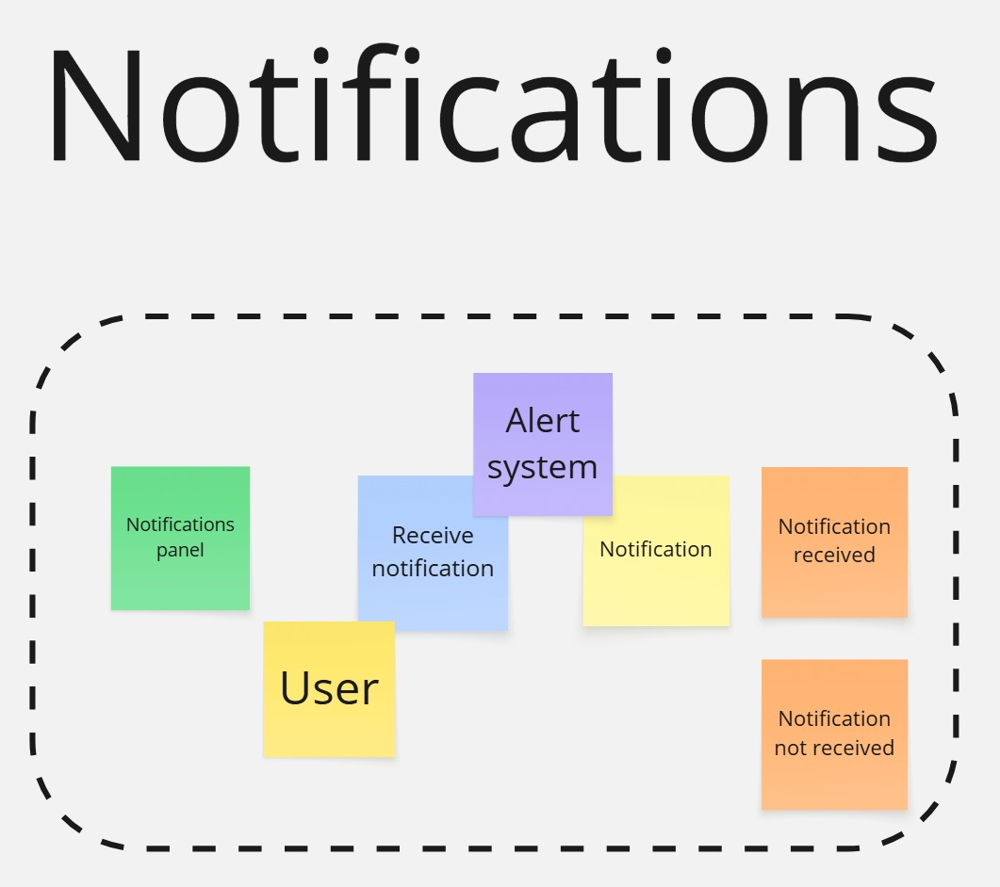 

## 2.5. Ubiquitous Language
| **Término (Inglés)**         | **Término (Español)**       | **Descripción**                                                                                              |
|------------------------------|-----------------------------|--------------------------------------------------------------------------------------------------------------|
| **Soil Moisture**            | Humedad del suelo           | Cantidad de agua presente en la tierra donde crece la planta; determina la necesidad de riego.               |
| **Air Quality**              | Calidad del aire            | Condiciones del aire que rodea al cultivo, considerando pureza y presencia de contaminantes.                 |
| **Sunlight Exposure**        | Exposición a la luz solar   | Cantidad de luz solar o artificial que recibe la planta, fundamental para la fotosíntesis y el crecimiento.  |
| **Plant Health**             | Salud de la planta          | Estado general de una planta basado en sus condiciones ambientales y cuidados recibidos.                     |
| **Watering Recommendation**  | Recomendación de riego      | Sugerencia personalizada generada para optimizar el uso del agua y mantener el buen estado del cultivo.      |
| **Alert Notification**       | Notificación de alerta      | Mensaje que informa al usuario sobre condiciones críticas que requieren acción inmediata.                    |
| **Dashboard**                | Panel de control            | Interfaz donde el usuario visualiza en tiempo real el estado de sus cultivos y recibe notificaciones.        |
| **Growth Stage**             | Etapa de crecimiento        | Fase de desarrollo en la que se encuentra la planta (germinación, crecimiento, floración, madurez).          |
| **Overwatering**             | Exceso de riego             | Situación en la que la planta recibe más agua de la necesaria, lo que puede causar pudrición de raíces.      |
| **Underwatering**            | Falta de riego              | Situación en la que la planta recibe menos agua de la necesaria, afectando su salud y crecimiento.           |
| **Indoor Plant**             | Planta de interior          | Planta cultivada dentro de un espacio cerrado, adaptada a condiciones de luz artificial o indirecta.         |
| **Outdoor Plant**            | Planta de exterior          | Planta cultivada en terrazas, balcones o jardines, expuesta a condiciones ambientales naturales.             |
| **Fertilizer Use**           | Uso de fertilizantes        | Práctica de añadir nutrientes a la maceta para mejorar el crecimiento y salud de la planta.                  |
