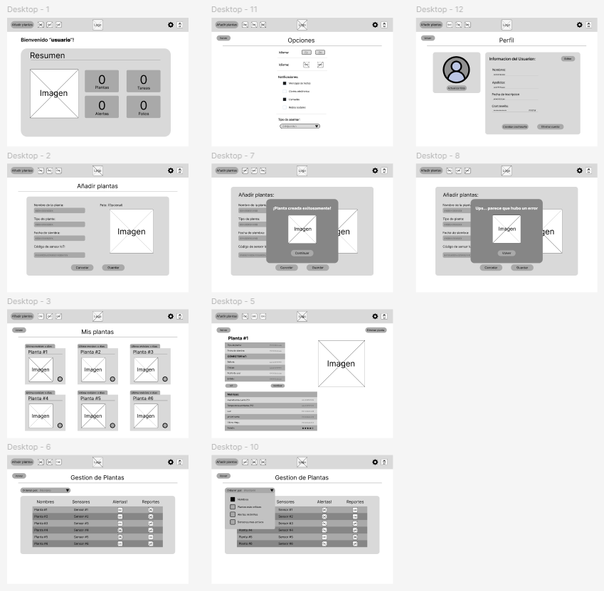
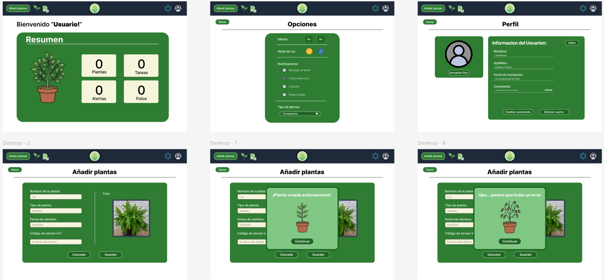
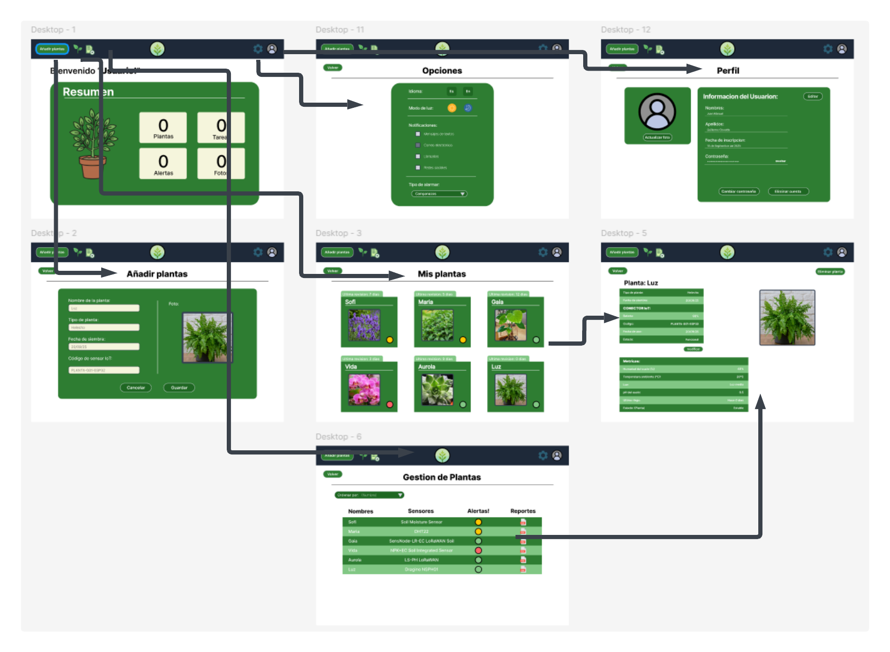
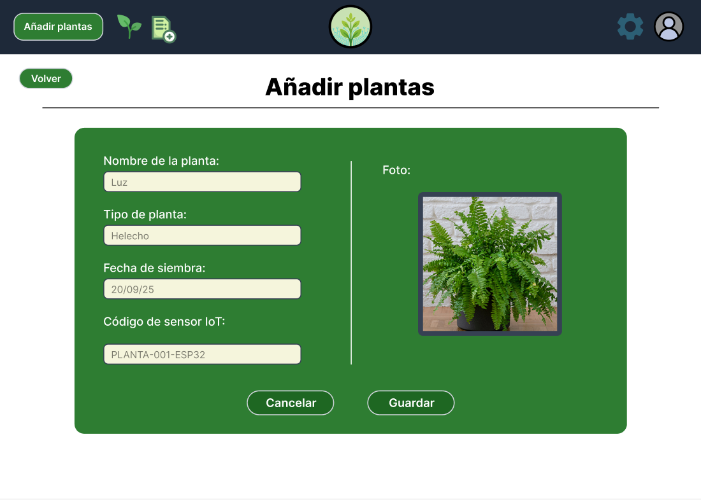
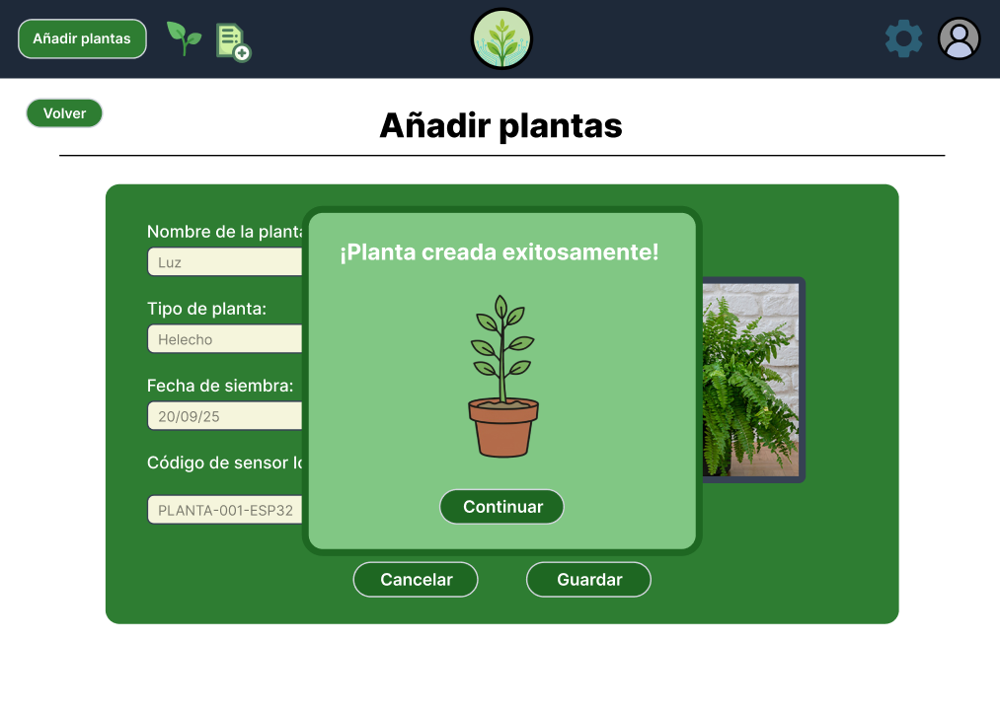
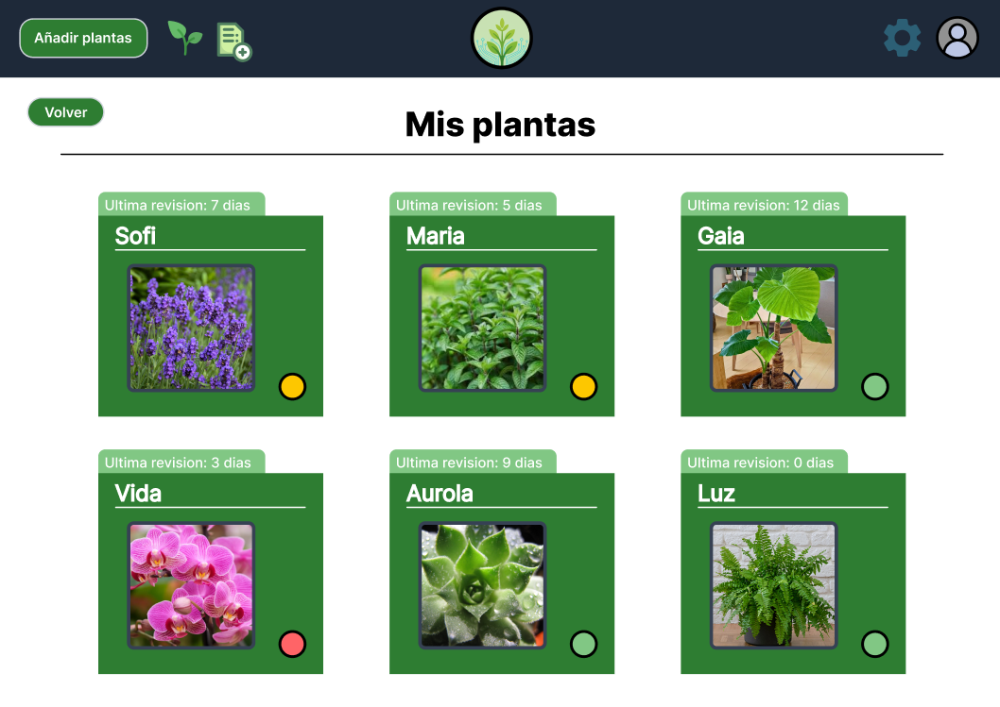
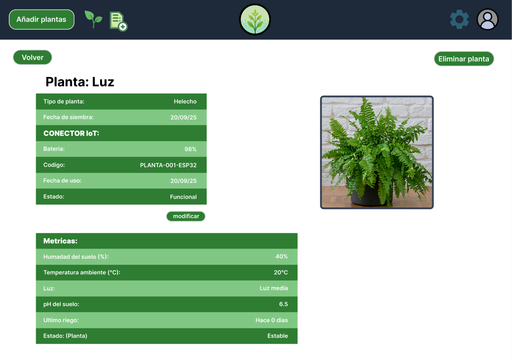
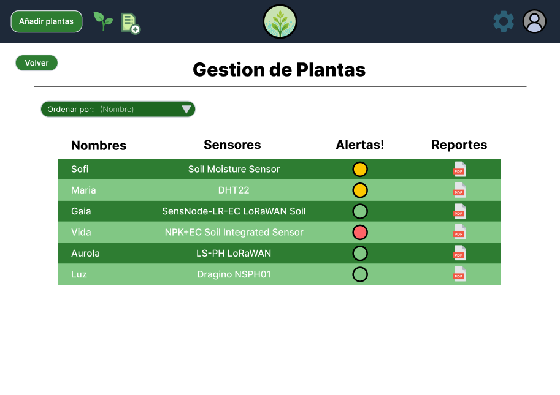

# Capítulo IV: Product Design
## 4.1. Style Guidelines
### 4.1.1. General Style Guidelines
### 4.1.2. Web Style Guidelines
## 4.2. Information Architecture
### 4.2.1. Organization Systems
### 4.2.2. Labeling Systems
### 4.2.3. SEO Tags and Meta Tags
### 4.2.4. Searching Systems
### 4.2.5. Navigation Systems

## 4.3. Landing Page UI Design
### 4.3.1. Landing Page Wireframe
### 4.3.2. Landing Page Mock-up

## 4.4. Web Applications UX/UI Design
### 4.4.1. Web Applications Wireframes

    

### 4.4.2. Web Applications Wireflow Diagrams

    

### 4.4.2. Web Applications Mock-ups

    
    

### 4.4.3. Web Applications User Flow Diagrams

    

## 4.5. Web Applications Prototyping
- Usuario aparece en el Dashboard, viendo las caracteristicas principales de sucontenido.

    - El usuario inicia en el Dashboard:
        

            
        

    
    - El usuario accede al menu de opciones, donde puede cambiar el estilo de la pagina y el idioma que le guste:
        

           
        

    - El usuario accede a su perfil, donde puede modificar su contraseña y la opcion de eliminar su cuenta:
        

           
        

    - El usuario puede añadir la planta que desee, ingresando su nombre y el codigo del sensor IoT:
        

            
        

    - Si todo es valido, se le mostrara la opcion de solicitud validada:
        

            
        

    - Caso contrario, se le negara el registro y tendra que volver a añadir su planta:
        

            
        

    - El usuario accede a la cantidad de plantas que posee, viendo la situacion de cada planta:
        

            
        

    - El usuario accede a la caracteristica de cada planta, viendo sus funciones que ofrece el IoT:
        

            
        

    - El usuario accede al registro de sus plantas con la posibilidad de descargar un reporte:
          

              
          

    - El usuario pude ordenar su lista dependiendo del nombre, urgencia, sensor y situacion critica de la planta:
          

              
          

### 4.6. Domain-Driven Software Architecture

#### 4.6.1. Software Architecture Context Diagrams

    

#### 4.6.2. Software Architecture Container Diagrams

 

#### 4.6.3. Software Architecture Components Diagrams

    

- Bounded Context IAM

    

- Bounded Context Dashboard

    

- Bounded Context Add-Plants

    

- Bounded Context Plants

    

- Bounded Context Monitoring

    

### 4.6.4. Software Architecture Components Diagrams

## 4.7. Software Object-Oriented Design
### 4.7.1. Class Diagrams
## 4.8. Database Design
### 4.8.1. Database Diagrams
