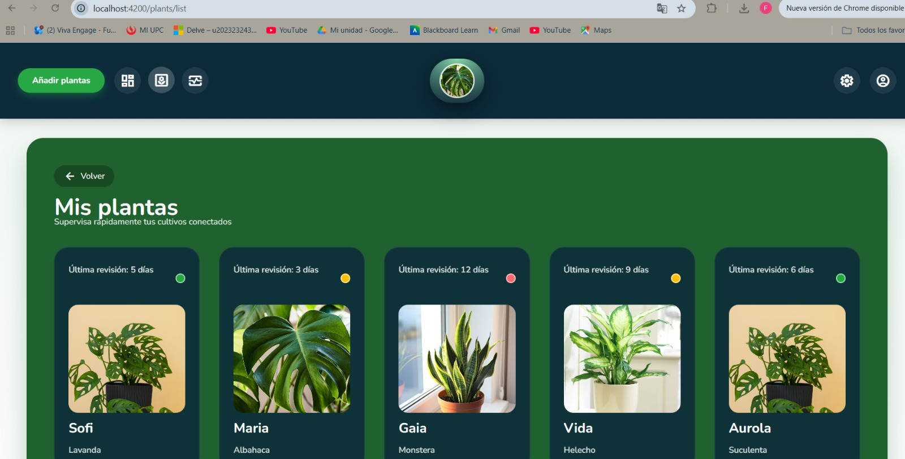
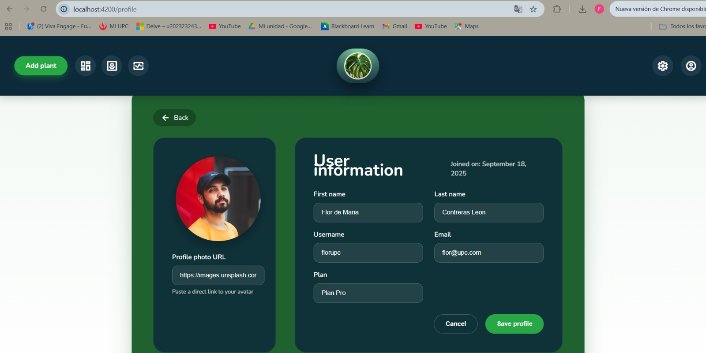

# Capítulo V: Product Implementation, Validation & Deployment
### 5.2.2. Sprint 2
Se documenta el proceso de implementación, pruebas, documentación y despliegue del segundo Sprint, enfocado en la construcción de la Frontend Web Application de PlantaE. Este sprint se centró en desarrollar las interfaces de usuario principales utilizando Angular y TypeScript, asegurando una experiencia fluida y atractiva para ambos segmentos objetivo: dueños de plantas y viveros.

#### 5.2.2.1. Sprint Planning 2.
| Sprint #                             | Sprint 1                                                                                                                                                                                                                                                                                                                                                                                                                                                                                                                              |
| ------------------------------------ | ------------------------------------------------------------------------------------------------------------------------------------------------------------------------------------------------------------------------------------------------------------------------------------------------------------------------------------------------------------------------------------------------------------------------------------------------------------------------------------------------------------------------------------- |
| **Sprint Planning Background** |                                                                                                                                                                                                                                                                                                                                                                                                                                                                                                                                       |
| Date                                 | 2025-09-10                                                                                                                                                                                                                                                                                                                                                                                                                                                                                                                            |
| Time                                 | 19:00 pm (GMT-5)                                                                                                                                                                                                                                                                                                                                                                                                                                                                                                                      |
| Location                             | Modalidad remota mediante la plataforma Discord                                                                                                                                                                                                                                                                                                                                                                                                                                                                                       |
| Prepared By                          | Contreras Leon, Flor De María                                                                                                                                                                                                                                                                                                                                                                                                                                                                                                     |
| Attendees (to planning meeting)      | Apaza Bocanegra, Elizabeth Noelia / Contreras Leon, Flor De María / Guillen Galindo, Julio Adolfo / Miraval Pomalaya, Rodrigo Jesus / Navarro Chinga, Antonio Jhair                                                                                                                                                                                                                                                                                                                                                                          |
| Sprint 0 Review Summary              | Dado que este es el sprint inicial, no se presenta un resumen del sprint anterior.                                                                                                                                                                                                                                                                                                                                                                                                                                                    |
| Sprint 0 Retrospective Summary       | Dado que este es el sprint inicial, no se presenta una retroalimentación del sprint anterior.                                                                                                                                                                                                                                                                                                                                                                                                                                        |
| **Sprint Goal & User Stories** |                                                                                                                                                                                                                                                                                                                                                                                                                                                                                                                                       |
| Sprint 1 Goal                        | Nos enfocamos en implementar la estructura principal y las funcionalidades clave de la landing page pública de PlantaE. Creemos que esto aportará una percepción más sólida del producto y despertará mayor interés entre los usuarios potenciales, al comunicar de forma clara el valor y los beneficios de la plataforma. Esto se confirmará cuando los visitantes puedan navegar de manera fluida por la página, comprendan fácilmente qué ofrece PlantaE y muestren intención de interactuar o registrarse. |
| Sprint 1 Velocity                    | 18 puntos                                                                                                                                                                                                                                                                                                                                                                                                                                                                                                                             |
| Sum of Story Points                  | 18 puntos     

#### 5.2.2.2. Aspect Leaders and Collaborators.
En esta sección se presenta la Leadership-and-Collaboration Matrix (LACX) correspondiente al Sprint 2, enfocado en el desarrollo de los bounded contexts del backend y la implementación de la arquitectura de microservicios. Esta matriz define los roles, responsabilidades y nivel de participación de cada miembro del equipo durante el desarrollo de los Web Services RESTful.
#### Aspectos Clave del Sprint 2
Para el Sprint 2, se han identificado cuatro aspectos fundamentales que abarcan el desarrollo frontend completo:

#### Frontend Development (Desarrollo de Interfaces)

- Desarrollo de la aplicación web con Angular

- Implementación de componentes, servicios, guards e interceptors

- Creación de páginas y vistas principales

#### UI/UX Implementation (Implementación de Diseño)

- Traducción de wireframes y mockups a interfaces funcionales

- Implementación de diseño responsive y adaptable

- Optimización de la experiencia de usuario

#### Navigation & Routing (Navegación y Enrutamiento)

- Configuración del sistema de navegación entre páginas

- Implementación de guards de autenticación y autorización

- Definición de flujos de navegación para ambos segmentos de usuarios

#### Integration & Deployment (Integración y Despliegue)Integration & Deployment (Integración y Despliegue)

Integración con la Landing Page existente

Configuración de variables de entorno y entornos

Despliegue y puesta en producción de la aplicación frontend
| Team Member (Last Name, First Name) | GitHub Username    | Frontend Development (L / C) | UI/UX Implementation (L / C) | Navigation & Routing (L / C) | Integration & Deployment (L / C) |
| :---------------------------------- | :----------------- | :--------------------- | :------- | :------- | :----------- |
| Apaza Bocanegra, Elizabeth Noelia | Elizabeth-Apaza     | L                      | C        | C        | C            | 
| Contreras Leon, Flor De María                | FlorDeMa           | C                      | L        | C        | C            |
| Guillen Galindo, Julio Adolfo	        | julio645         | C                      | C        | L        | C            |  
| Miraval Pomalaya, Rodrigo Jesus        | RodMiraval            | C                      | C        | C        | L            |
| Navarro Chinga, Antonio Jhair    | AntonioNavarro24 | C                      | C        | C        | C            | 

#### 5.2.2.3. Sprint Backlog 2.

#### 5.2.2.4. Development Evidence for Sprint Review.
**En esta sección se presenta la evidencia detallada del desarrollo alcanzado durante el Sprint 2, enfocado en la implementación de la Frontend Web Application de EcoTech utilizando Angular y TypeScript. Durante este segundo sprint, el equipo de EcoTech se concentró en desarrollar las interfaces de usuario principales que conectarán a los dos segmentos objetivo con las funcionalidades core de la plataforma.**

El desarrollo se llevó a cabo utilizando Angular como framework principal, junto con TypeScript para garantizar robustez en el código y HTML/CSS para la estructura y estilos. Se implementó una arquitectura de componentes reutilizables siguiendo las mejores prácticas de Angular, con separación clara entre componentes de presentación, servicios de lógica de negocio, guards de navegación e interceptors para manejo de HTTP.

Las principales funcionalidades implementadas durante este sprint abarcan todas las interfaces necesarias para que tanto usuarios particulares como administradores de viveros puedan interactuar eficientemente con EcoTech. Se desarrollaron componentes modulares y reutilizables, implementando lazy loading para optimizar el rendimiento y una experiencia de usuario fluida y responsive.

El trabajo de desarrollo se organizó siguiendo las mejores prácticas de desarrollo frontend, implementando componentes standalone según las nuevas recomendaciones de Angular, gestión de estado reactiva con RxJS, validaciones de formularios robustas y diseño responsive que funciona óptimamente en desktop, tablet y móvil.

Se estableció la integración completa con la Landing Page existente, agregando enlaces directos que permiten a los usuarios navegar fluidamente desde la página de presentación hacia la aplicación web funcional. La configuración incluye internacionalización (i18n), cambio de tema dinámico y optimización de rendimiento con lazy loading.

**Funcionalidades Implementadas con Operaciones CRUD**
- **Sistema de autenticación completo**
Login, registro y gestión de sesiones de usuarios.

- **Gestión de perfiles de usuario**
Edición de datos de perfil con validaciones en tiempo real.

- **Gestión de plantas con avisos**
Funcionalidad completa de agregar, listar, editar y eliminar plantas, incluyendo sistema de recordatorios.

- **Módulo "Mis Plantas"**
Visualización en lista y detalle de plantas asociadas a cada usuario.

- **Panel de administración de plantas (plant-manage)**
Interfaz para gestionar el inventario de plantas con operaciones CRUD.

- **Página de inicio personalizada**
Acceso rápido a opciones como configuración y dashboard principal.

- **Integración unificada con la Landing Page**
Navegación fluida entre la página de presentación y la aplicación web.

#### 5.2.2.5. Execution Evidence for Sprint Review.
**Durante el Sprint 2, se logró la implementación exitosa y el despliegue de la Frontend Web Application de EcoTech, estableciendo una interfaz de usuario completa y funcional que conecta ambos segmentos objetivo con las funcionalidades principales de la plataforma.**

**Principales logros del Sprint 2:**

**Aplicación Web Semi Completa: **Se desarrolló parcialmente la aplicación de Angular con las páginas y componentes necesarios para ambos tipos de usuarios (usuarios particulares y administradores de viveros).

**Experiencia de Usuario Optimizada:** Interfaces responsive e intuitivas que funcionan perfectamente en desktop, tablet y móvil con diseño consistente y accesible.

**Sistema de Navegación Robusto:** Implementación completa de routing con guards de autenticación, lazy loading y protección de rutas sensibles.

**Funcionalidades Interactivas:** Componentes dinámicos incluyendo calendarios de cuidados, filtros de búsqueda de plantas, dashboards de seguimiento y formularios con validaciones en tiempo real.

**Integración con Landing Page:** Enlaces funcionales desde la landing page hacia la aplicación web, creando un flujo de usuario continuo y sin fricciones.

**Funcionalidades implementadas y desplegadas:**

**Sistema de Autenticación:** Login, registro y gestión de sesiones con validaciones completas

**Gestión de Plantas:** CRUD para registro, edición y selección de plantas

**Vista de Seguimiento:** Monitoreo en tiempo real del estado y cuidados de plantas

**Sistema de Recordatorios:** Configuración y visualización de alertas para cuidados de plantas

**Landing Page Actualizada:** Enlaces directos hacia la aplicación web desde la landing page

**Screenshots de la aplicación en funcionamiento:**

Página de login para usuarios

Página de registro para nuevos usuarios

Página principal de la aplicación web con navegación y funcionalidades principales

Página de gestión de plantas

Página de vista para ver detalles de estado de una planta*

Panel de gestión para viveros con plantas registradas

Página de usuario

**Enlaces de despliegue:
**
**Frontend Application: **
**Landing Page: **

#### 5.2.2.6. Services Documentation Evidence for Sprint Review.

#### 5.2.2.7. Software Deployment Evidence for Sprint Review.
**Documentación Técnica – Sprint 2**

Durante el **Sprint 2**, se desarrolló documentación técnica **comprehensiva** para la **Frontend Web Application** implementada.  
La documentación incluye guías de componentes, patrones de diseño implementados y guías de mantenimiento para facilitar el desarrollo futuro y la colaboración del equipo.

---
**Documentación de Frontend generada**

La aplicación cuenta con documentación completa que incluye:

- **Especificación de componentes** con props y eventos soportados  
- **Guías de estilo** y patrones de diseño implementados  
- **Estructura de navegación** y configuración de rutas (*routing configuration*)  
- **Validaciones de formularios** y manejo de errores  
- **Guías de internacionalización** y cambio de tema  
- **Ejemplos de uso** y casos de testing  

---

**Módulos principales documentados**

**Authentication**
**Componentes:** `Login`, `Register`  
**Funcionalidades:** Inicio de sesión, registro, gestión de sesiones  

---

**User Management**
**Componentes:** `Profile`, `EditProfile`, `UserDashboard`  
**Funcionalidades:** Gestión de perfil, edición de datos, panel personal  

---

**Workshop Search**
**Componentes:** `Search`, `Filter`, `WorkshopList`  
**Funcionalidades:** Búsqueda avanzada, filtros dinámicos, resultados paginados  

**Tracking Dashboard**
**Componentes:** `TrackingState`, `NotificationView`, `ProgressBar`  
**Funcionalidades:** Seguimiento en tiempo real, visualización de estados, notificaciones  

**Evidencias de despliegue:**

#### 5.2.2.8. Team Collaboration Insights during Sprint.
**Organización Estratégica del Equipo**

El trabajo se organizó de manera estratégica, asignando a cada miembro módulos específicos según sus fortalezas técnicas y experiencia:

- **Apaza Bocanegra, Elizabeth Noelia** lideró el desarrollo del sistema de autenticación y modelos de seguridad, componentes críticos para la protección de datos de usuarios.  
- **Contreras Leon, Flor De María** se especializó en el dashboard de resumen y gestión de datos agregados, enfocándose en la presentación de métricas clave para los usuarios.  
- **Guillen Galindo, Julio Adolfo** desarrolló el núcleo del sistema de plantas, implementando los modelos y repositorios para la gestión del catálogo botánico.  
- **Miraval Pomalaya, Rodrigo Jesus** implementó la gestión de perfiles de usuario, asegurando una experiencia personalizada y consistente.  
- **Navarro Chinga, Antonio Jhair** desarrolló el sistema de configuraciones y preferencias, permitiendo la personalización de la aplicación.  

---

**Arquitectura Implementada para PLANT-CARE**

**PRESENTATION**  
- Log-in y perfil (`login`, `profile`, `register`)  
- Inicio y opciones (`setting`, `dashboard`)  
- Añadir plantas con avisos (`add-plant`)  
- Mis plantas y detalles de plantas (`plant-list`, `plant-detail`)  
- Gestión de plantas (`plant-manage`)  

**GUARDS**  
- Sistema de protección de rutas y autenticación  

**COMPONENTS**  
- Shell principal de la aplicación (`plant-care-shell`)  

**INFRASTRUCTURE**  
- `Auth-http` (Elizabeth)  
- `Dashboard-http` (Flor)  
- `Plant-http` (Julio)  
- `Settings-http` (Antonio)  
- `Profile-http` (Rodrigo)  

**DOMAIN**  
- `Auth.model` (Elizabeth)  
- `Dashboard-summary.model` (Flor)  
- `Plant.model`, `Plant-metrics.model`, `Plant-type.model` (Julio)  
- `Settings.model` (Antonio)  
- `User-profile.model` (Rodrigo)  

**REPOSITORIES**  
- `Auth.repository` (Elizabeth)  
- `Dashboard.repository` (Flor)  
- `Plant.repository` (Julio)  
- `Settings.repository` (Antonio)  
- `Profile.repository` (Rodrigo)  

**APPLICATION**  
- `Auth.facade` (Elizabeth)  
- `Dashboard.facade` (Flor)  
- `Plant.facade` (Julio)  
- `Settings.facade` (Antonio)  
- `Profile.facade` (Rodrigo)  

---

El **Sprint 2** consolidó al equipo como una unidad técnica cohesiva especializada en desarrollo frontend con **Angular**, estableciendo bases arquitectónicas sólidas para el módulo **PLANT-CARE** y sentando las bases para la integración futura con servicios backend.

